# Copilot Web Front-end

A simple local web app using the Copilot CLI SDK for a chat interface.

[Copilot CLI SDK](https://github.com/github/copilot-sdk)

## MVP: Local Development Only

**What we're building:**
- Simple chat interface running on localhost
- Single user (you)
- No authentication needed
- All tools enabled (`--allow-all` mode)
- No deployment complexity

## SDK Overview

**Key Points:**
- Multi-platform SDK (TypeScript, Python, Go, .NET)
- Communicates with Copilot CLI via JSON-RPC
- SDK manages CLI process lifecycle automatically
- Currently in Technical Preview
- Requires GitHub Copilot subscription (free tier available)
- Default `--allow-all` mode (perfect for local use)

## Requirements

- Node.js 18+
- GitHub Copilot CLI installed and authenticated
- npm

**Install Copilot CLI:**
```bash
# Follow GitHub's installation guide
copilot --version  # Verify it works
```

## Stack

**Frontend:** htmx (HTML-first, minimal JavaScript)
- No build step needed
- Declare behavior in HTML attributes
- Server renders everything
- Perfect for simple chat interface

**Backend:** Node.js + Express
- Serves HTML and handles htmx requests
- Integrates with Copilot SDK
- Runs on localhost:3000

**SDK:** @github/copilot-sdk (TypeScript)

## Architecture

```mermaid
graph TB
    Browser["Browser<br/>(localhost)"]
    Express["Express Server<br/>(localhost:3000)"]
    SDK["Copilot SDK"]
    CLI["Copilot CLI"]
    
    Browser -->|"HTTP (htmx)"| Express
    Express --> SDK
    SDK -->|JSON-RPC| CLI
    
    style Browser fill:#1e3a5f
    style Express fill:#3d2817
    style SDK fill:#4a1f5e
    style CLI fill:#1f4d28
```



### Components:
1. **Frontend**: Single HTML file with htmx
2. **Backend**: Express server with Copilot SDK
3. **No authentication, no sessions** - single user local app

### API Endpoints:
- `GET /` - Serve chat interface
- `POST /api/message` - Send message, return HTML fragment

## Running the Server

**Start the server:**
```bash
node server.js
# or with auto-reload:
npx nodemon server.js
```

Server will be available at: `http://localhost:3000`

**Stop the server:**
- Press `Ctrl+C` in the terminal

## Next Steps

1. **Setup**:
   - [ ] `npm init -y`
   - [ ] Install dependencies: `npm install express @github/copilot-sdk`
   - [ ] Create `server.js`
   - [ ] Create `public/index.html` with htmx

2. **MVP Features**:
   - [ ] Basic chat interface
   - [ ] Send message to Copilot
   - [ ] Display response
   - [ ] Message history in UI

3. **Nice to Have**:
   - [ ] Streaming responses
   - [ ] Basic styling
   - [ ] New chat button