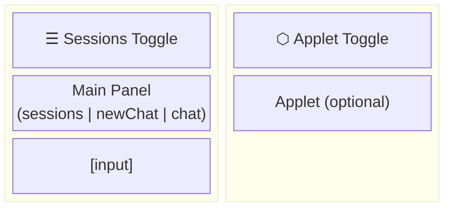
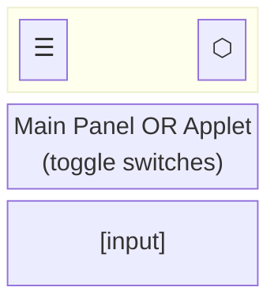

# Caco OS: UI revamp

## Requirements

- One specification doc for UI states including applet
- Minimize UI state code, ideally single file
- URL encodes work state "bookmark" (session id + applet slug)
- Applets and chat co-exist - switching doesn't destroy either
- Session view is full-screen for choosing cwd

---

# Minimal SPA Design

## Layout

### Desktop (wide viewport)



### Mobile (narrow viewport)



## Current HTML Structure

| Element | Status | Notes |
|---------|--------|-------|
| `#menuBtn` (☰) | ✅ Done | Upper-left sessions toggle |
| `#appletBtn` (⬡) | ✅ Done | Upper-right applet toggle |
| `#sessionView` | ✅ Done | Full-screen session overlay |
| `#newChat` | ✅ Done | Model selector, nested in `#chatView` |
| `#chat` | ✅ Done | Message container |
| `#chatPanel` | ✅ Done | Left panel containing chat scroll + footer |
| `#appletPanel` | ✅ Done | Right panel for applet, toggles via `.hidden` |
| `#appletView` | ✅ Done | Breadcrumbs removed, clean container |
| `.work-area` | ✅ Done | Flex container for split layout |
| CSS | ✅ Done | Media queries for mobile/desktop split |

**Current structure:**
- `<main>` → `.work-area` → `#chatPanel` + `#appletPanel`
- Navigation handled by `router.ts` (Navigation API)
- View state managed by `view-controller.ts`

## State Model

```typescript
interface UIState {
  mainPanel: 'sessions' | 'newChat' | 'chatting';  // ViewState from view-controller.ts
  appletSlug: string | null;      // null = no applet loaded
  appletVisible: boolean;         // mobile: which panel has focus
}
```

**Key insight:** Applet is orthogonal to main panel. Sessions list can show with applet beside it on desktop.

---

## Navigation UI

Two toggle buttons:

| Button | Position | Color | Action |
|--------|----------|-------|--------|
| ☰ Sessions | upper-left | blue | toggle main panel to/from sessions |
| ⬡ Applet | upper-right | orange | toggle applet visibility |

---

## Main Panel Actions

No state machine. Just actions:

```
toggleSessions
  → if showing sessions: restore previous (chat or newChat)
  → else: show sessions

sessionClick(id)
  → hide sessions
  → switch to session id
  → clear chat div
  → load history
  → show chat
  → URL: set ?session=id

newSessionClick
  → hide sessions
  → clear chat div
  → show model selector (newChat)
  → URL: remove ?session

modelSelectorSend(message)
  → hide model selector
  → POST to create session → get id
  → post user message
  → subscribe to session stream
  → show chat
  → URL: set ?session=id
```

## Applet Actions

```
toggleApplet
  → if no applet loaded: no-op (or open applet-browser?)
  → mobile: switch focus between main panel and applet
  → desktop: no-op (always visible when loaded)

loadApplet(slug)
  → destroy current applet if any
  → fetch and render new applet
  → set appletSlug
  → mobile: show applet
  → URL: set ?applet=slug
```

**No closeApplet action.** To close an applet:
- Navigate to URL without `?applet=` (back button, manual)
- Or load a different applet (replaces current)

---

## URL Philosophy

URL is for **bookmarking**, not state destruction.

**Format:** `?session=abc&applet=browser&path=subdir`

**Rules:**
1. `?session=X` → show chat view, if not current session Id, set Id, clear, request history
2. `?applet=X` → show applet X, if not loaded, load
3. Removing `?applet=` → nothing, do not close applet dom or unload current applet
4. Removing `?session=` → nothing, do not clear session or go to new session UI
5. Chat DOM persists regardless of URL
6. Applet DOM (with or without loaded Applet) persists regardless of URL

**One applet at a time.** Switching to different applet destroys previous.

### Applet URL Params

Applets can use additional query params (e.g., `?path=`) for their own state.

**Two update modes:**
- `updateAppletUrlParam(key, value)` - replaceState, no history entry (for state sync)
- `navigateAppletUrlParam(key, value)` - pushState, creates history entry (for user navigation)

**Rule:** User-initiated navigation (clicking folders, links) should use `navigateAppletUrlParam` so back/forward buttons work. Applets must listen to `popstate` events to handle navigation.

---

## Navigation API

Single handler for all navigation:

```typescript
navigation.addEventListener('navigate', (event) => {
  if (!event.canIntercept) return;
  
  const url = new URL(event.destination.url);
  const session = url.searchParams.get('session');
  const applet = url.searchParams.get('applet');
  
  event.intercept({
    handler: async () => {
      if (session) activateSession(session);
      if (applet) await loadApplet(applet);
      else hideApplet();  // hide, don't destroy
    }
  });
});
```

No breadcrumbs. No stack. Just current state.

---

## Files (Current)

| File | Purpose |
|------|---------|
| `public/ts/router.ts` | **Single owner** of URL + Navigation API |
| `public/ts/view-controller.ts` | Main panel view state (`ViewState`) |
| `public/ts/app-state.ts` | Session/model/UI flag state (non-view) |
| `public/ts/applet-runtime.ts` | Applet rendering (no navigation logic) |

Router imports from the others, doesn't replace them.

---

## Work Phases

### Phase 1: DOM & CSS restructure ✅
- [x] Rework `<main>` structure for split layout (chat-container + applet-container)
- [x] Remove `.applet-breadcrumbs` from appletView
- [x] Add CSS grid/flexbox for desktop split view
- [x] Add CSS media queries for mobile single-panel
- [x] Test responsive breakpoint behavior

### Phase 2: Strip old navigation ✅
- [x] Remove Navigation API handlers from applet-runtime.ts
- [x] Remove syncToUrl() and updateBreadcrumbUI() functions
- [x] Remove URL handling from app-state.ts
- [x] Simplify to single applet (no stack)
- [x] Verify build passes

### Phase 3: Create router.ts ✅
- [x] Create `public/ts/router.ts` as single URL owner
- [x] Implement UIState interface
- [x] Implement Navigation API handler
- [x] Wire up `toggleSessions` action
- [x] Wire up `sessionClick(id)` action
- [x] Wire up `newSessionClick` action
- [x] Wire up `toggleApplet` action
- [x] Wire up `loadApplet(slug)` action

### Phase 4: Integration & cleanup ✅
- [x] Update index.html onclick handlers to call router actions
- [x] Delete dead code from session-panel.ts
- [x] Clean up unused imports
- [x] Test all flows end-to-end
- [x] Build passes with knip (no unused exports)
