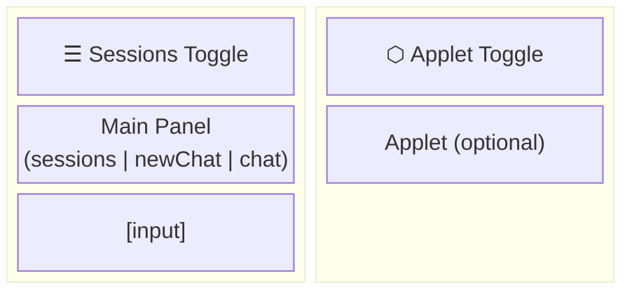
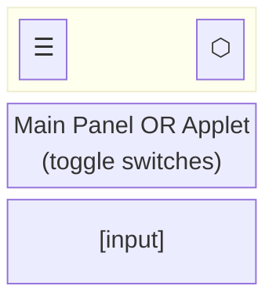

# Caco OS: UI revamp

## Requirements

- One specification doc for UI states including applet
- Minimize UI state code, ideally single file
- URL encodes work state (session id + applet slug)
- Applets and chat co-exist - switching doesn't destroy either
- Session view is full-screen for choosing cwd

---

# Minimal SPA Design

## Layout

### Desktop (wide viewport)



### Mobile (narrow viewport)



## Current HTML Assessment

| Element | Status | Notes |
|---------|--------|-------|
| `#menuBtn` (☰) | ✅ Ready | Upper-left sessions toggle |
| `#appletBtn` (⬡) | ✅ Ready | Upper-right applet toggle |
| `#sessionView` | ✅ Ready | Full-screen session list |
| `#newChat` | ✅ Ready | Model selector, nested in chatView |
| `#chat` | ✅ Ready | Message container |
| `#appletView` | ⚠️ Needs work | Has breadcrumbs to remove |
| `<main>` | ❌ Needs rework | Views stacked, not side-by-side |
| CSS | ❌ Needs rework | No split layout for desktop |

**Key changes needed:**
1. Rework `<main>` to have chat/applet side-by-side on desktop
2. Remove `.applet-breadcrumbs` from appletView
3. CSS media queries for responsive split
4. Remove all existing Navigation API handlers
5. Consolidate into router.ts

## State Model

```typescript
interface UIState {
  mainPanel: 'sessions' | 'newChat' | 'chat';
  appletSlug: string | null;      // null = no applet loaded
  appletVisible: boolean;         // mobile: which panel has focus
}
```

**Key insight:** Applet is orthogonal to main panel. Sessions list can show with applet beside it on desktop.

---

## Navigation UI

Two toggle buttons:

| Button | Position | Color | Action |
|--------|----------|-------|--------|
| ☰ Sessions | upper-left | blue | toggle main panel to/from sessions |
| ⬡ Applet | upper-right | orange | toggle applet visibility |

---

## Main Panel Actions

No state machine. Just actions:

```
toggleSessions
  → if showing sessions: restore previous (chat or newChat)
  → else: show sessions

sessionClick(id)
  → hide sessions
  → switch to session id
  → clear chat div
  → load history
  → show chat
  → URL: set ?session=id

newSessionClick
  → hide sessions
  → clear chat div
  → show model selector (newChat)
  → URL: remove ?session

modelSelectorSend(message)
  → hide model selector
  → POST to create session → get id
  → post user message
  → subscribe to session stream
  → show chat
  → URL: set ?session=id
```

## Applet Actions

```
toggleApplet
  → if no applet loaded: no-op (or open applet-browser?)
  → mobile: switch focus between main panel and applet
  → desktop: no-op (always visible when loaded)

loadApplet(slug)
  → destroy current applet if any
  → fetch and render new applet
  → set appletSlug
  → mobile: show applet
  → URL: set ?applet=slug
```

**No closeApplet action.** To close an applet:
- Navigate to URL without `?applet=` (back button, manual)
- Or load a different applet (replaces current)

---

## URL Philosophy

URL is for **bookmarking**, not state destruction.

**Format:** `?session=abc&applet=browser`

**Rules:**
1. `?session=X` → show chat view, if not current session Id, set Id, clear, request history
2. `?applet=X` → show applet X, if not loaded, load
3. Removing `?applet=` → nothing, do not close applet dom or unload current applet
4. Removing `?session=` → nothing, do not clear session or go to new session UI
5. Chat DOM persists regardless of URL
6. Applet DOM (with or without loaded Applet) persists regardless of URL

**One applet at a time.** Switching to different applet destroys previous.

---

## Navigation API

Single handler for all navigation:

```typescript
navigation.addEventListener('navigate', (event) => {
  if (!event.canIntercept) return;
  
  const url = new URL(event.destination.url);
  const session = url.searchParams.get('session');
  const applet = url.searchParams.get('applet');
  
  event.intercept({
    handler: async () => {
      if (session) activateSession(session);
      if (applet) await loadApplet(applet);
      else hideApplet();  // hide, don't destroy
    }
  });
});
```

No breadcrumbs. No stack. Just current state.

---

## Files (Target)

| File | Purpose |
|------|---------|
| `public/ts/router.ts` | **Single owner** of URL + view state |

Consolidate view-controller.ts + app-state.ts URL logic + applet-runtime.ts navigation into one module.

---

## Work Phases

### Phase 1: DOM & CSS restructure ✅
- [x] Rework `<main>` structure for split layout (chat-container + applet-container)
- [x] Remove `.applet-breadcrumbs` from appletView
- [x] Add CSS grid/flexbox for desktop split view
- [x] Add CSS media queries for mobile single-panel
- [x] Test responsive breakpoint behavior

### Phase 2: Strip old navigation
- [ ] Remove Navigation API handlers from app-state.ts
- [ ] Remove navigation handling from applet-runtime.ts
- [ ] Remove view switching from view-controller.ts
- [ ] Remove popstate/hashchange handlers if any
- [ ] Verify nothing breaks (expect broken nav)

### Phase 3: Create router.ts
- [ ] Create `public/ts/router.ts` as single URL owner
- [ ] Implement UIState interface
- [ ] Implement Navigation API handler
- [ ] Wire up `toggleSessions` action
- [ ] Wire up `sessionClick(id)` action
- [ ] Wire up `newSessionClick` action
- [ ] Wire up `modelSelectorSend(message)` action
- [ ] Wire up `toggleApplet` action
- [ ] Wire up `loadApplet(slug)` action

### Phase 4: Integration & cleanup
- [ ] Update index.html onclick handlers to call router actions
- [ ] Delete dead code from view-controller.ts
- [ ] Delete dead code from app-state.ts
- [ ] Delete dead code from applet-runtime.ts
- [ ] Test all flows end-to-end
- [ ] Test URL bookmarking behavior
- [ ] Test back/forward navigation
