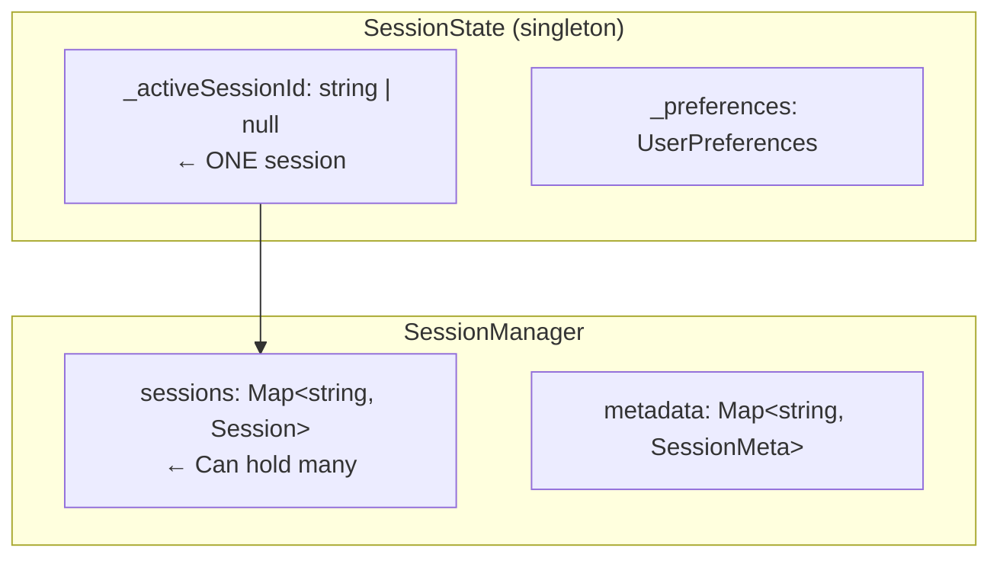
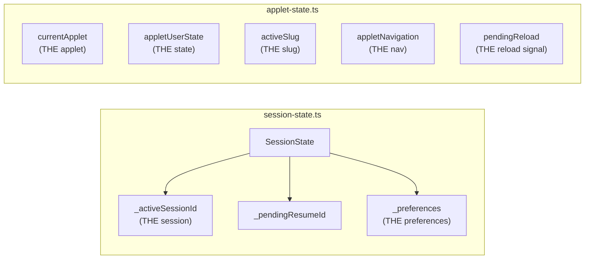
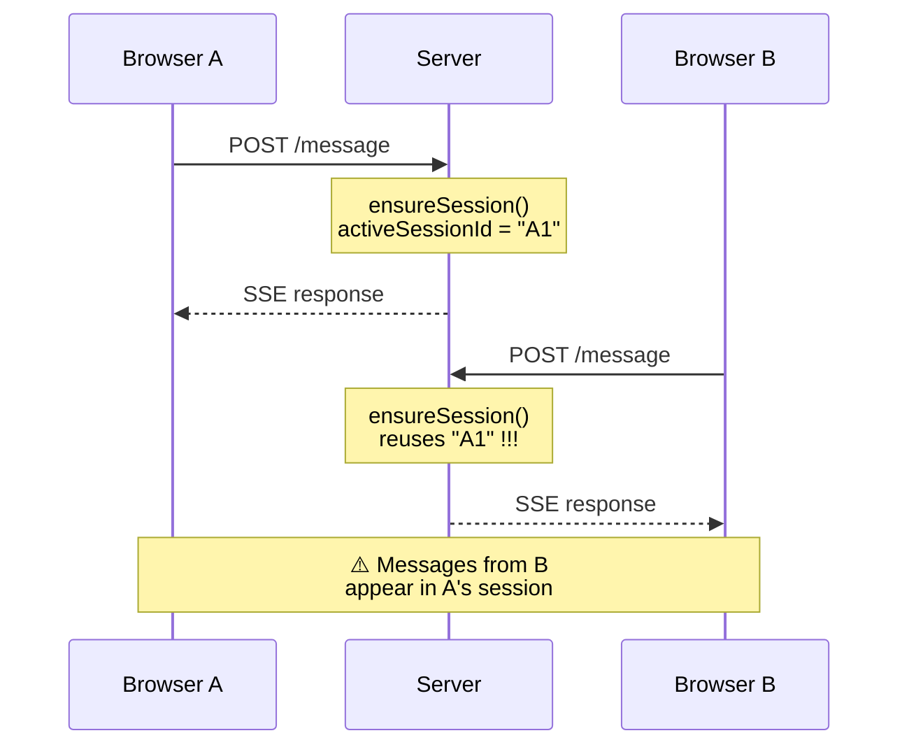
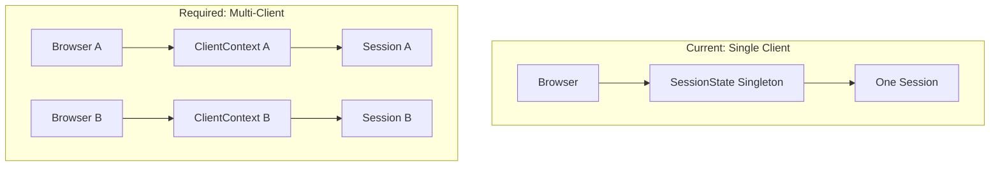
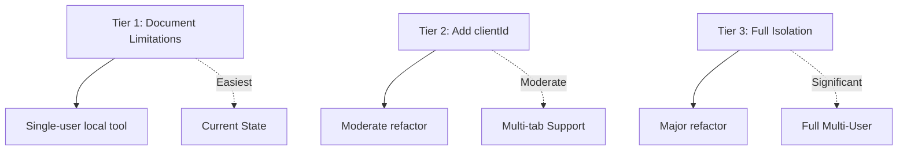

# Client-Server Coupling Analysis

Analysis of coupling between browser client and Node.js server in copilot-web.

## Primary Questions

For each API/component:
1. **Reentrant?** Can another caller use this API without impacting the front-end?
2. **Stateful?** Does it depend on server-side singleton state?
3. **Client-specific?** Is it tailored for browser flows?
4. **Multi-client safe?** Can multiple clients use it simultaneously?

---

## 1. HTTP API Review

### Session Management (`src/routes/sessions.ts`)

| Endpoint | Reentrant | Stateful | Client-Specific | Multi-Client Safe | Issues |
|----------|-----------|----------|-----------------|-------------------|--------|
| `GET /session` | ✅ | ⚠️ | ⚠️ | ❌ | Returns singleton `sessionState.activeSessionId` |
| `GET /sessions` | ✅ | ✅ | ✅ | ✅ | Lists all sessions from disk, safe |
| `POST /sessions/new` | ⚠️ | ⚠️ | ⚠️ | ❌ | Calls `sessionState.prepareNewChat()` - affects singleton |
| `POST /sessions/:id/resume` | ⚠️ | ⚠️ | ⚠️ | ❌ | Switches singleton active session |
| `DELETE /sessions/:id` | ✅ | ⚠️ | ✅ | ⚠️ | Deletes from disk, may clear singleton if active |

**Core Issue:** `sessionState` is a singleton. Only ONE active session across ALL clients.

### Streaming (`src/routes/stream.ts`)

| Endpoint | Reentrant | Stateful | Client-Specific | Multi-Client Safe | Issues |
|----------|-----------|----------|-----------------|-------------------|--------|
| `POST /message` | ⚠️ | ⚠️ | ⚠️ | ❌ | Stores `appletState` and `appletNavigation` in singletons |
| `GET /stream/:streamId` | ⚠️ | ⚠️ | ⚠️ | ❌ | Uses `sessionState.ensureSession()` - singleton |

**Core Issues:**
- `pendingMessages` Map is per-server, but tied to singleton session
- `setAppletUserState()` and `setAppletNavigation()` overwrite global state
- Any client's message affects the one active session

### API Routes (`src/routes/api.ts`)

| Endpoint | Reentrant | Stateful | Client-Specific | Multi-Client Safe | Issues |
|----------|-----------|----------|-----------------|-------------------|--------|
| `GET /models` | ✅ | ✅ | ✅ | ✅ | Cached, no session coupling |
| `GET /preferences` | ✅ | ⚠️ | ✅ | ✅ | Returns singleton prefs, read-only |
| `POST /preferences` | ✅ | ⚠️ | ✅ | ⚠️ | Updates singleton, affects all clients |
| `GET /outputs/:id` | ✅ | ⚠️ | ✅ | ✅ | Output storage is global but ID-keyed |
| `GET /history` | ⚠️ | ⚠️ | ⚠️ | ❌ | Uses `sessionState.sessionIdForHistory` singleton |
| `GET /debug/messages` | ⚠️ | ⚠️ | ⚠️ | ❌ | Same singleton dependency |

### Applet State (`src/routes/api.ts`)

| Endpoint | Reentrant | Stateful | Client-Specific | Multi-Client Safe | Issues |
|----------|-----------|----------|-----------------|-------------------|--------|
| `POST /applet/state` | ⚠️ | ⚠️ | ⚠️ | ❌ | Overwrites global `appletUserState` |
| `GET /applet/state` | ✅ | ⚠️ | ✅ | ❌ | Returns global state |
| `GET /applets` | ✅ | ✅ | ✅ | ✅ | Reads from disk, stateless |
| `GET /applets/:slug` | ✅ | ✅ | ✅ | ✅ | Reads from disk, stateless |
| `POST /applets/:slug/load` | ⚠️ | ⚠️ | ⚠️ | ❌ | Calls `setApplet()` - affects global state |

**Core Issue:** `applet-state.ts` stores a SINGLE applet in memory. All clients share it.

### File Operations (`src/routes/api.ts`)

| Endpoint | Reentrant | Stateful | Client-Specific | Multi-Client Safe | Issues |
|----------|-----------|----------|-----------------|-------------------|--------|
| `GET /files` | ✅ | ✅ | ✅ | ✅ | Reads filesystem, stateless |
| `GET /file` | ✅ | ✅ | ✅ | ✅ | Reads filesystem, stateless |
| `GET /files/read` | ✅ | ✅ | ✅ | ✅ | Reads filesystem, stateless |
| `POST /files/write` | ✅ | ✅ | ✅ | ⚠️ | Writes to disk, race conditions possible |

**These are clean.** File APIs are stateless and work for any caller.

---

## 2. MCP Tools Review

MCP tools run server-side during agent conversation. Key coupling points:

| Tool | Depends On | Multi-Client Safe | Issues |
|------|------------|-------------------|--------|
| `set_applet_content` | `setApplet()` singleton | ❌ | Sets global applet state |
| `get_applet_state` | `getApplet()`, `getAppletUserState()` | ❌ | Reads global state |
| `save_applet` | `getApplet()` singleton | ❌ | Saves global applet |
| `load_applet` | `setApplet()` singleton | ❌ | Sets global applet |
| `list_applets` | Disk only | ✅ | Stateless |
| `reload_page` | `triggerReload()` singleton | ❌ | Global reload signal |
| `restart_server` | N/A | ✅ | Affects all clients equally |

**Core Issue:** All applet tools assume ONE applet for the whole server.

---

## 3. Session Management Analysis

### Current Architecture



### Questions Answered

**Can sessions be managed without a front-end?**
Partially. `sessionManager` can create/resume/stop sessions independently.
But `sessionState` singleton tracks "the" active session, assuming one client.

**Is there clear separation?**
No. `sessionState` is called directly from routes, coupling:
- `/api/session` → `sessionState.activeSessionId`
- `/api/history` → `sessionState.sessionIdForHistory`
- `/api/message` → `sessionState.ensureSession()`

### Key Singleton Dependencies



---

## 4. Multiple Clients Analysis

### Current State: NOT SUPPORTED

Two browsers connecting would:
1. Share `sessionState.activeSessionId` - both see same session
2. Share `appletUserState` - one client's state overwrites the other
3. Share `currentApplet` - setting applet in one affects both
4. Share `pendingReload` - reload signal meant for one goes to both

### What Would Break



### Required for Multi-Client



1. **Client ID/Token** - Each browser gets unique identifier
2. **Session-per-client** - Map from clientId → sessionId
3. **Applet-per-client** - Map from clientId → applet state
4. **Scoped state** - All singletons become per-client maps

---

## 5. Recommendations

### Tier 1: Document Current Limitations
- This is a single-user local tool
- Multiple tabs may conflict
- Document expected usage pattern

### Tier 2: Minimal Multi-Client Support
```typescript
// Add clientId to all stateful endpoints
interface ClientContext {
  clientId: string;
  sessionId: string | null;
  applet: AppletContent | null;
  appletState: Record<string, unknown>;
  navigation: NavigationContext;
}

const clients = new Map<string, ClientContext>();
```

### Tier 3: Full Session Isolation
```typescript
// Each client gets isolated state
POST /message { clientId, prompt, ... }
GET /stream/:streamId { clientId }  // scoped to client's session
POST /applet/state { clientId, state }
```

---

## 6. Summary

### API Safety Classification

```mermaid
graph LR
    subgraph "Safe APIs (stateless)"
        M[GET /models]
        S[GET /sessions]
        AP[GET /applets]
        F[GET /files]
        LA[list_applets tool]
    end
    
    subgraph "Problematic APIs (singleton)"
        MSG[/message]
        STR[/stream/:id]
        SESS[/session]
        HIST[/history]
        AST[/applet/state]
        SAC[set_applet_content]
        GAS[get_applet_state]
    end
    
    style MSG fill:#f66
    style STR fill:#f66
    style SESS fill:#f66
    style HIST fill:#f66
    style AST fill:#f66
    style SAC fill:#f66
    style GAS fill:#f66
```

### Root Cause
The server was designed for **one browser tab = one server instance**.
Global singletons assume single-client usage.

### Path Forward



1. Accept single-client as design constraint (easiest)
2. Add clientId parameter to stateful routes (moderate effort)
3. Refactor singletons to per-client maps (significant effort)

