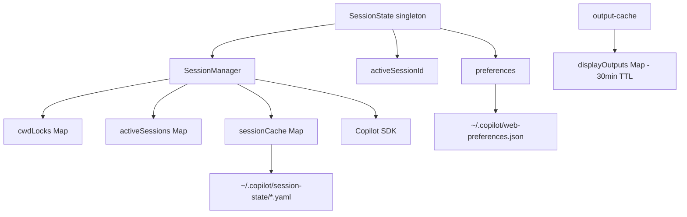
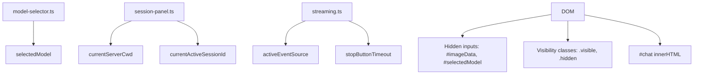

# State Analysis: copilot-web

## Overview

Mutable state is the biggest source of complexity. This document inventories all state in the application, identifies duplication and inconsistencies, and proposes consolidation.

---

## 1. State Inventory

### Server-Side State

| Location | State | Type | Lifecycle | Persistence |
|----------|-------|------|-----------|-------------|
| `SessionState` | `_activeSessionId` | `string \| null` | App lifetime | Via preferences |
| `SessionState` | `_preferences` | `UserPreferences` | App lifetime | `~/.copilot/web-preferences.json` |
| `SessionState` | `_config` | `SessionStateConfig` | App lifetime | None (config) |
| `SessionState` | `_initialized` | `boolean` | App lifetime | None |
| `SessionManager` | `cwdLocks` | `Map<cwd, sessionId>` | App lifetime | None |
| `SessionManager` | `activeSessions` | `Map<sessionId, ActiveSession>` | App lifetime | None |
| `SessionManager` | `sessionCache` | `Map<sessionId, CachedSession>` | App lifetime | Discovered from `~/.copilot/session-state/` |
| `output-cache` | `displayOutputs` | `Map<id, CacheEntry>` | 30 min TTL | None |

### Client-Side State

| Location | State | Type | Lifecycle | Persistence |
|----------|-------|------|-----------|-------------|
| `model-selector.ts` | `selectedModel` | `string` | Page lifetime | Via server preferences |
| `session-panel.ts` | `currentServerCwd` | `string` | Page lifetime | None (fetched from server) |
| `session-panel.ts` | `currentActiveSessionId` | `string \| null` | Page lifetime | None (fetched from server) |
| `streaming.ts` | `activeEventSource` | `EventSource \| null` | Per-request | None |
| `streaming.ts` | `stopButtonTimeout` | `Timeout \| null` | Per-request | None |
| `image-paste.ts` | Image in DOM | Base64 string | Until sent | None |
| DOM | Hidden inputs | `#imageData`, `#selectedModel` | Form lifetime | None |
| DOM | Visibility states | `.visible`, `.hidden` classes | User interaction | None |

### Persisted State

| File | Contents | Owner |
|------|----------|-------|
| `~/.copilot/web-preferences.json` | `lastCwd`, `lastModel`, `lastSessionId` | `preferences.ts` |
| `~/.copilot/session-state/*.yaml` | Session metadata (SDK) | Copilot SDK |

---

## 2. State Flow

### Server State Hierarchy


### Client State Locations


### Data Flow: Server ↔ Client
- **Preferences**: Server persists → Client fetches on load → Client POSTs on change
- **Sessions**: Server owns → Client fetches list → Client triggers switch via POST
- **Streaming**: Client initiates SSE → Server streams events → Client updates DOM

---

## 3. Problems Identified

### 3.1 Duplicate State

| State | Locations | Problem |
|-------|-----------|---------|
| Selected model | Client: `selectedModel`, `#selectedModel` input | Two places track the same thing |
| Active session ID | Server: `SessionState._activeSessionId` | None - already consolidated ✓ |
| Current CWD | Server: `preferences.lastCwd`, Client: `currentServerCwd` | Client just caches server value |

### 3.2 Sync Issues

| Flow | Problem |
|------|---------|
| Model selection | Client stores locally, then POSTs to server. What if POST fails? |
| Session switch | Client reloads entire page instead of updating state |
| New chat | Client reloads entire page instead of updating state |

### 3.3 State Scattered Across Modules

The client has state scattered across:
- `model-selector.ts` → `selectedModel`
- `session-panel.ts` → `currentServerCwd`, `currentActiveSessionId`
- `streaming.ts` → `activeEventSource`, `stopButtonTimeout`

No central place to query "what is the current app state?"

---

## 4. Consolidation Strategy

### 4.1 Server State (Already Good!)

`SessionState` already serves as the single source of truth for:
- Active session ID
- User preferences

**No changes needed** for server-side state management. The pattern works.

### 4.2 Client State Consolidation

Create a **ClientState** module as single source of truth:

```typescript
// public/ts/state.ts

interface AppState {
  // Session state
  activeSessionId: string | null;
  currentCwd: string;
  
  // Model state
  selectedModel: string;
  
  // UI state (derived from DOM, but tracked here for convenience)
  isStreaming: boolean;
  hasImage: boolean;
  
  // Session panel
  isSessionPanelOpen: boolean;
  isModelDropdownOpen: boolean;
}

// Singleton state store
const state: AppState = {
  activeSessionId: null,
  currentCwd: '',
  selectedModel: 'claude-sonnet-4',
  isStreaming: false,
  hasImage: false,
  isSessionPanelOpen: false,
  isModelDropdownOpen: false
};

// State accessors
export function getState(): Readonly<AppState> {
  return state;
}

// State mutations (explicit, trackable)
export function setActiveSession(sessionId: string | null, cwd: string): void {
  state.activeSessionId = sessionId;
  state.currentCwd = cwd;
}

export function setSelectedModel(modelId: string): void {
  state.selectedModel = modelId;
  // Also update hidden input for form submission
  const input = document.getElementById('selectedModel') as HTMLInputElement;
  if (input) input.value = modelId;
}

export function setStreaming(isStreaming: boolean): void {
  state.isStreaming = isStreaming;
}

// etc.
```

### 4.3 Reduce Page Reloads

Currently these actions reload the page:
- Switch session (`window.location.reload()`)
- Create new session (`window.location.reload()`)

Instead:
1. Update local state
2. Fetch new history HTML
3. Update `#chat` innerHTML
4. Update header/UI to reflect new session

### 4.4 Use DOM as Source of Truth for UI

Some UI state (like which panel is open) is already tracked in DOM classes (`.visible`). Instead of duplicating in JS, we could:
- Query DOM when needed: `panel.classList.contains('visible')`
- Only track non-DOM state in the store

---

## 5. Implementation Plan

### Phase 4a: Create Client State Store
1. Create `public/ts/state.ts` with `AppState` interface
2. Move state from `model-selector.ts`, `session-panel.ts`, `streaming.ts` to store
3. Update modules to use store getters/setters
4. Remove duplicate hidden input sync (or derive from state)

### Phase 4b: Reduce Page Reloads
1. Session switch: fetch history, update DOM, update state
2. New chat: clear chat, update state
3. Delete session: if active, clear chat

### Phase 4c: Server State Cleanup (Optional)
Already in good shape. Could consider:
1. Make `SessionManager` internal to `SessionState` (reduce public surface)
2. Add state change events for debugging

---

## 6. State Lifecycle Summary

### Server Startup
```
init()
├── SessionManager.init() → Scan ~/.copilot/session-state/
├── loadPreferences() → Read ~/.copilot/web-preferences.json
├── Resume lastSessionId OR most recent for cwd OR wait
└── SessionState ready
```

### Client Page Load
```
DOMContentLoaded
├── loadPreferences() → GET /api/preferences
│   └── applyModelPreference() → Set selectedModel
├── loadHistory() → GET /api/history
│   └── Render HTML in #chat
└── Setup event handlers
```

### Message Send
```
Form submit
├── setFormEnabled(false)
├── addUserBubble()
├── streamResponse(prompt, model)
│   ├── EventSource /api/stream
│   ├── Server: ensureSession(model) → Create if needed
│   └── Stream events → Update DOM
└── finishPendingResponse()
    └── setFormEnabled(true)
```

### Session Switch
```
Click session item
├── POST /api/sessions/:id/resume
├── Server: SessionState.switchSession()
└── Client: window.location.reload() ← Could be improved
```

---

## 7. Summary

| Area | Current State | Proposed |
|------|---------------|----------|
| Server state | ✅ Consolidated in `SessionState` | No change |
| Client state | ⚠️ Scattered across 4 modules | Consolidate in `state.ts` |
| Session switching | ❌ Full page reload | Fetch + update DOM |
| Model selection | ⚠️ Duplicated in var + hidden input | Single source + derive |
| Streaming state | ✅ Scoped to module | Keep as is (transient) |

**Priority**: Create `state.ts` store first, then gradually migrate modules.
