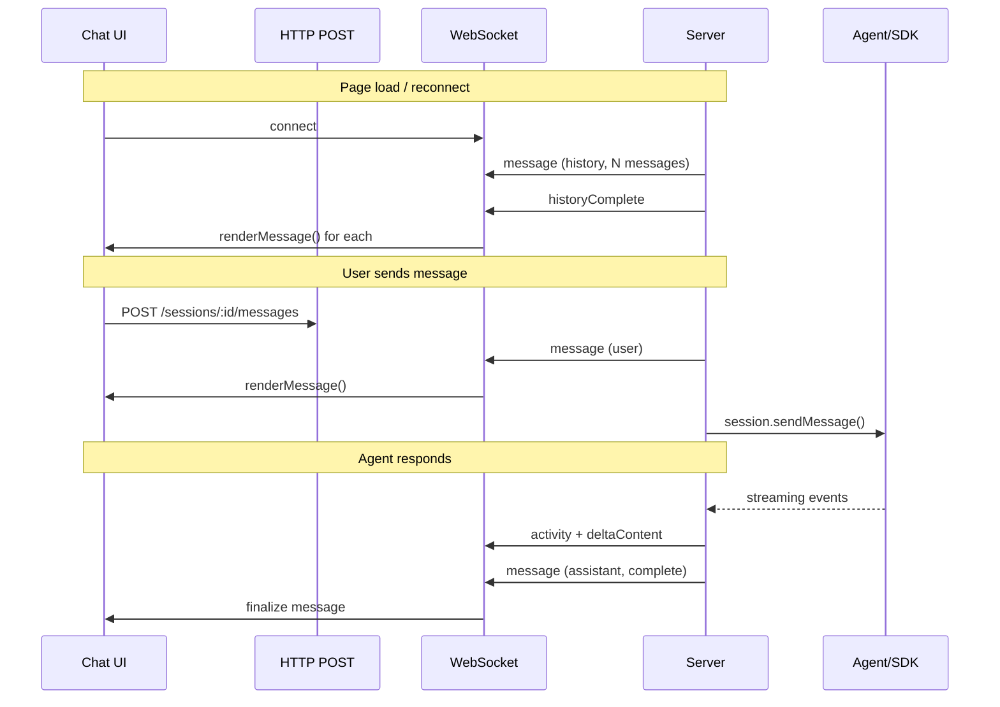

# WebSocket Session Channel

## Architecture: Unified WebSocket Rendering

All chat rendering flows through WebSocket, sending uses HTTP POST:

```
User types  → HTTP POST  → server → WS broadcast → renderMessage() → DOM
History     → page load  → server → WS sends all → renderMessage() → DOM  
Applet      → HTTP POST  → server → WS broadcast → renderMessage() → DOM
Agent       → streaming  → server → WS streams   → renderMessage() → DOM
```

**One function renders everything.** Server controls message format and metadata.
**One API for sending.** HTTP POST allows any client (curl, orchestrator, applet) to send messages.

## Endpoint

```
ws://localhost:53000/ws/session?id=<sessionId>
```

## Message Protocol

### Client → Server

| Type | Payload | Purpose |
|------|---------|---------|
| `setState` | `{ data }` | Push applet state |
| `ping` | `{}` | Heartbeat |

Chat messages are sent via HTTP POST, not WebSocket.

### Server → Client

| Type | Payload | Purpose |
|------|---------|---------|
| `message` | `ChatMessage` | Message (history, live, or streaming update) |
| `activity` | `ActivityItem` | Tool calls, intents, errors |
| `historyComplete` | `{}` | History streaming finished |
| `stateUpdate` | `{ data }` | Applet state pushed |
| `error` | `{ error }` | Error occurred |
| `pong` | `{}` | Heartbeat response |

### Unified Message Protocol

All messages use the same `message` type with `id` for updates:

```typescript
// Create
{ type: 'message', id: 'msg_1', role: 'assistant', content: '', status: 'streaming' }
// Append (streaming)
{ type: 'message', id: 'msg_1', deltaContent: 'Hello ' }
// Finalize
{ type: 'message', id: 'msg_1', content: 'Hello world!', status: 'complete' }
```

### ChatMessage Structure

```typescript
interface ChatMessage {
  id: string;
  role: 'user' | 'assistant';
  status?: 'streaming' | 'complete';
  content?: string;
  deltaContent?: string;
  timestamp?: string;
  source?: 'user' | 'applet';
  appletSlug?: string;
  hasImage?: boolean;
  outputs?: OutputMeta[];
}
```

### Activity Events

```typescript
interface ActivityItem {
  type: string;  // SDK event type (e.g., 'assistant.intent', 'tool.execution_start')
  text: string;
  details?: string;
}
```

## Message Source Styling

| Source | Style |
|--------|-------|
| `user` | Blue bubble |
| `applet` | Orange bubble with applet slug prefix |
| `agent` | Purple bubble |

## Future: File Operations

- `readFile(path)` with streaming
- `writeFile(path, content)`
- `subscribe(path)` for file watching

## Flow Diagram


