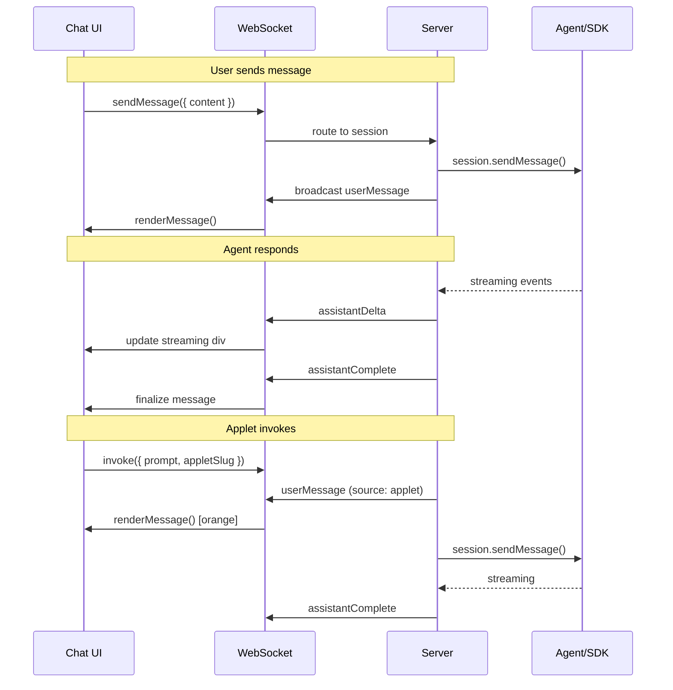

# WebSocket Session Channel

## WebSocket Primer

WebSocket is a bidirectional protocol over a single TCP connection. Unlike HTTP (request/response) or SSE (server-push only), either side can send messages at any time. Connection starts as HTTP upgrade, then becomes persistent binary/text frames.

**When to use:** Real-time bidirectional communication (chat, live updates, gaming).
**When not to use:** Simple request/response, infrequent updates (HTTP is simpler).

---

## Architecture: Unified WebSocket Rendering

### The Problem with Dual Rendering Paths

Current chat has two rendering paths:
1. **User input** → `addUserBubble()` → direct DOM manipulation
2. **History reload** → `GET /api/history` → server returns HTML → innerHTML

Two paths = two places for bugs, styling drift, feature divergence.

### Solution: Single WebSocket Source of Truth

All chat content flows through WebSocket:

```
User types  → WS send    → server → WS broadcast → renderMessage() → DOM
History     → page load  → server → WS sends all → renderMessage() → DOM  
Applet      → WS invoke  → server → WS broadcast → renderMessage() → DOM
Agent       → WS/SSE     → server → WS streams   → renderMessage() → DOM
```

**One function renders everything.** Server controls message format and metadata.

### Benefits

| Concern | Dual path (before) | Unified WS (after) |
|---------|---------------------|---------------------|
| Styling consistency | Two places to maintain | One renderer |
| Applet messages | Third path to add | Already handled |
| Message metadata | Parse in two places | Server controls |
| History format | HTML string | Structured JSON |
| Live/reload parity | Easy to diverge | Guaranteed same |
| Future features | Add to both paths | Add once |

---

## Endpoint

```
ws://localhost:3000/ws/session?id=<sessionId>
```

Note: Renamed from `/ws/applet` to `/ws/session` - it now handles all session communication.

---

## Message Protocol

### Client → Server

| Type | Payload | Purpose |
|------|---------|---------|
| `sendMessage` | `{ content, imageData? }` | User sends chat message |
| `invoke` | `{ prompt, source, appletSlug? }` | Applet invokes agent |
| `loadHistory` | `{}` | Request session history |
| `setState` | `{ data }` | Push applet state |
| `ping` | `{}` | Heartbeat |

### Server → Client

| Type | Payload | Purpose |
|------|---------|---------|
| `history` | `{ messages: ChatMessage[] }` | Full history on connect |
| `userMessage` | `ChatMessage` | User/applet message (echo back) |
| `assistantStart` | `{ messageId }` | Assistant response starting |
| `assistantDelta` | `{ messageId, delta }` | Streaming content |
| `assistantComplete` | `ChatMessage` | Full assistant message |
| `stateUpdate` | `{ data }` | Applet state pushed |
| `error` | `{ error }` | Error occurred |
| `pong` | `{}` | Heartbeat response |

### ChatMessage Structure

```typescript
interface ChatMessage {
  id: string;
  role: 'user' | 'assistant';
  content: string;
  timestamp: string;
  
  // User message metadata
  source?: 'user' | 'applet';
  appletSlug?: string;        // If source === 'applet'
  hasImage?: boolean;
  
  // Assistant message metadata  
  outputs?: OutputMeta[];     // Display tool outputs
  activity?: ActivityItem[];  // Tool calls, intents
}

interface OutputMeta {
  id: string;
  type: 'file' | 'terminal' | 'image' | 'embed';
  // ... type-specific fields
}

interface ActivityItem {
  type: 'turn' | 'intent' | 'tool' | 'tool-result';
  text: string;
  details?: string;
}
```

---

## Client Rendering

Single renderer for all message types:

```typescript
function renderMessage(msg: ChatMessage): HTMLElement {
  const div = document.createElement('div');
  div.className = `message ${msg.role}`;
  div.id = `msg-${msg.id}`;
  
  if (msg.role === 'user') {
    // User or applet message
    if (msg.source === 'applet') {
      div.classList.add('applet-invoked');
      div.dataset.appletSource = msg.appletSlug || 'unknown';
    }
    div.innerHTML = escapeHtml(msg.content);
    if (msg.hasImage) {
      div.innerHTML += ' <span class="image-indicator">[img]</span>';
    }
  } else {
    // Assistant message
    div.innerHTML = renderAssistantContent(msg);
  }
  
  return div;
}
```

---

## UI Specification: Orange Bubbles

Messages sent by applets (not typed by user) are visually distinct:

```css
.message.user { 
  background: linear-gradient(135deg, #0066cc 0%, #0099ff 100%);
}

.message.user.applet-invoked {
  background: linear-gradient(135deg, #e65c00 0%, #f09819 100%);
  border-left: 3px solid #ff7b00;
}

.message.user.applet-invoked::before {
  content: '🔧 ' attr(data-applet-source);
  display: block;
  font-size: 0.75em;
  opacity: 0.7;
  margin-bottom: 4px;
}
```

---

## Implementation Status

### Phase 1: WebSocket Infrastructure ✅
- [x] Add `ws` package dependency
- [x] Create WebSocket endpoint
- [x] Track connections by sessionId
- [x] Client-side connection manager
- [x] Auto-connect when applet loads

### Phase 2: State Push (Agent → Applet) ✅
- [x] `set_applet_state` MCP tool
- [x] `pushStateToApplet(sessionId, data)` server function
- [x] `onStateUpdate(callback)` client API

### Phase 3: Unified Chat Rendering
- [ ] **3A: User message round-trip** ← NEXT
  - [ ] Client sends `sendMessage` via WS instead of POST
  - [ ] Server echoes back as `userMessage`
  - [ ] Single `renderMessage()` function
  - [ ] Remove `addUserBubble()` direct DOM
- [ ] **3B: History via WebSocket**
  - [ ] Server sends `history` on WS connect
  - [ ] Remove `GET /api/history` endpoint
  - [ ] Client renders via `renderMessage()`
- [ ] **3C: Applet invocation**
  - [ ] `invokeAgent()` client API
  - [ ] Server routes to session
  - [ ] Orange bubble rendering
- [ ] **3D: Streaming via WebSocket**
  - [ ] Replace SSE with WS streaming
  - [ ] `assistantDelta` messages
  - [ ] Unified output rendering

### Phase 4: File Operations (Future)
- [ ] `readFile(path)` with streaming
- [ ] `writeFile(path, content)`  
- [ ] `subscribe(path)` for file watching

---

## Migration Path

### Step 1: User Message Round-Trip
1. Add `sendMessage` handler to WS server
2. Server calls existing message sending logic
3. Server broadcasts `userMessage` back
4. Client waits for `userMessage` before rendering bubble
5. Remove direct `addUserBubble()` call

### Step 2: History via WebSocket
1. On WS connect, server sends `history` with all messages
2. Client renders each via `renderMessage()`
3. Remove `/api/history` endpoint
4. Handle reconnection (re-fetch history)

### Step 3: Applet Invocation
1. Add `invoke` handler to WS server
2. Server sends message with `source: 'applet'` metadata
3. Broadcast `userMessage` with applet info
4. Client renders orange bubble

### Step 4: Streaming Migration
1. Replace SSE with WS streaming
2. `assistantStart` → `assistantDelta` → `assistantComplete`
3. Single streaming renderer
4. Remove SSE infrastructure

---

## Flow Diagram


