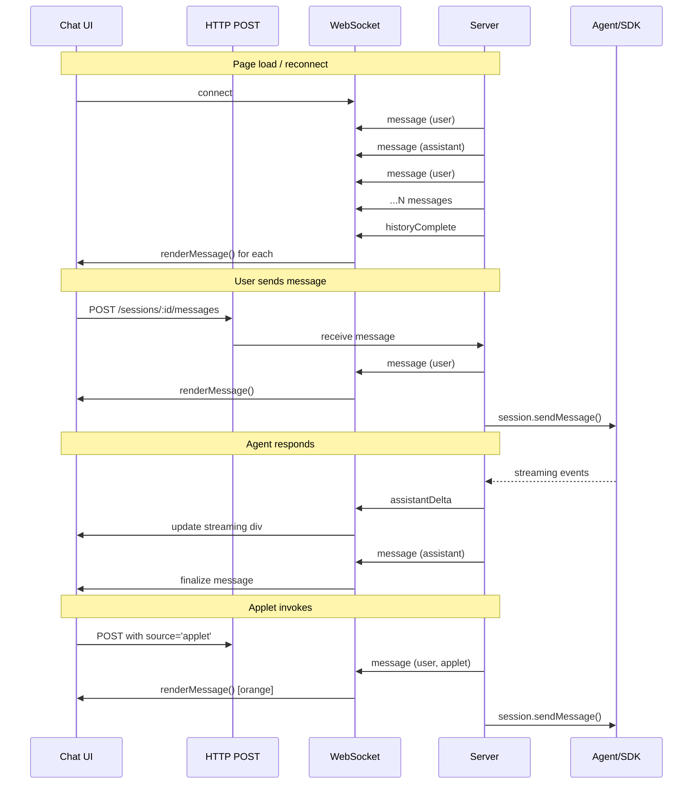

# WebSocket Session Channel

## WebSocket Primer

WebSocket is a bidirectional protocol over a single TCP connection. Unlike HTTP (request/response) or SSE (server-push only), either side can send messages at any time. Connection starts as HTTP upgrade, then becomes persistent binary/text frames.

**When to use:** Real-time bidirectional communication (chat, live updates, gaming).
**When not to use:** Simple request/response, infrequent updates (HTTP is simpler).

---

## Architecture: Unified WebSocket Rendering

### The Problem with Dual Rendering Paths

Current chat has two rendering paths:
1. **User input** → `addUserBubble()` → direct DOM manipulation
2. **History reload** → `GET /api/history` → server returns HTML → innerHTML

Two paths = two places for bugs, styling drift, feature divergence.

### Solution: Single WebSocket Source of Truth

All chat rendering flows through WebSocket, but sending uses HTTP POST:

```
User types  → HTTP POST  → server → WS broadcast → renderMessage() → DOM
History     → page load  → server → WS sends all → renderMessage() → DOM  
Applet      → HTTP POST  → server → WS broadcast → renderMessage() → DOM
Agent       → streaming  → server → WS streams   → renderMessage() → DOM
```

**One function renders everything.** Server controls message format and metadata.
**One API for sending.** HTTP POST allows any client (curl, orchestrator, applet) to send messages.

### Benefits

| Concern | Dual path (before) | Unified WS (after) |
|---------|---------------------|---------------------|
| Styling consistency | Two places to maintain | One renderer |
| Applet messages | Third path to add | Already handled |
| Message metadata | Parse in two places | Server controls |
| History format | HTML string | Structured JSON |
| Live/reload parity | Easy to diverge | Guaranteed same |
| Future features | Add to both paths | Add once |

---

## Endpoint

```
ws://localhost:3000/ws/session?id=<sessionId>
```

Note: Renamed from `/ws/applet` to `/ws/session` - it now handles all session communication.

---

## Message Protocol

### Client → Server

| Type | Payload | Purpose |
|------|---------|---------|
| `setState` | `{ data }` | Push applet state |
| `ping` | `{}` | Heartbeat |

Note: Chat messages are sent via HTTP POST, not WebSocket. This allows any client to send messages.

### Server → Client

| Type | Payload | Purpose |
|------|---------|---------|
| `message` | `ChatMessage` | Message (history, live, or streaming update) |
| `activity` | `ActivityItem` | Tool calls, intents, errors |
| `historyComplete` | `{}` | History streaming finished |
| `stateUpdate` | `{ data }` | Applet state pushed |
| `error` | `{ error }` | Error occurred |
| `pong` | `{}` | Heartbeat response |

### Unified Message Protocol

All messages (history and live streaming) use the same `message` type with `id` for updates:

**Creating a new message:**
```typescript
{ type: 'message', id: 'msg_1', role: 'assistant', content: '', status: 'streaming' }
```

**Appending content (streaming):**
```typescript
{ type: 'message', id: 'msg_1', deltaContent: 'Hello ' }
{ type: 'message', id: 'msg_1', deltaContent: 'world!' }
```

**Finalizing message:**
```typescript
{ type: 'message', id: 'msg_1', content: 'Hello world!', status: 'complete' }
```

**Client logic:**
```typescript
onMessage((msg) => {
  const existing = document.querySelector(`[data-message-id="${msg.id}"]`);
  if (existing) {
    if (msg.deltaContent) appendContent(existing, msg.deltaContent);
    if (msg.status === 'complete') finalizeMessage(existing, msg);
  } else {
    createMessage(msg);
  }
});
```

### ChatMessage Structure

```typescript
interface ChatMessage {
  id: string;
  role: 'user' | 'assistant';
  status?: 'streaming' | 'complete';  // Optional, defaults to 'complete'
  
  // Content - one of:
  content?: string;        // Full content (create or replace)
  deltaContent?: string;   // Append to existing
  
  timestamp?: string;
  
  // User message metadata
  source?: 'user' | 'applet';
  appletSlug?: string;        // If source === 'applet'
  hasImage?: boolean;
  
  // Assistant message metadata  
  outputs?: OutputMeta[];     // Display tool outputs
}

interface OutputMeta {
  id: string;
  type: 'file' | 'terminal' | 'image' | 'embed';
  // ... type-specific fields
}
```

### Activity Events

Activity items (tool calls, intents, errors) are sent separately from message content:

```typescript
{ type: 'activity', item: { type: 'turn', text: 'Turn 1...' } }
{ type: 'activity', item: { type: 'tool', text: '▶ read_file', details: 'Arguments: ...' } }
{ type: 'activity', item: { type: 'tool-result', text: '✓ read_file', details: '...' } }
```

```typescript
interface ActivityItem {
  type: 'turn' | 'intent' | 'tool' | 'tool-result' | 'error' | 'info';
  text: string;
  details?: string;
}
```

---

## Client Rendering

Single renderer for all message types:

```typescript
function renderMessage(msg: ChatMessage): HTMLElement {
  const div = document.createElement('div');
  div.className = `message ${msg.role}`;
  div.id = `msg-${msg.id}`;
  
  if (msg.role === 'user') {
    // User or applet message
    if (msg.source === 'applet') {
      div.classList.add('applet-invoked');
      div.dataset.appletSource = msg.appletSlug || 'unknown';
    }
    div.innerHTML = escapeHtml(msg.content);
    if (msg.hasImage) {
      div.innerHTML += ' <span class="image-indicator">[img]</span>';
    }
  } else {
    // Assistant message
    div.innerHTML = renderAssistantContent(msg);
  }
  
  return div;
}
```

---

## UI Specification: Orange Bubbles

Messages sent by applets (not typed by user) are visually distinct:

```css
.message.user { 
  background: linear-gradient(135deg, #0066cc 0%, #0099ff 100%);
}

.message.user.applet-invoked {
  background: linear-gradient(135deg, #e65c00 0%, #f09819 100%);
  border-left: 3px solid #ff7b00;
}

.message.user.applet-invoked::before {
  content: '🔧 ' attr(data-applet-source);
  display: block;
  font-size: 0.75em;
  opacity: 0.7;
  margin-bottom: 4px;
}
```

---

## Implementation Status

### Phase 1: WebSocket Infrastructure ✅
- [x] Add `ws` package dependency
- [x] Create WebSocket endpoint
- [x] Track connections by sessionId
- [x] Client-side connection manager
- [x] Auto-connect when applet loads

### Phase 2: State Push (Agent → Applet) ✅
- [x] `set_applet_state` MCP tool
- [x] `pushStateToApplet(sessionId, data)` server function
- [x] `onStateUpdate(callback)` client API

### Phase 3: Unified Chat Rendering
- [x] **3A: User message via POST, render via WS** ✅
  - [x] HTTP POST `/api/sessions/:id/messages` sends to agent
  - [x] Server broadcasts `message` via WS after POST
  - [x] Client renders bubble from WS (if connected)
  - [x] Fallback to direct render if WS not connected
- [x] **3B: History via WebSocket** ✅
  - [x] Server streams `message` events on WS connect
  - [x] Server sends `historyComplete` when done
  - [x] Client waits for historyComplete before finishing render
  - [x] Clean separation: loadPreferences() → connectWs() → waitForHistoryComplete()
  - [ ] Remove `GET /api/history` endpoint (keep as fallback for now)
- [ ] **3C: Applet invocation** ← NEXT
  - [ ] Applet POSTs with `source: 'applet'` metadata
  - [ ] Server broadcasts with applet info
  - [ ] Orange bubble rendering
- [ ] **3D: Streaming via WebSocket**
  - [ ] Replace SSE with WS streaming
  - [ ] `assistantDelta` messages
  - [ ] Unified output rendering

### Phase 4: File Operations (Future)
- [ ] `readFile(path)` with streaming
- [ ] `writeFile(path, content)`  
- [ ] `subscribe(path)` for file watching

---

## Migration Path

### Step 1: User Message Round-Trip ✅
1. HTTP POST `/api/sessions/:id/messages` receives message
2. Server broadcasts `userMessage` via WS to all session connections
3. Client renders bubble from WS broadcast (if connected)
4. Fallback: direct render if WS not connected (new chat, offline)

### Step 2: History via WebSocket
1. On WS connect, server sends `history` with all messages
2. Client renders each via `renderMessage()`
3. Remove `/api/history` endpoint
4. Handle reconnection (re-fetch history)

### Step 3: Applet Invocation
1. Applet POSTs to `/api/sessions/:id/messages` with `source: 'applet'`
2. Server broadcasts `userMessage` with applet metadata
3. Client renders orange bubble

### Step 4: Streaming Migration
1. Replace SSE with WS streaming
2. `assistantStart` → `assistantDelta` → `assistantComplete`
3. Single streaming renderer
4. Remove SSE infrastructure

---

## Flow Diagram


