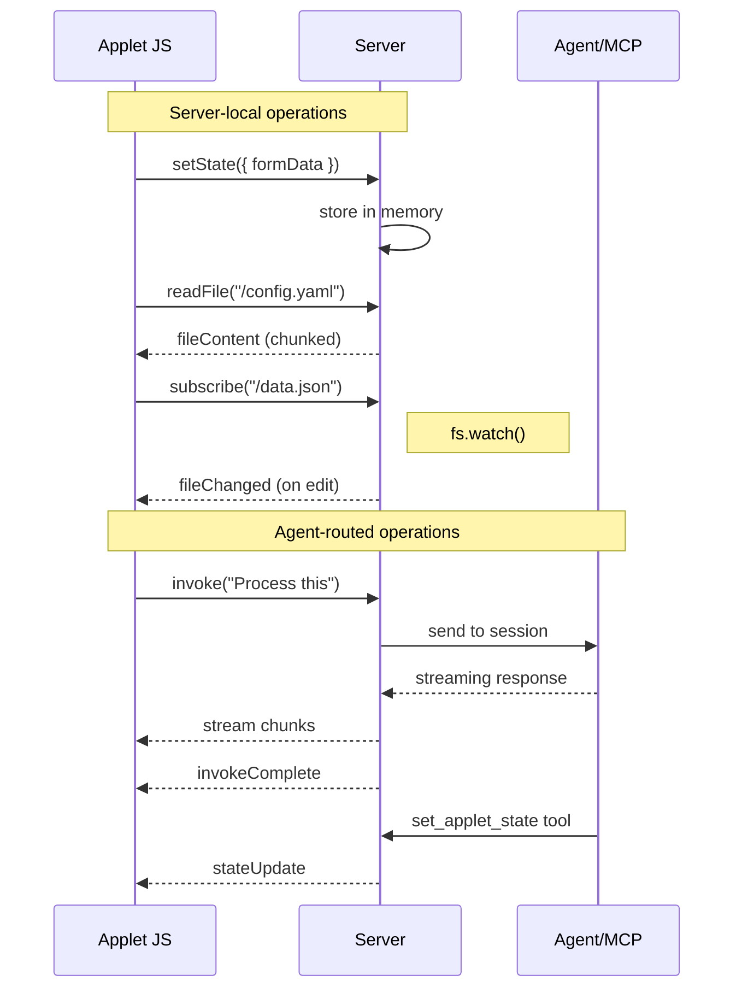

# WebSocket Applet Channel

## WebSocket Primer

WebSocket is a bidirectional protocol over a single TCP connection. Unlike HTTP (request/response) or SSE (server-push only), either side can send messages at any time. Connection starts as HTTP upgrade, then becomes persistent binary/text frames.

**When to use:** Real-time bidirectional communication (chat, live updates, gaming).
**When not to use:** Simple request/response, infrequent updates (HTTP is simpler).

## Current State

| Direction | Current Mechanism | Problem |
|-----------|-------------------|---------|
| Applet → Server | `setAppletState()` batched with next message POST | Requires user to send message |
| Server → Applet | SSE `_applet` event (reload only) | No general state push |
| Agent → Applet | ❌ None | Agent can't update running applet |
| Applet → Agent | ❌ None | Applet can't invoke agent directly |

## Proposed Solution

Single WebSocket per applet session. Server handles all messages - some locally, some routed to agent.

### Endpoint
```
ws://localhost:3000/ws/applet?session=<sessionId>
```

### Message Types

**Client → Server (server-local):**
| Type | Payload | Purpose |
|------|---------|---------|
| `setState` | `{ data: {...} }` | Push UI state |
| `readFile` | `{ path }` | Stream file content back |
| `writeFile` | `{ path, content }` | Write file |
| `subscribe` | `{ path }` | Watch file for changes |

**Client → Server (agent-routed):**
| Type | Payload | Purpose |
|------|---------|---------|
| `invoke` | `{ prompt, background? }` | Trigger agent action |

**Server → Client:**
| Type | Payload | Purpose |
|------|---------|---------|
| `stateUpdate` | `{ data }` | State pushed (from agent tool or server) |
| `fileContent` | `{ path, chunk, done }` | Streamed file data |
| `fileChanged` | `{ path, event }` | Watched file changed |
| `stream` | `{ delta }` | Agent response chunk |
| `invokeComplete` | `{ id, result, error? }` | Agent finished |

### Client API (applet JS)

```javascript
// State sync (server-local)
setAppletState({ key: value });

// File operations (server-local, streamed)
const content = await readFile('/path/to/file');
await writeFile('/path/to/file', content);
subscribeFile('/path/to/file', (event) => reload());

// Agent invocation
const result = await invokeAgent("Analyze this", { background: true });

// Receive pushed state (from agent or server)
onStateUpdate((state) => {
  document.getElementById('progress').value = state.progress;
});
```

### MCP Tools

**Existing:**
- `get_applet_state` - Query state pushed by applet

**New:**
```typescript
set_applet_state({
  data: { progress: 50, status: "Processing..." }
})
// Pushes state to applet via WebSocket
```

## Implementation Plan

### Phase 1: WebSocket Infrastructure ✅
- [x] Add `ws` package dependency
- [x] Create `/ws/applet` endpoint in `src/routes/applet-ws.ts`
- [x] Track connections by sessionId
- [x] Client-side connection manager in `public/ts/applet-ws.ts`
- [x] Auto-connect when applet loads

### Phase 2: State Push (Agent → Applet) ✅
- [x] `set_applet_state` MCP tool
- [x] `pushStateToApplet(sessionId, data)` server function
- [x] `onStateUpdate(callback)` client API

### Phase 3: Agent Invocation (Applet → Agent)
- [ ] `invokeAgent(prompt, options)` client API
- [ ] Server routes `invoke` message to session
- [ ] Stream response back via WebSocket
- [ ] Chat UI receives applet-invoked messages (orange bubbles)

### Phase 4: File Operations
- [ ] `readFile(path)` with streaming response
- [ ] `writeFile(path, content)`
- [ ] `subscribe(path)` for file watching

---

## Phase 3: Applet → Agent Communication (Detailed Spec)

### Three Invocation Scenarios

| Scenario | Description | Session | UI Effect |
|----------|-------------|---------|-----------|
| **1. Active Chat** | Applet triggers agent in currently viewed session | Active session | Orange bubble appears in chat |
| **2. Background** | Applet triggers agent in known non-active session | Existing sessionId | No UI, result via WS |
| **3. New Session** | Applet creates fresh session for isolated task | New sessionId | No UI, result via WS |

### HTTP APIs (Already Support All Scenarios)

```
POST /api/sessions                    # Create new session → sessionId
POST /api/sessions/:id/messages       # Send message → streamId
GET  /api/stream/:streamId            # SSE for response (or use WS)
```

**Applet can use these directly.** The missing piece is UI coordination.

### The Active Chat Problem

When user types in chat:
```
User types → addUserBubble() → POST /sessions/:id/messages → SSE stream → render response
```

When applet invokes agent:
```
Applet → POST /sessions/:id/messages → SSE stream → ???
```

**Problem:** Chat UI doesn't know a message was sent. No user bubble appears. Response not rendered.

### Solution: WebSocket Session Events

Upgrade the applet WebSocket to a **session channel** that broadcasts:
- `messageStarted` - A message was sent (from any source)
- `streamConnected` - SSE stream is ready
- `messageDone` - Agent finished responding

**New message types (Server → Client):**

| Type | Payload | Purpose |
|------|---------|---------|
| `messageStarted` | `{ prompt, source, streamId }` | Message sent to session |
| `streamReady` | `{ streamId }` | SSE stream ready to connect |

### Client API Extension

```javascript
// Invoke agent from applet
const result = await invokeAgent("Analyze this data", {
  session: 'active',        // 'active' | 'background' | 'new' | <sessionId>
  showInChat: true,         // Show orange bubble in chat UI
  waitForResult: false      // Return immediately or wait for response
});

// Options:
// session: 'active' - use current browser session
// session: 'background' - use current session but don't show in chat
// session: 'new' - create new ephemeral session
// session: '<uuid>' - target specific session
```

---

## UI Specification: Orange Bubbles

### Requirement

Messages sent by applets (not typed by user) must be visually distinct:
- **Orange background** instead of user's blue
- **Applet indicator** showing which applet sent it
- **Consistent rendering** in live chat AND history reload

### CSS Classes

```css
.message.user { ... }                  /* Normal user - blue */
.message.user.applet-invoked { ... }   /* Applet-invoked - orange */
```

### Proposed Styling

```css
.message.user.applet-invoked {
  background: linear-gradient(135deg, #e65c00 0%, #f09819 100%);
  border-left: 3px solid #ff7b00;
}

.message.user.applet-invoked::before {
  content: attr(data-applet-source);
  display: block;
  font-size: 0.75em;
  opacity: 0.7;
  margin-bottom: 4px;
}
```

### Message Source Identification

**Problem:** SDK stores messages in `events.jsonl` with fixed format:
```json
{"type":"user.message","data":{"content":"Hello"}}
```

We cannot add custom fields to SDK storage.

**Solution:** Message prefix marker

Applet-invoked messages are prefixed with a marker:
```
[applet:calculator] What is 2+2?
```

Format: `[applet:<slug>] <actual prompt>`

**Rendering logic:**
1. Check if message starts with `[applet:`
2. Extract slug and actual content
3. Render with `.applet-invoked` class and `data-applet-source` attribute

### Metadata Storage (Supplement)

In addition to the prefix, store richer metadata in our storage:

```
.copilot-web/sessions/<sessionId>/
├── outputs.json           # Existing - display tool outputs
└── message-meta.json      # NEW - message source metadata
```

**message-meta.json format:**
```json
{
  "messages": [
    {
      "timestamp": "2026-01-27T20:00:00.000Z",
      "source": "applet",
      "appletSlug": "calculator",
      "prompt": "What is 2+2?"
    }
  ]
}
```

**Purpose:** Richer metadata for future features (analytics, filtering).
**Fallback:** Prefix marker in content is the source of truth for rendering.

### Live Chat Rendering

When applet calls `invokeAgent()`:

1. Applet sends WS message: `{ type: 'invoke', prompt, options }`
2. Server broadcasts to session: `{ type: 'messageStarted', prompt, source: 'applet', appletSlug }`
3. Chat UI receives `messageStarted` event
4. Chat UI calls `addAppletBubble(prompt, appletSlug)` instead of `addUserBubble()`
5. Chat UI connects to SSE stream for response

**New function in response-streaming.ts:**
```typescript
export function addAppletBubble(message: string, appletSlug: string): HTMLElement {
  const chat = document.getElementById('chat');
  
  const userDiv = document.createElement('div');
  userDiv.className = 'message user applet-invoked';
  userDiv.setAttribute('data-applet-source', appletSlug);
  userDiv.innerHTML = escapeHtml(message);
  chat.appendChild(userDiv);
  
  // ... add pending response div ...
}
```

### History Rendering

When loading session history (`GET /api/history`):

```typescript
// In api.ts history rendering
if (isUser) {
  const { isApplet, slug, content } = parseAppletMessage(rawContent);
  
  if (isApplet) {
    htmlParts.push(`<div class="message user applet-invoked" data-applet-source="${slug}">${escapeHtml(content)}</div>`);
  } else {
    htmlParts.push(`<div class="message user">${escapeHtml(content)}</div>`);
  }
}

function parseAppletMessage(content: string): { isApplet: boolean; slug: string; content: string } {
  const match = content.match(/^\[applet:([^\]]+)\]\s*(.*)/s);
  if (match) {
    return { isApplet: true, slug: match[1], content: match[2] };
  }
  return { isApplet: false, slug: '', content };
}
```

---

## Implementation Checklist

### Phase 3A: Core Infrastructure
- [ ] Add `invoke` message type to WS server
- [ ] Add `messageStarted` broadcast from server
- [ ] Implement `invokeAgent()` client API
- [ ] Wire up POST /sessions/:id/messages from WS handler

### Phase 3B: Chat UI Coordination
- [ ] Chat connects to session WS (not just applet WS)
- [ ] Handle `messageStarted` event in chat
- [ ] Add `addAppletBubble()` function
- [ ] Connect to SSE stream from WS event

### Phase 3C: Visual Styling
- [ ] Add `.applet-invoked` CSS styles
- [ ] Add applet source indicator styling
- [ ] Test with calculator applet

### Phase 3D: History Persistence
- [ ] Implement prefix marker for applet messages
- [ ] Parse prefix in history rendering
- [ ] Create `message-meta.json` storage (optional enrichment)
- [ ] Test reload renders orange bubbles correctly

## Files to Create/Modify

| File | Action | Status |
|------|--------|--------|
| `src/routes/applet-ws.ts` | New - WebSocket server | ✅ |
| `src/applet-tools.ts` | Add `set_applet_state` tool | ✅ |
| `public/ts/applet-ws.ts` | New - Client WebSocket manager | ✅ |
| `public/ts/applet-runtime.ts` | Integrate WS, expose new APIs | ✅ |
| `server.ts` | Mount WebSocket on HTTP server | ✅ |

## Flow Diagram


