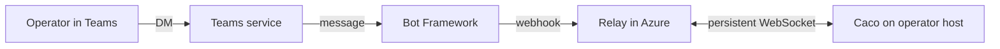

# Teams bridge for remote Caco

A single-user bridge that lets one person chat with their own Caco instance through Microsoft Teams. Intended for environments where the local workstation is locked down (browser whitelist, restricted egress) but Teams is permitted. Caco runs elsewhere — a Dev Box, a personal VM, or any host the operator controls inside the same Azure AD tenant.

This document is a security-first design spec. The architecture is sketched; the focus is on the trust model, the threats it must address, and the open questions that must be closed before building.

## Goals

1. One operator chats with one Caco instance through a Teams bot identity.
2. The locked-down workstation needs nothing beyond a working Teams client.
3. The Caco host never accepts inbound connections from the public internet.
4. Only the registered operator can interact with the bot. Messages from any other principal are rejected.
5. Messages and responses are not retained outside Caco's normal session store.

## Non-goals

- Multi-user. The bridge serves exactly one identity.
- Multi-tenant. The bot and the operator live in the same Azure AD tenant.
- Federation. The bot is not published to AppSource and is not installable by others.
- High availability. Caco offline is an acceptable failure mode; messages either error or are dropped.

## Architecture



Four moving parts:

- **Bot identity** — an Azure Bot resource registered to the operator's AAD tenant. Appears in Teams as a chat target.
- **Relay** — a small stateless service hosted in Azure (Container Apps, Functions, or App Service). Public HTTPS endpoint. Receives Bot Framework webhooks; forwards over WebSocket to Caco; receives responses; posts back to Bot Framework. Holds no chat data at rest.
- **Caco** — the operator's existing Caco instance, running on a host they control. Opens an outbound WebSocket to the relay at startup and maintains it.
- **Operator** — a single human identity, identified by AAD object ID (an immutable GUID per AAD user).

The Caco host never accepts inbound connections. All traffic crossing the public internet terminates at the relay.

## Trust model

Three principals, three trust relationships:

| Principal | Trusted by | Trust scope |
|---|---|---|
| Operator | Bot Framework, Relay, Caco | Sole permitted message sender |
| Bot Framework | Relay | Issuer of signed webhooks |
| Relay | Caco | Holder of the bridge secret |

The relay is the only public-facing component. It must be assumed to be the most exposed surface and therefore handle the least sensitive material:

- **No tools.** The relay does not invoke any agent tooling. It is a message forwarder.
- **No persistence.** Messages in flight live in memory only. A relay restart loses in-flight messages; that is acceptable.
- **No outbound to Caco except through the WebSocket Caco itself initiated.** The relay cannot pull data from Caco; it can only respond to messages Caco asks for.
- **Single shared secret with Caco.** Used to authenticate the WebSocket. Rotated by the operator at will.

Caco is the only place where chat content is processed by the agent or persisted. If the relay is compromised, an attacker can inject messages into Caco *as if they were the operator* — this is the worst-case threat, and the mitigations below are dimensioned against it.

## Authentication and authorization

### Bot Framework → Relay

Microsoft's standard JWT signing applies. Each webhook from Bot Framework includes a bearer token issued by the AAD-hosted Bot Connector. The relay validates:

1. JWT signature against Microsoft's published JWKS.
2. Issuer (`https://api.botframework.com`).
3. Audience matches the relay's registered Bot App ID.
4. Expiry.

Webhooks failing any check are dropped with HTTP 401. No body parsing happens before validation.

### Operator identity check

Every webhook body contains the sender's AAD object ID under `from.aadObjectId` (a stable GUID). The relay compares this against a single constant, set at relay startup:

```
ALLOWED_OPERATOR_OBJECT_ID=<guid>
```

Mismatches are dropped with HTTP 403 and logged. The check happens **before** forwarding to Caco. Caco performs the same check independently — defense in depth.

The operator's `userPrincipalName` (the @-style address) is **not** used for matching because it can be changed by tenant admins. The object ID is immutable per user.

### Caco ↔ Relay

The persistent WebSocket is authenticated by a single shared secret embedded in the upgrade request's `Authorization` header. Generated by the operator, stored in environment variables on both sides. Rotated by restarting both sides with a new value.

- The WebSocket uses TLS (wss://).
- Caco initiates the connection; the relay never initiates to Caco.
- A failed handshake disconnects with no body. No information leaked about why.

### Per-message replay protection

Each message envelope between relay and Caco includes:

- `id` — relay-generated UUID, one per Teams turn.
- `ts` — relay timestamp, ISO 8601.
- `aadObjectId` — sender AAD object ID, copied from the validated Bot Framework body.

Caco rejects:
- Messages older than 60 seconds (`ts` skew).
- Duplicate `id` values seen in the last 10 minutes (in-memory LRU).
- `aadObjectId` not matching `ALLOWED_OPERATOR_OBJECT_ID` on the Caco side.

## Data handling

| Class | Where it lives | Retention |
|---|---|---|
| Operator's Teams message text | Relay memory (in flight); Caco session store (after dispatch) | Relay: until forwarded. Caco: per existing session retention. |
| Bot Framework auth tokens | Relay memory | Per-request only. Never logged. |
| Bridge shared secret | Relay environment, Caco environment | Until rotated. Not logged. |
| Operator object ID | Relay environment, Caco environment, message envelopes | Indefinite (it's a configuration value). |

The relay logs HTTP status codes and structural events (message received, forwarded, response posted) but **does not** log message bodies. This is enforced by code review and a single log helper that takes typed status arguments, never strings interpolating user content.

Caco's existing session persistence applies once a message has been forwarded — meaning Teams content ends up in `~/.copilot/session-state/.../events.jsonl` like any other prompt. If the operator wants Teams sessions isolated, they should create a dedicated session for the bridge and not share it with their interactive Caco usage.

## Threat model

What an attacker who has compromised the relay can do:

1. **Inject arbitrary messages into Caco as the operator.** Mitigation: rotate the bridge secret. Operator's existing trust in Caco (e.g. tool permissions, approve-all behavior) determines blast radius. **Operators should treat bridge-originated sessions as lower-trust than direct Caco access.**
2. **See message content in flight.** Mitigation: minimize relay code surface; pinned dependencies; standard hardening of the hosting environment.
3. **Drop or delay messages.** Mitigation: none required beyond user expectation that the bridge can be offline.

What an attacker who has compromised the Caco host can do:

- Everything they could do with direct Caco access. The bridge does not expand this surface.

What an attacker who has compromised Bot Framework can do:

- Inject signed messages with arbitrary `aadObjectId`. Mitigation: Caco-side `aadObjectId` check is the second line of defense. The shared secret on the WebSocket is the third.

What an attacker who has the operator's AAD credentials can do:

- DM the bot legitimately. This is by design; treat AAD credential compromise as the same severity as direct Caco access compromise.

## Failure modes

| Failure | Behavior |
|---|---|
| Caco offline | Relay returns "Caco is offline; try again shortly." to the operator via Bot Framework. No retry queue. |
| Relay offline | Bot Framework returns "Sorry, the bot is unavailable" to the operator. |
| Caco crash mid-dispatch | Existing session state remains. On restart, Caco reconnects to relay. Any in-flight Teams message that was acknowledged but not completed is reported as failed via the existing session-error event path. |
| Bot Framework throttling | Relay backs off per Microsoft's rate-limit headers. Excess operator messages are dropped with an in-Teams warning. |
| Bridge secret leak | Operator rotates the secret; restart both sides. All in-flight WebSockets are dropped. |
| Operator AAD account suspended | Bot Framework stops sending messages; bridge naturally becomes unreachable. |

## Open blockers

These must be answered before building. Until they are, this is a design exercise, not a plan.

### Blocker 1: AAD app registration permitted in operator's tenant

Registering a bot requires an AAD app registration with the right Microsoft Graph and Bot Framework permissions. Many corporate tenants restrict app registration to admins.

**Question for IT:** Can the operator register a single-tenant AAD application for personal use? If not, can IT register one on the operator's behalf?

**If blocked:** the project does not proceed.

### Blocker 2: Azure resource creation permitted in operator's subscription

The relay needs to live somewhere. Cheapest option is Azure Container Apps (free tier or low-cost consumption). Alternative: Azure App Service or Container Instances.

**Question for IT:** Does the operator have a subscription they can deploy a small public-facing container to? If a corporate subscription is used, what's the cost-center / approval path?

**If blocked:** the operator could deploy on a personal Azure subscription using their personal email, but this introduces cross-tenant friction with the Teams bot registration. Investigate the dual-tenant story before committing.

### Blocker 3: Operator's data classification policy

The fact that operator-typed text passes through a relay container, even one in the operator's own tenant, may trigger data-loss-prevention review.

**Question for compliance:** Is it acceptable for the operator's Teams chat content (which is already in Teams) to additionally pass through a tenant-managed Azure Container App and an operator-managed VM in the same tenant?

If the workstation is restricted because of *outbound* concerns (data exfiltration), this is probably fine — the data does not leave the tenant. If the restriction is *agent* concerns (don't run arbitrary code), this is a harder conversation because Caco runs arbitrary agent code by definition.

**If blocked:** the project does not proceed.

### Blocker 4: Caco host's network posture

The Caco host needs to make outbound WebSocket connections to the relay. Almost always fine, but Dev Box specifically has been observed to apply outbound proxy interception in some configurations.

**Question for the operator:** Can the chosen Caco host reach `wss://<relay-host>.azurecontainerapps.io` (or equivalent) without proxy issues? Test with a one-line WebSocket ping before building.

**If blocked:** consider a different Caco host (personal VM in the same tenant), or a polling-based bridge instead of WebSocket (more complex; deferred).

### Blocker 5: Bot publishing scope

The bot must be installable in Teams to be DM'd. For a single-user bot, the right scope is "personal" with "side-loading" — the operator installs the bot for themselves only.

**Question for IT:** Is custom app side-loading enabled in the tenant's Teams policy? Many tenants disable it by default.

**If blocked:** the bot can be made available tenant-wide via Teams admin center, but that requires IT involvement and an approval step.

## Out of scope for v1

- Outbound Caco-initiated messages (notifications, scheduled session results).
- Multiple operators sharing the bridge.
- Multiple Caco instances behind one bot identity.
- Voice or attachments. Text-only.
- Threading / channels. Operator DM only.
- Adaptive Cards or Teams-native UI affordances. Plain text in, plain text out.

Outbound notifications are the most-likely first follow-up; the WebSocket transport already supports them (Caco pushes a frame, relay posts to Bot Framework). Deferred only to keep v1 scope tight.

## Wire format sketch

Relay-to-Caco message (JSON over WebSocket text frame):

```json
{
  "id": "uuid",
  "ts": "2025-01-01T00:00:00Z",
  "aadObjectId": "guid",
  "type": "message",
  "text": "<operator's message>"
}
```

Caco-to-relay response:

```json
{
  "id": "uuid",
  "type": "response",
  "text": "<Caco's reply>"
}
```

Caco-to-relay error:

```json
{
  "id": "uuid",
  "type": "error",
  "reason": "rate_limited" | "dispatch_failed" | "auth_failed"
}
```

Heartbeat (either direction, every 30s):

```json
{ "type": "ping" }
```

The wire format is intentionally narrow. No attachments, no markdown signaling, no structured cards. Markdown survives because Teams renders a subset of it in DMs.

## What v1 would actually deliver

If all blockers are cleared, v1 is:

1. **Relay** (~300 lines TypeScript) — Express + a WebSocket library. One HTTPS endpoint for Bot Framework webhooks. One WebSocket endpoint for Caco. In-memory message correlation by `id`. Logs structural events only.
2. **Caco endpoint** (~150 lines) — outbound WebSocket client to the relay. Receives messages, dispatches to a single configured session ID, streams the assistant's final response back. Exposes a setting in Caco's preferences.
3. **Bot registration** — Azure portal clickthrough.
4. **Operator documentation** — half a page on how to deploy the relay, set the secrets, install the bot in Teams.

The simplest possible thing that works end-to-end. No multi-user, no notifications, no UI beyond Teams's own.

## Recommendation

The architecture is sound and the security model is defensible. The blockers are the entire risk: any one of them not cleared kills the project. They are mostly **organizational, not technical** — meaning even a perfectly-built bridge can be blocked by IT policy.

Before any code is written, the operator should close blockers 1, 3, and 5 with their IT and compliance contacts. Blockers 2 and 4 can be verified by the operator alone in under an hour each.

If all five clear, building v1 is approximately one focused weekend. If any one is uncertain, document the answer and revisit before committing further effort.
