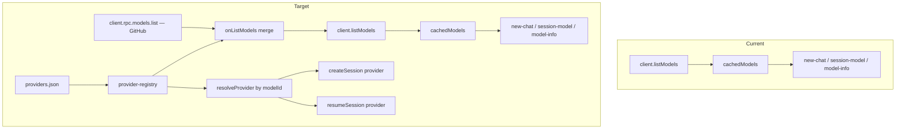

# Spec: BYOK Multi-Provider Support

**Status:** draft · **Depends on:** `docs/multi-provider.md` (research) · **SDK:** `@github/copilot-sdk@1.0.0-beta.7`

## Goal

Let a Caco user run sessions on non-GitHub model providers (OpenAI, Anthropic, Azure, Ollama, OpenRouter) **alongside** GitHub Copilot models, using the SDK's native BYOK (`provider` field). GitHub and BYOK models appear in one aggregated picker; each session is bound to exactly one provider.

Non-goal: switching a *live* session across providers (SDK can't — see [Constraints](#hard-constraints)). Non-goal: a homegrown LLM abstraction layer (unnecessary — SDK already abstracts the provider).

## Hard constraints (verified in SDK source)

These shape the entire design. All verified against `node_modules/@github/copilot-sdk/dist/`.

| Constraint | Evidence | Consequence |
|---|---|---|
| `provider` is **per-session**, set on `SessionConfigBase`. | `types.d.ts:1219` | One shared `CopilotClient` serves GitHub *and* BYOK sessions simultaneously. No second client needed. |
| `provider` binds at **create AND resume**. | `client.js:628` (`session.create`), `:754` (`session.resume`) — both pass `provider: config.provider`. | Resume must re-derive and re-pass the provider. It is not persisted by the runtime. |
| `setModel` → `model.switchTo({ modelId })` has **no provider param**. | `session.js:805`, `session.d.ts:262` | Cannot change provider on a live session. Cross-provider switch = tear down + recreate/resume with the new provider. |
| `onListModels` **replaces** the runtime list, not augments. | `types.d.ts:172` ("instead of"), `client.js:855` | To aggregate, our handler must itself fetch runtime models and merge. |
| Runtime models reachable via raw RPC `models.list`. | `rpc.js:11–19`, exposed as `client.rpc.models.list({})` → `ModelList`. | Our `onListModels` can fetch GitHub models even while overriding `listModels()`. No chicken-and-egg. |
| BYOK forces session telemetry off. | `types.d.ts:1225` | Acceptable; our own throughput accounting is independent. |
| Static credentials only (apiKey / static bearerToken). | `byok.md`, `types.d.ts:1421` | Keys read from env at session-create time. No OAuth/refresh. |

### Answering the open questions directly

- **Can one SDK client aggregate GitHub + BYOK?** Yes — but *aggregation is our code*, not an SDK feature. The client is provider-agnostic; `provider` is chosen per session. The aggregated *model list* is produced by our `onListModels` merging `client.rpc.models.list()` (GitHub) with config-derived BYOK models.
- **Will all three UIs show aggregated models?** Yes, automatically. `/session-model`, the model-info applet, and new-chat all read `sessionManager.getModels()` → `cachedModels` ← `client.listModels()`. One merge point feeds all three. (Confirmed: `routes/api.ts:39,46`, `routes/sessions.ts:105,147`.)
- **Where does `ProviderConfig` come from?** Not from the SDK, and not from any Copilot CLI file. **It is a Caco invention.** Caco owns and parses a new file `~/.caco/providers.json`; nothing else reads it. The SDK only *consumes* the `ProviderConfig` object Caco constructs and passes to `createSession`. GitHub models + metadata come from the runtime (`rpc.models.list`); BYOK models + their `provider` configs come from our file. API keys come from env vars *named* in the file (never inlined, never persisted in session meta).

## Model flow (current → target)



## Config: `~/.caco/providers.json`

This is a **Caco-owned** file (it lives under `~/.caco/`, alongside `memory.json`, `prompts/`, `schedule/`). It is *not* a Copilot CLI convention — the CLI/SDK never reads it. Contrast with `~/.copilot/mcp-config.json`, which lives under `~/.copilot/` precisely because the CLI shares it; our provider file is shared with nothing, so it belongs in Caco's own directory.

```jsonc
{
  "providers": {
    "openrouter": {
      "type": "openai",
      "baseUrl": "https://openrouter.ai/api/v1",
      "apiKeyEnv": "OPENROUTER_API_KEY",     // env var NAME, not the key
      "models": [
        { "id": "anthropic/claude-opus-4", "name": "Claude Opus 4",
          "agentModel": "claude-sonnet-4.6",  // optional: Copilot-known model for agent config
          "contextWindow": 200000,
          "inputPerMtok": 5, "outputPerMtok": 25, "cachePerMtok": 0.5 }
      ]
    },
    "azure-proxy": {
      "type": "openai",
      "baseUrl": "https://my-proxy.example.com/v1",
      "bearerTokenEnv": "MY_PROXY_TOKEN",     // alternative to apiKeyEnv; sets Authorization directly
      "headersEnv": { "X-Org": "MY_ORG_HEADER" }, // optional: header name → env var holding its value
      "models": [ { "id": "gpt-4o", "name": "GPT-4o (proxy)", "contextWindow": 128000 } ]
    },
    "ollama": {
      "type": "openai",
      "baseUrl": "http://localhost:11434/v1",
      "models": [ { "id": "qwen2.5-coder:32b", "name": "Qwen2.5 Coder 32B", "contextWindow": 32768 } ]
    }
  }
}
```

- **Credentials are env-var *names*, never inline secrets.** Exactly one of `apiKeyEnv` / `bearerTokenEnv` per provider (bearer takes precedence per `types.d.ts:1421`); both optional for local providers (Ollama). `headersEnv` maps a header name to the env var holding its value — for proxies needing static headers.
- **Env lifecycle caveat:** Caco is long-running and reads `process.env` at session-create time. Changing a shell env var after the server started will not affect already-running Caco — the var must be set in the server's environment (documented in README).
- `models[]` carries display + cost metadata BYOK providers can't self-report (the model-info applet and cost UI need `inputPerMtok` etc.). `agentModel` is optional (defaults to `DEFAULT_AGENT_MODEL`).
- Absent file → behavior identical to today (GitHub-only).

## Namespacing & the id→SDK mapping (critical)

BYOK model ids are namespaced as `<providerId>:<wireModel>`, e.g. `openrouter:anthropic/claude-opus-4`. `providerId` is a config key and **must not contain `:`** (validated at load); the split is on the *first* `:` so OpenRouter suffixes like `anthropic/x:free` survive in the `wireModel` part. GitHub models keep bare ids (`claude-sonnet-4.6`).

There are **four distinct id slots** and the spec must keep them straight — the SDK's `provider.wireModel` falls back to `provider.modelId` then to `SessionConfig.model` (`types.d.ts:1445-1457`), so passing the namespaced Caco id straight through as the SDK `model` would send a garbage wire model. The mapping:

| Slot | GitHub model | BYOK model | Source |
|---|---|---|---|
| **Caco id** (persisted in session meta, shown in UI, `lastModel`) | `claude-sonnet-4.6` | `openrouter:anthropic/claude-opus-4` | our id |
| **SDK `SessionConfig.model`** | `claude-sonnet-4.6` | `modelId` of the registry entry (a *Copilot-known* model used only for agent config: tools/prompts/limits) — e.g. `claude-sonnet-4.6`, configurable per BYOK model via an optional `agentModel` field; defaults to a sane known model. | registry |
| **`provider.modelId`** | — (no provider) | same as the SDK `model` above | registry |
| **`provider.wireModel`** (name actually sent to the provider API) | — | the part after the first `:` → `anthropic/claude-opus-4` | parsed from Caco id |

So `resolveModel(cacoId)` returns `{ sdkModel, provider? }` where for BYOK: `sdkModel = entry.agentModel ?? DEFAULT_AGENT_MODEL`, `provider = { ...profile, modelId: sdkModel, wireModel: <after-colon> }`. For GitHub: `{ sdkModel: cacoId }`, no provider. This single resolver is used by create, resume, and switch — one owner, no divergence.

The prefix makes resume self-sufficient: the persisted `model` encodes its provider, so resume re-derives `provider` + `wireModel` with no extra stored state.

## UX

- **new-chat picker:** BYOK models listed alongside GitHub, grouped under a provider sub-header ("OpenRouter", "Ollama"). Same cost/context-window rendering already shipped — fed by the `models[]` metadata. Selecting one stores the namespaced id as `lastModel`.
- **/session-model:** lists the same aggregated set. **Selecting a model in a different provider than the current session triggers recreate-with-provider** (see below), not a bare `switchTo`. Within the same provider, normal `switchTo`.
- **model-info applet:** already reads `/api/models/raw` → shows BYOK rows with their metadata. A small "provider" line is added.
- **No keys configured / bad key:** the model still lists; session-create fails with a clear toast ("OPENROUTER_API_KEY not set"). Validation is create-time, not list-time.

## Cross-provider switch (the one non-trivial flow)

`setModel` cannot cross providers. When `/session-model` selects a model whose provider differs from the live session's:

1. Detect mismatch (`resolveModel(new).providerId !== session.providerId`).
2. Tear down the active SDK session via Caco's existing disconnect path (`session-manager.ts:642-655`), keeping the Caco session id + history on disk.
3. `resumeSession(id, { model: sdkModel, provider, ... })` with the **resolved SDK model AND provider** (both required — resume currently passes neither). The runtime replays history under the new provider/model.
4. Update session meta `model` to the new namespaced Caco id (only after a successful resume).

Same-provider switches keep the fast `setModel(model, options)` path, preserving the `reasoningEffort`/`modelCapabilities` options the SDK accepts (`session.d.ts:262`) — for a cross-provider recreate, reasoning options reset to the new model's default. Persist `providerId` on the active-session record so the mismatch check is O(1).

## Code changes (ownership)

| File | Change |
|---|---|
| `src/provider-registry.ts` *(new)* | Single owner of `~/.caco/providers.json`. Loads/validates it (rejects `providerId` containing `:`); exposes `hasProviders(): boolean` (gates handler attachment), `listByokModels(): SDKModelInfo[]`, `resolveModel(cacoId): { sdkModel, providerId?, provider?: ProviderConfig } \| null`, and resolves `apiKeyEnv`/`bearerTokenEnv`/`headersEnv` from `process.env` at create time. Follows the load-and-validate *code pattern* of `mcp-config-loader.ts`, but reads from `~/.caco/`, not `~/.copilot/`. |
| `src/session-manager.ts` | (a) **Conditionally** pass `onListModels` to `new CopilotClient` (`:217`) — **only when `providerRegistry.hasProviders()` is true.** With no/empty/broken config the handler is never attached, so the client uses the SDK's native `models.list` path unchanged (see [Graceful degradation](#graceful-degradation)). When attached, the handler **closes over `this`**, calls `this.sharedClient.rpc.models.list({})` (NOT `listModels()` — would recurse) for GitHub models, **replicates the SDK's capability-normalization** (the SDK skips its own `:863-877` defaulting when `onListModels` is set — without this, BYOK/GitHub models may lack `capabilities.limits.max_context_window_tokens`), then concatenates `providerRegistry.listByokModels()` inside a try/catch so a registry fault returns GitHub-only + logs. (b) Resolve `{ sdkModel, provider }` via the shared resolver; pass `model: sdkModel` + `provider` at `createSession` (`:420`) and add **both** `model: sdkModel` and `provider` to `resumeArgs` (`:528`) — resume currently omits `model` entirely (`:528-537`), which R3/R4 require. (c) Track `providerId` per active session; `setSessionModel` branches to recreate-on-mismatch. (d) Extend the `rpc` interface type with `models: { list }`. |
| `src/model-billing.ts` | `modelCostSummary` already handles missing billing; ensure BYOK `models[]` metadata maps through `SDKModelInfo` shape (synthesize a `billing`-like or pass `*PerMtok` directly). |
| `src/routes/sessions.ts:484` | `/session-model` handler tolerates the recreate path (already async). |
| `public/ts/model-selector.ts` | Group rows by provider sub-header; already renders context/cost. |
| Docs | Update `docs/multi-provider.md` cross-link; document `providers.json` in README/API. |

No tool-layer changes: `defineTool`, streaming, events, surfaces, MCP all work unchanged under BYOK (the runtime emits the same events regardless of provider).

## Graceful degradation

The overriding constraint: **a user with no BYOK config (the default, and the only state that can't be tested before merge) must see byte-for-byte identical behavior to today.** Guaranteed by design, not by hope:

| State | What happens | Guarantee |
|---|---|---|
| **No `~/.caco/providers.json`** (default) | `providerRegistry.hasProviders()` → false → `onListModels` is **never attached** to `CopilotClient`. The client takes its native `models.list` path (`client.js:856-878`), including the SDK's own capability normalization. No Caco code runs in the model-listing path. | **Provably unchanged.** The only new code that executes is a single `existsSync` check at client construction. |
| **File exists but malformed / not JSON** | Registry load wraps parse in try/catch, logs a warning, reports zero providers → identical to no-config (handler not attached). | GitHub-only continues. |
| **File valid, ≥1 provider** | Handler attached. It fetches GitHub via `rpc.models.list`, normalizes capabilities, then appends BYOK models inside a try/catch. If the registry call throws → GitHub-only + log. If the GitHub RPC throws → same as today: `_fetchModels` already catches and sets `cachedModels=[]` (`:349-353`); UIs fall back to `FALLBACK_MODELS` (`model-selector.ts:14`). | GitHub models never depend on BYOK code succeeding. |
| **Provider configured but its env key unset** | Does **not** affect listing (keys are read only at session-create). The BYOK model still lists; starting it fails fast with a toast naming the missing var. | GitHub sessions unaffected; failure is isolated to the one BYOK model. |
| **Config added while server running** | Model list is cached per client lifetime (`modelsCache`); new providers appear after a model-cache refresh or server restart (same lifecycle as `mcp-config.json`). Documented, not a regression. | No crash; no effect on running sessions. |

Net: the feature is **additive and isolated.** Every failure mode of the BYOK layer collapses to "GitHub-only, as today." R1 can ship and sit dormant with zero observable change until a user opts in by writing the config file.

## Risks & mitigations

| Risk | Mitigation |
|---|---|
| `assistant.usage` shape differs per provider → throughput numbers wrong. | Verify against OpenAI-compat + Anthropic live; add a per-provider normalizer in `dispatch-events.ts` if fields differ. Cost-estimate degrades gracefully (hidden) when metadata absent. |
| `onListModels` makes `listModels()` fail if registry throws → kills the *whole* model list incl. GitHub. | Two layers: (1) handler attached only when `hasProviders()` — no-config users never run it; (2) when attached, registry call is inside try/catch → returns GitHub-only on fault. Registry errors never block GitHub. |
| Key leakage. | Only env-var *names* (`apiKeyEnv`/`bearerTokenEnv`/`headersEnv`) in the file; resolved from env at create; never written to session meta or logs. |
| Tool-calling unreliable on some OpenRouter upstreams. | Document `:exacto` / `require_parameters`; out of scope for v1, achievable later via `provider.headers`/extra body. |
| Cross-provider switch mid-conversation replays history under a model that may reject it (context/format). | Surface resume errors via existing auto-repair + toast; switch is explicit user action. |
| Runtime `models.list` latency added to every cold model fetch. | Already cached (`modelsCache`, `client.js:850`); merge happens once per client lifetime. |

## Divisibility (suggested order)

1. **R1 — Registry + aggregated listing (read-only).** `provider-registry.ts`, `onListModels` merge, UI grouping. Outcome: BYOK models *appear* everywhere; creating one still uses GitHub (no provider passed yet). Safe, observable, no behavior change for existing users.
2. **R2 — Create with provider.** Thread `provider` into `createSession`; new-chat can start a BYOK session. Throughput/cost verified.
3. **R3 — Resume with provider.** Re-derive provider on resume from namespaced id. BYOK sessions survive restart.
4. **R4 — Cross-provider switch in /session-model.** Recreate-on-mismatch. Most complex; ships last.

Each requirement is independently testable and leaves the system shippable.

## Edge cases

- Namespaced id whose provider was removed from config → `resolveModel` returns null → treated as unknown model; session-create fails with clear message; listing omits it. **Active session whose provider was removed, on resume** → resume fails fast with "provider 'X' no longer configured"; surfaced via existing auto-repair + toast.
- Same model id offered by two providers → distinct namespaced ids, no collision.
- `providerId` containing `:` → rejected at config load (would break the split); logged, that provider skipped.
- Env var (`apiKeyEnv`/`bearerTokenEnv`/`headersEnv` target) unset at create → fail fast naming the missing var. Note env-lifecycle: must be set in the *server's* environment, not a post-start shell.
- `providers.json` malformed → ignored with a logged warning; GitHub-only continues. Malformed single `models[]` entry → that entry skipped, rest of provider kept.
- Ollama/local with no key → both `apiKeyEnv` and `bearerTokenEnv` omitted (valid per SDK).
- Duplicate of a GitHub model id under a provider → still distinct (prefix differs); UI shows both.

## Open verification (do during R2)

- Confirm `assistant.usage` is emitted (and field names) for an OpenAI-compat provider and for Anthropic `type: "anthropic"`.
- Confirm `client.rpc.models.list({})` works before any session exists (cold) — it should; it's a client-level RPC.
