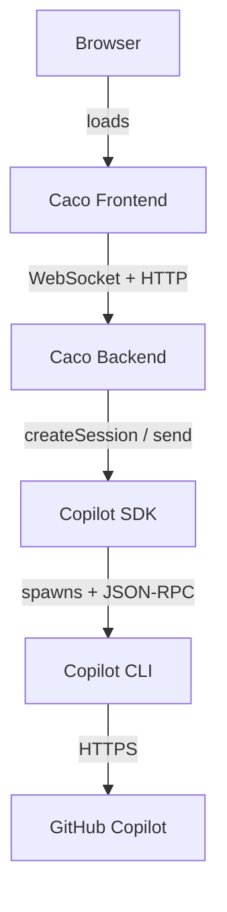

# Caco Architecture Diagrams

## Component Relationships

```mermaid
%%{init: {"theme": "default", "themeVariables": {"fontSize": "14px", "nodePadding": 40}}}%%
graph TD
    Browser["Browser"]
    FE["Caco Frontend"]
    BE["Caco Backend"]
    SDK["Copilot SDK"]
    CLI["Copilot CLI"]
    AI["GitHub Copilot"]

    Browser -- "loads" --> FE
    FE -- "WebSocket + HTTP" --> BE
    BE -- "createSession / send" --> SDK
    SDK -- "spawns + JSON-RPC" --> CLI
    CLI -- "HTTPS" --> AI
```
