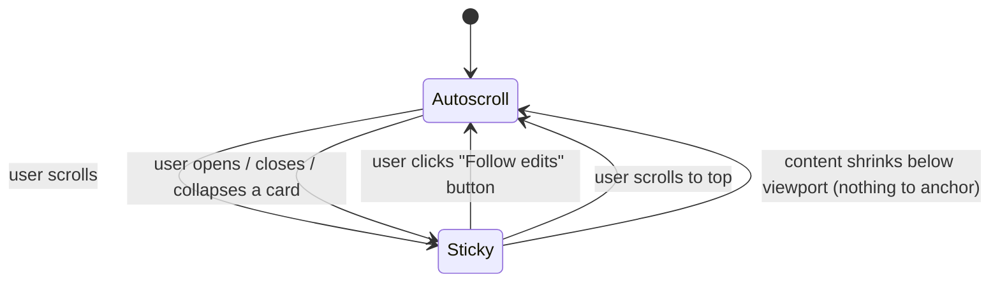

# File Edits V2

V2 builds on the shipped v1 applet (`applets/file-edits/`,
`src/git-edit-poller.ts`, `src/routes/file-edits.ts`). V1 spec:
`docs/file-edits.md`.

V2 is **display fidelity only.** No new sources, no commit/stage/push,
no fsmonitor. The git poller stays exactly as-is for V2.

## Goal

Replace v1's raw `git diff -u` hunk view with a text-editor-quality
diff card: see the entire file, with changed regions visually
distinct, while the polling loop keeps scrolling out from under your
feet under control.

## Scope (locked)

Four items from the original V2 list. Side-by-side dropped per operator.

| # | Item | Phase |
| - | ---- | ----- |
| 1 | Full-file textviewer diff | 1 (foundational — others depend on it) |
| 2 | Per-language syntax highlighting | folded into Phase 1 |
| 3 | Word-level intra-line diff | 2 (depends on stable line model from Phase 1) |
| 4 | Sticky auto-scroll | 3 (last; lets us tune against real diff sizes) |

Phase ordering rationale: full-file establishes a stable per-line DOM
model. Word-level diff needs that line model (and stable line nodes)
to attach mark spans. Sticky auto-scroll needs both the full-file
heights and the word-level mutation patterns to design anchoring
correctly.

## Non-Goals (V2)

Explicitly out of scope; deferred to V3:

- Stage / unstage / commit / push (git-status replacement).
- Commit-lease enforcement.
- `git fsmonitor` integration.
- Server-side per-path hashing / mtime gating.
- Side-by-side / split-pane.
- Multi-source signals beyond git.
- Keyboard navigation, filter bar, file tree sidebar, jump-to-editor.
- Image / binary previews beyond v1's "(binary)" badge.

## Use Cases

1. **Read a small change in context.** I want to see `function foo()`
   five lines above the change so I know what `this` refers to. v1
   shows only the hunk; v2 shows the whole function with the change
   highlighted.
2. **Read a typo-fix word-level.** A long renamed identifier shouldn't
   light up the whole line red+green; only the changed word should.
3. **Read while the agent works.** I'm reviewing line 80 of file A; the
   agent edits line 200 of file A and line 5 of file B; my viewport
   must not jump. When I'm ready, one obvious click puts me back at
   the freshest edit.

---

# Phase 1 — Full-file diff view

## What you see

Each card's body changes from "raw `git diff` hunks" to "the full
working-tree file content, with line-level coloring":

- **Unchanged** lines: rendered in muted text color, no background.
- **Added** lines: green background, full file context above and
  below.
- **Removed** lines: red background, shown inline at the position
  they used to occupy (line numbers from HEAD).
- **Gutter:** two columns of line numbers — HEAD line number (or
  blank for added) and working-tree line number (or blank for
  removed).
- **Header:** unchanged from v1 (chevron, status pill, path, time,
  X). Add a small "viewing N changed regions" indicator next to the
  path.
- **Long unchanged runs:** collapsed by default to a single
  "… (N unchanged lines) …" row, click to expand. Default expansion
  threshold: collapse any run of >20 unchanged lines into a fold.
  Configurable per-card via header toggle.

## Syntax highlighting (folded in)

- highlight.js is already vendored.
- Detect language from file extension (`detectByExt`); fallback: no
  highlighting, just the diff coloring.
- Highlight runs **per logical line**, not on a giant concatenated
  string. Each line span keeps its line-level (`fe-d-add` /
  `fe-d-del` / `fe-d-ctx`) class and gets a child
  `<code class="hljs language-…">` whose inner spans are the
  hljs tokens.
- Adds bytes: highlight.js core + ~6 common languages
  (ts/js/py/sh/json/md/css/html). Lazy-load via a separate
  bundle the applet pulls on first card render so the empty
  applet stays cheap.

## Data path

V1 server endpoints unchanged (`/snapshot`, `/refresh`, `caco.edit`
events). V2 enriches the per-edit payload:

```ts
type FileEdit = {
  relativePath: string;
  status: 'modified' | 'untracked' | 'deleted' | 'renamed' | 'clean';
  renamedFrom?: string;
  timestamp: string;
  isBinary: boolean;
  truncated?: { hiddenLines: number };
  // V1:
  diff: string;                  // raw `git diff` output; kept for fallback
  // V2 additions:
  fullFile?: {
    headLines: string[] | null;  // HEAD blob lines (null for untracked)
    workLines: string[];         // working-tree file lines
    hunks: Array<{               // parsed from `git diff -U0` or unified
      headStart: number;
      headLen: number;
      workStart: number;
      workLen: number;
    }>;
  };
};
```

The full-file payload is computed on the server next to the existing
`git diff` call:

- `git show HEAD:<path>` for HEAD blob.
- File-system read for working-tree (already touched by the watcher).
- Parse diff hunks to compute `headStart/headLen/workStart/workLen`
  (already half-implicit in the unified diff; just record them
  alongside).
- Skip `fullFile` for binary, deleted (working tree absent), and
  files exceeding a size cap (default: 5000 lines). Fall back to v1
  hunk render in those cases.

Bandwidth concern: a 1000-line file shipped as JSON is ~30-100 KB.
Multiply by N changed files: bounded by the existing 50-card cap and
the 5000-line per-file cap. Compress at the HTTP level (already gzip
in Express). Per-card lazy-fetch (load full-file only on card expand)
is the escape hatch if real-world payloads bite.

**Decision:** ship eager (full payload in `caco.edit`) for V2; switch
to lazy on-expand if payloads exceed 256 KB per poll in practice.

## Render

Client-side, per card:

1. Render gutter + line rows in a virtualized container *(skip
   virtualization for V2 — measure first; with 5000-line cap, naive
   render is probably fine. Add virtualization only if profiling shows
   need.)*
2. Apply hljs to each line span individually, **after** assigning
   the line-level diff class so the line-level color shows through
   any token background that isn't set.
3. Folds for unchanged runs: a single clickable row inserted
   between the last unchanged-line-before and the first unchanged-line
   inside the fold; rendering on click replaces the row with the
   collapsed lines.

## Phase 1 acceptance

- A 200-line file with 3 small changes renders the full file; the
  3 changes are visible without scrolling within the card.
- Long unchanged runs are folded by default.
- Token highlighting visible for at least .ts, .js, .py, .sh, .md.
- Binary, deleted, and files >5000 lines fall back to v1 hunk view
  with a small "fallback: hunk view" note in the card header.
- Performance: render of one 1000-line card stays under 50ms on
  Caco's dev machine.

---

# Phase 2 — Word-level intra-line diff

## What you see

For each adjacent `(-, +)` line pair within a hunk, the unchanged
prefix/suffix tokens stay base-colored. Only the changed tokens get
a `<mark>` background:

- Inside `-` lines: removed tokens get a darker red highlight.
- Inside `+` lines: added tokens get a darker green highlight.
- Lines that aren't part of a pair (a `-` with no `+` after it, or
  vice versa) stay fully red/green at the line level, no mark
  spans (no "before" to diff against).

## Algorithm

- Group consecutive `-`/`+` lines into change blocks.
- For each block, pair lines in order. (`N` removed + `M` added`:
  pair 1↔1, 2↔2, … `min(N,M)` pairs.)
- For each pair, tokenize on word boundaries (`/\b/`) keeping
  punctuation and whitespace as separate tokens. Use Myers diff
  on the token streams (or `diff-match-patch`'s word mode).
- Emit each unchanged token as a plain text node; emit each
  removed/added token wrapped in `<mark class="fe-w-del">` /
  `<mark class="fe-w-add">`.

## Interaction with syntax highlighting

Word marks live **inside** highlighted line content. Either:

(a) Highlight first → walk the resulting DOM and inject `<mark>`
    spans, taking care to split text nodes at token boundaries
    while preserving the parent hljs spans.
(b) Run diff first on raw text → highlight afterward, on the
    text-content with marks recorded as char ranges, then re-apply
    marks via offsets.

**Pick (a):** highlight.js produces a stable, simple span tree;
walking it with a text-offset cursor and splitting at word
boundaries is well-understood. (b) requires re-running hljs on
fragments and re-mapping offsets, which is fragile.

## Library

Use `diff-match-patch` (small, MIT) for the word-level diff. It's
~16KB minified. Lazy-load with the full-file payload.

## Phase 2 acceptance

- A typo fix in a 60-character line highlights only the corrected
  word; the rest of the line stays neutral.
- A line replaced wholesale (no shared tokens) marks the entire
  line, no degenerate empty `<mark>` spans.
- A `-` with no paired `+` (pure deletion) stays solid-red, no
  word marks (correct — nothing to compare to).
- Syntax highlighting still visible underneath word marks.

---

# Phase 3 — Sticky auto-scroll

This is the most state-heavy phase. The single goal: **the user's
reading position is never disturbed**, and re-engaging with new
edits is always one obvious click away.

## State machine

Two states, exhaustive:



- **Autoscroll** is the default on applet open and after session
  switch. Newest edit pinned at the top of the visible area.
- **Sticky** is "the user is reading." All scroll-position
  manipulation by the applet is suppressed; content grows are
  anchored so the user's visible content does not move.

### Sticky enters when

- User performs any non-trivial scroll on `#feStream` (i.e. wheel,
  touch drag, scroll-bar grab, page keys, arrow keys in the stream).
- User clicks chevron / header to **collapse** a card.
- User clicks chevron / header to **expand** a card.
- User opens (creates) a card via interaction (not applicable in v2
  — v1 has no "open a closed card" gesture; future-proofing only).
- User clicks the X to dismiss a card.

Note: a scroll generated programmatically by the applet itself must
NOT enter Sticky. Implementation: set a `programmaticScroll = true`
flag around any `scrollTop` write and ignore the next `scroll` event.

### Autoscroll enters when

- User clicks the **"Follow edits"** button (the only explicit way
  back). The button is always visible while in Sticky mode.
- User has scrolled to (or very near) the top — `scrollTop < 4`.
  Mirror common chat UX: scrolling all the way back means "I'm
  caught up, follow new edits."
- The stream's `scrollHeight <= clientHeight` (content no longer
  scrollable — nothing to be sticky about).
- Session switch (applet resets all state).

## Autoscroll behavior

When in Autoscroll mode and edits arrive:

- If the changed card is **fully visible** in the viewport: do
  nothing. (No flicker, no unnecessary scroll.)
- Else: scroll so the **top of the changed card** sits at the
  top of the visible area (best effort; if the card is taller
  than the viewport, the top of the diff is what we anchor on).
- If multiple cards change in one poll: scroll to the topmost
  affected card (or, equivalently, the freshest by timestamp at
  the top of the stream).

Always use `behavior: 'smooth'` for autoscroll moves; users tolerate
motion they initiated, jarring jumps look like a bug.

## Sticky behavior

When in Sticky mode and edits arrive: **the visible content does
not move.**

Two concurrent forces try to move it:

1. **New cards inserted above the current scrollTop** push everything
   down.
2. **Diff content grows inside a card above the current scrollTop**
   pushes everything below it down.

### Solution baseline: `overflow-anchor: auto` (CSS)

Modern browsers (Chrome / Edge / Firefox / Safari 18+) support
`overflow-anchor: auto` on scroll containers. When content is
inserted above the viewport, the browser picks an anchor element
near the viewport top and adjusts `scrollTop` so the anchor stays
visually fixed. This handles **both** force #1 and #2 for free,
as long as:

- The scroll container has `overflow-anchor: auto` (default true,
  but be explicit).
- Anchor candidates aren't disabled via `overflow-anchor: none`
  on children (don't set it).

This is the V2 baseline. Test on Safari early — set a minimum
version requirement and document fallback.

### JS fallback / cases the browser anchoring misses

Browser anchoring misses:

- **Card reorder** (existing card moves position in the DOM —
  v1 does this when an existing card gets a new edit, moving it
  to the top). The browser sees a remove + insert, may pick a
  different anchor.
- **Card removal above viewport** (user dismissed off-screen).
- **Card body collapse / expand by another tab / process** — not
  applicable in V2, all collapses are user gestures (which already
  enter Sticky and ARE allowed to move things).

Fallback strategy: an "anchor save / restore" wrapper around any
mutation we know will change layout above the viewport:

```ts
function withAnchor(fn) {
  if (state !== 'sticky') { fn(); return; }
  const stream = streamEl;
  const anchor = pickAnchor(stream);             // first card whose top >= scrollTop
  const beforeTop = anchor ? anchor.getBoundingClientRect().top : 0;
  programmaticScroll = true;
  fn();                                          // mutate DOM
  const afterTop = anchor && document.contains(anchor)
    ? anchor.getBoundingClientRect().top
    : null;
  if (afterTop !== null && afterTop !== beforeTop) {
    stream.scrollTop += (afterTop - beforeTop);
  }
  programmaticScroll = false;
}
```

This runs inside a single rAF so layout is read/written atomically.

### Newest-on-top vs newest-at-bottom

Operator offered the alternative "new files always at bottom (simpler)."

Recommendation: **keep newest-on-top in Autoscroll, append-at-bottom
in Sticky.** Specifically:

- In Autoscroll: a new card prepends to the stream (v1 behavior).
- In Sticky: a new card appends to the stream's end. The user's view
  is unaffected (the new card is below them, off-screen). On exit
  Sticky, the stream is re-sorted by recency (timestamp desc) and
  Autoscroll scrolls to the freshest.

This dodges the most violent reorder case (a new card pushing
everything down) without requiring the anchor logic to be perfect
for that case. It does mean stream order is non-monotonic during
Sticky — acceptable because the user isn't looking for "what's
newest" while reading.

### Existing card receives an update

In Sticky: do not move the card. Just re-render its body in place.
The browser's overflow-anchor handles vertical compensation if the
diff grew above the viewport. (JS fallback above handles edge cases.)

In Autoscroll: same v1 behavior — move card to top, render diff,
scroll to top.

### Card body collapse / expand by user

This is a user gesture, so:

1. Enter Sticky if not already.
2. Capture the card itself as anchor; preserve its top-of-viewport
   offset across the collapse/expand mutation.
3. If the card was the only thing keeping content scrollable and
   collapse makes content fit the viewport, exit Sticky (no scroll
   anymore).

### Smooth transitions

For diff body growth (in-place re-render that changes height): apply
a CSS height transition on the body so the height change animates
over ~150ms. Browser anchoring tracks the animation frame-by-frame
and the user perceives a smooth slide rather than a jump.

Tradeoff: animation has cost; if a card grows by 800 lines all at
once, 150ms transition is noticeable but not bad. Set transition
duration to scale with delta size, capped at 200ms.

### Race: user scroll arrives concurrent with poll

Sequence: poll mutation starts → user begins wheel → mutation
finishes → wheel event fires → our `programmaticScroll` flag is
already cleared.

This is fine: the wheel event correctly enters Sticky and
captures the anchor based on the post-mutation scrollTop, which
is what the user is currently looking at.

The dangerous race is the reverse: user wheel → poll mutation
overwrites scrollTop. Prevented by `withAnchor` only setting
`scrollTop` if we're already in Sticky and the anchor moved.

### Edge: empty stream

If the stream has zero cards (cap = 0 or all dismissed), state
forces Autoscroll and the Follow button is hidden.

## "Follow edits" button

- Floating button anchored to bottom-right of `#feStream`
  container (position: sticky inside the scroll container, or
  position: fixed inside the applet root with right + bottom
  offsets).
- Visible only in Sticky mode.
- Label: `↓ Follow edits` (icon + text). If new edits arrived
  while in Sticky, add a count badge: `↓ 3 new edits`. Counter
  resets on click.
- Click: exit Sticky → re-sort stream (newest first) → smooth-scroll
  to top of newest card.
- Optional keyboard shortcut: `End` while focus is in the stream
  triggers the same. Deferred to V3 keyboard nav.

## Phase 3 acceptance

- Scroll to mid-stream → poll arrives with edit to a visible card →
  scrollTop does not change.
- Scroll to mid-stream → poll arrives with edit to a card above the
  viewport → the visible content does not move (overflow-anchor or
  fallback compensates).
- Scroll to mid-stream → new file edited → in Sticky, appears at
  bottom of stream; visible content does not move.
- Click chevron to collapse a visible card → the card collapses
  in place; surrounding content does not jump.
- Sticky mode active → "Follow edits" button is visible with count
  of edits since entering Sticky.
- Click "Follow edits" → smooth-scroll to top of newest card; button
  hides.
- Scroll back to top in Sticky → exits Sticky automatically.
- Session switch resets to Autoscroll.

## Phase 3 risks

- **Browser anchoring inconsistency.** Safari support history is
  rough. Mitigation: ship feature-detection (Element-level
  `overflowAnchor in HTMLElement.prototype.style`), fall back to
  JS-only for Safari <18. Add operator-visible warning on first
  use if fallback is engaged.
- **rAF scheduling vs polling.** If three polls arrive in one frame
  we coalesce them; if they arrive across frames we anchor-restore
  each time. Verify no visible flicker via screenshot test.
- **Smooth scroll on small viewports.** Mobile / narrow panel: skip
  smooth-scroll if `clientHeight < 400` (jump is shorter than the
  animation cost would justify).

---

## Cross-phase risks

- **Payload size regression.** Full-file content blown into every
  `caco.edit` event could 10x bandwidth. Mitigation: monitor in
  Phase 1; switch to lazy-on-expand if real numbers bite.
- **Card render time.** A 5000-line file with hljs and word marks
  could push render past 100ms and stutter. Mitigation: 5000-line
  cap, only render body when card is expanded (already v1 behavior),
  per-card render benchmark added to tests.
- **State sync between Sticky/Autoscroll and DOM.** Concretely: card
  reorder during Autoscroll → Sticky transition could miss an
  anchor. Mitigation: state transitions go through a single function
  that always captures an anchor before mutating.

## Acceptance for V2 overall

- All three phases' acceptance criteria pass.
- V1 fallback behavior still available (raw hunk view) for the
  fallback cases listed in Phase 1.
- No regressions in v1 polling cadence or `caco.edit` event shape
  (`fullFile` is purely additive).
- Code review passes (one BLOCKER threshold, like v1).

## Open questions

1. Is `diff-match-patch` license / size acceptable, or should we
   write a 100-line Myers token diff ourselves? (Lean toward
   writing our own — fewer deps.)
2. Eager full-file payload vs lazy on-expand: pick a payload
   threshold (proposed: 256 KB per poll).
3. Should `overflow-anchor` fallback emit a console warning, a
   toast, or stay silent? Proposed: console.warn, no UI.
4. Auto-exit Sticky on scroll-to-top: pixel threshold (4? 10?
   20?). Mirror chat applet's value — TBD; check
   `public/ts/ui-utils.ts`.
5. Append-at-bottom-in-Sticky behavior — operator confirm before
   Phase 3 implementation; this is a visible UX change from v1.

## Document layout

- `docs/file-edits.md` — V1 spec, untouched.
- `docs/file-edits-v2.md` — this doc.
- `docs/file-edits-review.md` — V1 review log; V2 review appended
  with a separator.
