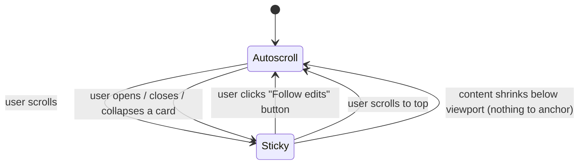

# File Edits V2

V2 builds on the shipped v1 applet (`applets/file-edits/`,
`src/git-edit-poller.ts`, `src/routes/file-edits.ts`). V1 spec:
`docs/file-edits.md`.

V2 is **display fidelity only.** No new sources, no commit/stage/push,
no fsmonitor. The git poller stays exactly as-is for V2.

## Goal

Replace v1's raw `git diff -u` hunk view with a text-editor-quality
diff card: see the entire file, with changed regions visually
distinct, while the polling loop keeps scrolling out from under your
feet under control.

## Scope (locked)

Four items from the original V2 list. Side-by-side dropped per operator.

| # | Item | Phase |
| - | ---- | ----- |
| 1 | Full-file textviewer diff | 1 (foundational — others depend on it) |
| 2 | Per-language syntax highlighting | folded into Phase 1 |
| 3 | Word-level intra-line diff | 2 (depends on stable line model from Phase 1) |
| 4 | Sticky auto-scroll | 3 (last; lets us tune against real diff sizes) |

Phase ordering rationale: full-file establishes a stable per-line DOM
model. Word-level diff needs that line model (and stable line nodes)
to attach mark spans. Sticky auto-scroll needs both the full-file
heights and the word-level mutation patterns to design anchoring
correctly.

## Non-Goals (V2)

Explicitly out of scope; deferred to V3:

- Stage / unstage / commit / push (git-status replacement).
- Commit-lease enforcement.
- `git fsmonitor` integration.
- Server-side per-path hashing / mtime gating.
- Side-by-side / split-pane.
- Multi-source signals beyond git.
- Keyboard navigation, filter bar, file tree sidebar, jump-to-editor.
- Image / binary previews beyond v1's "(binary)" badge.

## Use Cases

1. **Read a small change in context.** I want to see `function foo()`
   five lines above the change so I know what `this` refers to. v1
   shows only the hunk; v2 shows the whole function with the change
   highlighted.
2. **Read a typo-fix word-level.** A long renamed identifier shouldn't
   light up the whole line red+green; only the changed word should.
3. **Read while the agent works.** I'm reviewing line 80 of file A; the
   agent edits line 200 of file A and line 5 of file B; my viewport
   must not jump. When I'm ready, one obvious click puts me back at
   the freshest edit.

---

# Phase 1 — Full-file diff view

## What you see

Each card's body changes from "raw `git diff` hunks" to "the full
working-tree file content, with line-level coloring":

- **Unchanged** lines: rendered in muted text color, no background.
- **Added** lines: green background, full file context above and
  below.
- **Removed** lines: red background, shown inline at the position
  they used to occupy (line numbers from HEAD).
- **Gutter:** two columns of line numbers — HEAD line number (or
  blank for added) and working-tree line number (or blank for
  removed).
- **Header:** unchanged from v1 (chevron, status pill, path, time,
  X). Add a small "viewing N changed regions" indicator next to the
  path.
- **Long unchanged runs:** collapsed by default to a single
  "… (N unchanged lines) …" row, click to expand. Default expansion
  threshold: collapse any run of >20 unchanged lines into a fold.
  Configurable per-card via header toggle.

## Syntax highlighting (folded in)

- highlight.js is already vendored.
- Detect language from file extension (`detectByExt`); fallback: no
  highlighting, just the diff coloring.
- Highlight runs **per logical line**, not on a giant concatenated
  string. Each line span keeps its line-level (`fe-d-add` /
  `fe-d-del` / `fe-d-ctx`) class and gets a child
  `<code class="hljs language-…">` whose inner spans are the
  hljs tokens.
- Adds bytes: highlight.js core + ~6 common languages
  (ts/js/py/sh/json/md/css/html). Lazy-load via a separate
  bundle the applet pulls on first card render so the empty
  applet stays cheap.

## Data path

V1 server endpoints unchanged (`/snapshot`, `/refresh`, `caco.edit`
events). V2 enriches the per-edit payload:

```ts
type FileEdit = {
  relativePath: string;
  status: 'modified' | 'untracked' | 'deleted' | 'renamed' | 'clean';
  renamedFrom?: string;
  timestamp: string;
  isBinary: boolean;
  truncated?: { hiddenLines: number };
  // V1:
  diff: string;                  // raw `git diff` output; kept for fallback
  // V2 additions:
  fullFile?: {
    headLines: string[] | null;  // HEAD blob lines (null for untracked)
    workLines: string[];         // working-tree file lines
    hunks: Array<{               // parsed from `git diff -U0` or unified
      headStart: number;
      headLen: number;
      workStart: number;
      workLen: number;
    }>;
  };
};
```

The full-file payload is computed on the server next to the existing
`git diff` call:

- `git show HEAD:<path>` for HEAD blob.
- File-system read for working-tree (already touched by the watcher).
- Parse diff hunks to compute `headStart/headLen/workStart/workLen`
  (already half-implicit in the unified diff; just record them
  alongside).
- Skip `fullFile` for binary, deleted (working tree absent), and
  files exceeding a size cap (default: 5000 lines). Fall back to v1
  hunk render in those cases.

Bandwidth concern: a 1000-line file shipped as JSON is ~30-100 KB.
Multiply by N changed files: bounded by the existing 50-card cap and
the 5000-line per-file cap. Compress at the HTTP level (already gzip
in Express). Per-card lazy-fetch (load full-file only on card expand)
is the escape hatch if real-world payloads bite.

**Decision:** ship eager (full payload in `caco.edit`) for V2; switch
to lazy on-expand if payloads exceed 256 KB per poll in practice.

### Truncation harmonization

V1's `DIFF_LINE_CAP = 1000` (`src/git-edit-poller.ts:54`) is unchanged
in V2 for the raw `diff` field. V2 introduces a separate 5000-line cap
for `fullFile`. To avoid stale truncation UI:

- When `fullFile` is present on a card, the `truncated` field (which
  describes `diff`-string truncation) is **ignored** by the renderer.
  The "↘" header indicator only appears when the card is in
  fallback hunk-view mode.
- When `fullFile` is absent (fallback case), `truncated` behaves
  exactly as in V1.

This keeps the two caps independent without producing contradictory
indicators on the same card.

## Render

### Indexing convention

`headStart`, `workStart`, `headLen`, `workLen` are **1-indexed line
numbers** as they appear in unified diff `@@ -h,hlen +w,wlen @@`
headers. `headLines[0]` corresponds to HEAD line 1; a hunk with
`headStart = 1` starts at the first array element. A hunk header
`@@ -1,3 +5,2 @@` means: starting at HEAD line 1, 3 lines were
removed; at working-tree line 5, 2 lines were added.

A hunk with `headLen = 0` is a pure addition at HEAD position
`headStart` (insertion *before* that line); `workLen = 0` is a pure
deletion. Either field being 0 with the other non-zero is the standard
case for new/removed regions.

### Merge walk (client-side)

Single pass over hunks (already sorted by `headStart`), building an
ordered list of rows. Pseudocode:

```ts
type Row =
  | { kind: 'ctx',  head: number, work: number, text: string }
  | { kind: 'del',  head: number, work: null,   text: string }
  | { kind: 'add',  head: null,   work: number, text: string }
  | { kind: 'fold', count: number, headStart: number, workStart: number };

function buildRows(headLines, workLines, hunks) {
  const rows = [];
  let h = 1, w = 1; // 1-indexed cursors
  for (const hunk of hunks) {
    // Emit unchanged context between previous position and this hunk.
    while (h < hunk.headStart) {
      rows.push({ kind: 'ctx', head: h, work: w, text: headLines[h - 1] });
      h++; w++;
    }
    // Emit removed lines (from HEAD).
    for (let i = 0; i < hunk.headLen; i++) {
      rows.push({ kind: 'del', head: h, work: null, text: headLines[h - 1] });
      h++;
    }
    // Emit added lines (from working tree).
    for (let i = 0; i < hunk.workLen; i++) {
      rows.push({ kind: 'add', head: null, work: w, text: workLines[w - 1] });
      w++;
    }
  }
  // Emit unchanged tail.
  while (h <= headLines.length) {
    rows.push({ kind: 'ctx', head: h, work: w, text: headLines[h - 1] });
    h++; w++;
  }
  return rows;
}
```

After `buildRows`, a second pass collapses any run of >20 consecutive
`ctx` rows into a single `fold` row, preserving the rows before/after
so click-expand can restore them. Default threshold 20, configurable
per-card via header toggle.

### DOM structure per row

Each non-fold row is a single `<div class="fe-row fe-row-{kind}">`
containing exactly three children:

```html
<div class="fe-row fe-row-add">
  <span class="fe-gutter fe-gutter-head"></span>    <!-- empty for add -->
  <span class="fe-gutter fe-gutter-work">42</span>
  <code class="fe-line hljs language-typescript">…tokens…</code>
</div>
```

Gutter cells are fixed-width (text-align: right, font-mono, muted
color). Empty cells render as `&nbsp;` so column alignment is stable.
The `<code>` child receives the syntax-highlighted token spans; the
`fe-row-{kind}` class on the parent controls the line-level
background. Phase 2's word marks live inside the `<code>`.

**Long-line behavior.** Lines do not wrap. `.fe-line` uses
`white-space: pre`; lines wider than the pane scroll horizontally
within `.fe-diff` (the code column is `minmax(max-content, 1fr)`, so it
fills the pane for short files and grows past it for long lines). The
two gutter columns are fixed-width (`--fe-gutter-w`) and pinned
(`position: sticky; left`) with opaque backgrounds so line numbers
remain visible during horizontal scroll. This matches VS Code / GitHub
diff behavior and keeps every row exactly one line tall (which also
removes the sub-pixel row-height jitter that `pre-wrap` caused). See
`files-applet-diff-nowrap.md`.

Fold rows use a distinct structure with a chevron and a click handler:

```html
<div class="fe-row fe-row-fold" data-head-start="N" data-work-start="M" data-count="K">
  <span class="fe-gutter fe-gutter-head"></span>
  <span class="fe-gutter fe-gutter-work"></span>
  <button class="fe-fold-btn">… K unchanged lines …</button>
</div>
```

Clicking `fe-fold-btn` swaps the fold row for K rendered `ctx` rows
and inserts a small "collapse" affordance at the top of the
expanded region. Clicking the collapse re-folds the same span.

### Render pipeline (per card body)

Client-side, per card:

1. Run `buildRows` then fold collapse → ordered row list.
2. For each row, create the DOM structure above. The `<code>` text
   content is the raw line text initially.
3. If hljs is available, highlight each `<code>` element
   individually with the detected language. Per-line highlighting
   keeps the row-level diff color visible underneath token
   backgrounds and avoids cross-row token bleed.
4. *(Phase 2 adds: word-mark injection per add/del pair, between
    steps 2 and 3 — see Phase 2.)*

Virtualization is intentionally skipped for V2 (measure first; with
the 5000-line cap, naive render is probably fine). Revisit if a
single-card render exceeds 50ms in profiling.

## Fallback cases and rationale

`fullFile` is **skipped** (card falls back to v1 raw-hunk view) when:

- **Binary file** — `git diff` produces no line-by-line content; HEAD
  blob isn't text either.
- **File >5000 lines** — payload cost and render cost both become
  unbounded; the hunk view is honest about being a hunk view.
- **Deleted file** — *V2 design decision:* a deletion has `workLines = []`
  and complete `headLines`. The full-file view would show every HEAD
  line as a `del` row, which is the most informative view possible.
  However, V2 ships fallback here to keep Phase 1 small; deletions
  using the V1 hunk view remain readable, and a future minor revision
  can promote deleted files to full-file view once the renderer is
  proven. Documented gap; not a foundational design choice.
- **`headLines = null` (untracked)** — file has no HEAD blob;
  rendered as all-`add` rows with the HEAD gutter blank throughout.
  *This is a supported full-file case, not a fallback.*

The header shows a small "fallback: hunk view" note when in fallback
mode so the user knows why the view differs.

## "Changed regions" indicator

The header indicator `viewing N changed regions` uses `N = fullFile.hunks.length`
— the count of hunk entries returned by `git diff`. Adjacent
add/delete blocks within a single hunk count as one region.
Independent edits in different parts of the file are separate hunks
and count separately.

## Phase 1 acceptance

- A 200-line file with 3 small changes renders the full file; the
  3 changes are visible without scrolling within the card.
- Long unchanged runs are folded by default. Expanded folds show a
  "collapse" affordance and re-fold on click.
- Token highlighting visible for at least .ts, .js, .py, .sh, .md.
- An **untracked** file renders all lines as `add` rows, HEAD gutter
  column blank throughout, no `del` rows.
- A **modified** file with both adds and deletes renders gutter
  columns correctly: HEAD-only lines have blank work gutter; work-only
  lines have blank HEAD gutter; unchanged lines have both.
- Binary, deleted, and files >5000 lines fall back to v1 hunk view
  with a "fallback: hunk view" note in the card header.
- Performance: render of one 1000-line card stays under 50ms on
  Caco's dev machine.
- hljs bundle failure (network error, CSP block) degrades silently
  to unhighlighted text with diff coloring intact; no
  unhandled-rejection.

---

# Phase 2 — Word-level intra-line diff

## What you see

For each adjacent `(-, +)` line pair within a hunk, the unchanged
prefix/suffix tokens stay base-colored. Only the changed tokens get
a `<mark>` background:

- Inside `-` lines: removed tokens get a darker red highlight.
- Inside `+` lines: added tokens get a darker green highlight.
- Lines that aren't part of a pair (a `-` with no `+` after it, or
  vice versa) stay fully red/green at the line level, no mark
  spans (no "before" to diff against).

## Algorithm

- Group consecutive `-`/`+` lines into change blocks.
- For each block, pair lines in order. (`N` removed + `M` added`:
  pair 1↔1, 2↔2, … `min(N,M)` pairs.)
- For each pair, tokenize on word boundaries (`/\b/`) keeping
  punctuation and whitespace as separate tokens. Use Myers diff
  on the token streams (or `diff-match-patch`'s word mode).
- Emit each unchanged token as a plain text node; emit each
  removed/added token wrapped in `<mark class="fe-w-del">` /
  `<mark class="fe-w-add">`.

## Interaction with syntax highlighting

Word marks live **inside** highlighted line content. Order chosen:

**(a) Highlight first → walk DOM, split at word boundaries.**

Approach (b) — diff-then-highlight — requires re-running hljs on
fragments and re-mapping char offsets, which is fragile across
nested spans.

### DOM split algorithm

The line `<code>` after highlighting is a tree of nested
`<span class="hljs-…">` and raw text nodes. Word marks come as
`{startOffset, endOffset}` ranges into the line's text content.

For each mark range, walk the line's text nodes in document order
keeping a running character cursor. When the cursor crosses
`startOffset`, split the current text node at `startOffset - cursor`.
The right half of that split is the first character of the mark.
Continue walking; when the cursor crosses `endOffset`, split again
and stop. Wrap every text-node fragment between the two split points
in a `<mark class="fe-w-{add,del}">`.

If a mark spans across a span boundary (e.g., a renamed identifier
that crosses from a `hljs-keyword` into a `hljs-identifier`), the
algorithm produces multiple `<mark>` siblings, one per text fragment.
Each mark preserves its original hljs ancestor: the wrap is applied
**around** the text fragment without removing or re-parenting the
enclosing hljs spans. This means a mark may sit inside a hljs span,
or directly between two hljs spans; either is valid HTML and both
render correctly.

The walk is implemented with a `TreeWalker` filtering for
`NodeFilter.SHOW_TEXT`, which gives a flat iteration over text nodes
inside the highlighted line. No recursive cloning of ancestor spans
is required; the algorithm only ever splits text nodes and wraps
the fragments.

Empty `<mark>` elements (mark ranges of zero width) are skipped
entirely — they produce no DOM output.

## Library

Use `diff-match-patch` (small, MIT) for the word-level diff. It's
~16KB minified. Lazy-load with the full-file payload.

## Phase 2 acceptance

- A typo fix in a 60-character line highlights only the corrected
  word; the rest of the line stays neutral.
- A line replaced wholesale (no shared tokens) marks the entire
  line, no degenerate empty `<mark>` spans.
- A `-` with no paired `+` (pure deletion) stays solid-red, no
  word marks (correct — nothing to compare to).
- Syntax highlighting still visible underneath word marks.
- **Nested hljs span case:** a word change that falls inside a nested
  hljs token (e.g., a renamed identifier inside a `hljs-comment`
  region, or a change spanning a `hljs-keyword`→`hljs-identifier`
  boundary) produces correct `<mark>` wrapping with no orphaned spans,
  no empty marks, and no token-class bleed across the original
  word boundaries.

---

# Phase 3 — Sticky auto-scroll

This is the most state-heavy phase. The single goal: **the user's
reading position is never disturbed**, and re-engaging with new
edits is always one obvious click away.

## State machine

Two states, exhaustive:



- **Autoscroll** is the default on applet open and after session
  switch. Newest edit pinned at the top of the visible area.
- **Sticky** is "the user is reading." All scroll-position
  manipulation by the applet is suppressed; content grows are
  anchored so the user's visible content does not move.

### Sticky enters when

- User performs any non-trivial scroll on `#feStream` (i.e. wheel,
  touch drag, scroll-bar grab, page keys, arrow keys in the stream).
- User clicks chevron / header to **collapse** a card.
- User clicks chevron / header to **expand** a card.
- User opens (creates) a card via interaction (not applicable in v2
  — v1 has no "open a closed card" gesture; future-proofing only).
- User clicks the X to dismiss a card.

Note: scrolls generated programmatically by the applet itself must
NOT enter Sticky. This is non-trivial because `behavior: 'smooth'`
emits a continuous stream of `scroll` events through the animation,
not just one. A single-shot suppress flag is insufficient.

**Adopted strategy: use instant programmatic scrolls + scroll-end
detection by stable position.**

- All applet-initiated scroll writes use `scrollTop = N` (no
  `behavior: 'smooth'`), which emits exactly one `scroll` event.
  This trades visual polish for state-machine simplicity.
- The applet maintains `pendingProgrammaticScroll: { target: number }
  | null`. Set immediately before each write. The scroll handler
  checks: if the event's resulting `scrollTop` equals (within ±1px
  rounding) the pending target, consume the flag and ignore.
  Otherwise (real user scroll, or an unexpected interaction) clear
  the flag and proceed with Sticky-entry logic.

Why instant scrolls: the alternative — tracking the smooth animation
via the `scrollend` event — has incomplete browser support
(Firefox shipped it in 109; Safari only added it in 17.4). Falling
back to rAF polling for `scrollTop` stabilization would be a third
code path. Instant scrolls produce a single deterministic event and
are jarring only if the distance is large; the autoscroll target is
"top of changed card" which is usually within a viewport of the
current position.

V3 may revisit this with CSS scroll animations or `scrollend` once
browser support is universal.

### Autoscroll enters when

- User clicks the **"Follow edits"** button (the only explicit way
  back). The button is always visible while in Sticky mode.
- User has scrolled to (or very near) the top — `scrollTop < 4`.
  Mirror common chat UX: scrolling all the way back means "I'm
  caught up, follow new edits."
- The stream's `scrollHeight <= clientHeight` (content no longer
  scrollable — nothing to be sticky about).
- Session switch (applet resets all state).

## Autoscroll behavior

See **Autoscroll behavior under no-reorder** below in §Card ordering.
The behavior is defined there because it depends on the never-reorder
rule.

## Sticky behavior

When in Sticky mode and edits arrive: **the visible content does
not move.**

Two concurrent forces try to move it:

1. **New cards inserted above the current scrollTop** push everything
   down.
2. **Diff content grows inside a card above the current scrollTop**
   pushes everything below it down.

### Solution baseline: `overflow-anchor: auto` (CSS)

Modern browsers (Chrome / Edge / Firefox / Safari 18+) support
`overflow-anchor: auto` on scroll containers. When content is
inserted above the viewport, the browser picks an anchor element
near the viewport top and adjusts `scrollTop` so the anchor stays
visually fixed. This handles **both** force #1 and #2 for free,
as long as:

- The scroll container has `overflow-anchor: auto` (default true,
  but be explicit).
- Anchor candidates aren't disabled via `overflow-anchor: none`
  on children (don't set it).

This is the V2 baseline. Test on Safari early — set a minimum
version requirement and document fallback.

### JS fallback / cases the browser anchoring misses

Browser anchoring misses:

- **Card reorder** (existing card moves position in the DOM —
  v1 does this when an existing card gets a new edit, moving it
  to the top). The browser sees a remove + insert, may pick a
  different anchor.
- **Card removal above viewport** (user dismissed off-screen).
- **Card body collapse / expand by another tab / process** — not
  applicable in V2, all collapses are user gestures (which already
  enter Sticky and ARE allowed to move things).

Fallback strategy: an "anchor save / restore" wrapper around any
mutation we know will change layout above the viewport. The wrapper
schedules its read/write pair inside a single `requestAnimationFrame`
so layout is read and written atomically, and the
`pendingProgrammaticScroll` flag persists until the actual `scroll`
event fires (not pre-cleared synchronously):

```ts
function withAnchor(fn) {
  if (state !== 'sticky') { fn(); return; }
  const stream = streamEl;
  requestAnimationFrame(() => {
    const anchor = pickAnchor(stream);
    const beforeTop = anchor ? anchor.getBoundingClientRect().top : 0;
    fn();                                          // mutate DOM
    const afterTop = anchor && document.contains(anchor)
      ? anchor.getBoundingClientRect().top
      : null;
    if (afterTop !== null && afterTop !== beforeTop) {
      const target = stream.scrollTop + (afterTop - beforeTop);
      pendingProgrammaticScroll = { target };
      stream.scrollTop = target;
      // pendingProgrammaticScroll is NOT cleared here. The scroll
      // event handler consumes it by matching `scrollTop ≈ target`.
    }
  });
}
```

`pickAnchor(stream)`:

1. The first card whose `getBoundingClientRect().top >= 0` (i.e. first
   card whose top is at or below the viewport's top edge).
2. If no such card exists (every card is scrolled above the viewport),
   fall back to the **last card in the stream** — the lowest visible
   boundary. Content inserted above will still displace the user's
   viewport reference (the bottom of the stream), so anchor restore
   preserves the bottom of the visible content.
3. If the stream is empty, return `null`; `withAnchor` no-ops the
   restore phase.

If `fn()` runs synchronously inside the rAF callback (it does), any
caller that needs to inspect post-mutation layout must do so inside
its own next rAF or use callbacks scheduled from `withAnchor`. No
current caller has that dependency.

### Card ordering: never reorder (resolved)

> **Resolved by operator decision (2026-05-29).** Option A (append-
> at-bottom) is adopted in its strongest form: **cards are never
> reordered**, in either Sticky or Autoscroll mode.

Rules:

- **New card:** appended to the end of the stream
  (`streamEl.appendChild(card)`). Always. No special-case for
  Autoscroll.
- **Existing card receives update:** re-rendered in place. The
  card's DOM position never changes after creation.
- **No re-sort** on Sticky → Autoscroll transition. No re-sort on
  "Follow edits" click. The "Follow edits" click scrolls to the
  topmost card affected by edits arriving during the Sticky session
  (or to the bottom of the stream if no affected card is identifiable).
- **Cap eviction:** when the 50-card cap is hit, the **oldest** card
  by creation order is removed (the topmost in DOM). This is the only
  position-changing operation other than user X dismiss.

Stream order is therefore first-touched-first, top-to-bottom — a
stable timeline rather than a recency ranking. Trades the "newest at
top, see what just happened" reading affordance for absolute visual
stability under polling. Operator priority is stability.

### Autoscroll behavior under no-reorder

When in Autoscroll mode and edits arrive (i.e., the user has not
scrolled away):

- If the changed card is **fully visible** in the viewport: do
  nothing. (No flicker, no unnecessary scroll.)
- Else: scroll so the **top of the changed card** sits at the top
  of the visible area. The card may be anywhere in the stream, not
  just at top.
- If multiple cards change in one poll: scroll to the topmost
  affected card in DOM order (i.e., the card that has been in the
  stream the longest — closest to stream top).

The v1 default-on-applet-open behavior of "scroll to top" is
retained: a fresh applet starts scrolled at top, which is the oldest
card. The user can scroll down to follow the timeline.

All autoscroll moves use **instant** `scrollTop` writes (no
`behavior: 'smooth'`) for the state-machine reasons documented above.

### Card body collapse / expand by user

This is a user gesture, so:

1. Enter Sticky if not already.
2. Capture the card itself as anchor; preserve its top-of-viewport
   offset across the collapse/expand mutation.
3. If the card was the only thing keeping content scrollable and
   collapse makes content fit the viewport, exit Sticky (no scroll
   anymore).

### Smooth transitions

`behavior: 'smooth'` is not used for scroll writes (see state-machine
note above). However, **CSS height transitions** on the diff body
during in-place re-render are unaffected by that decision and still
desirable:

For diff body growth (in-place re-render that changes height): apply
a CSS height transition on the body so the height change animates
over ~150ms. Browser anchoring (overflow-anchor + the JS fallback)
tracks the animation frame-by-frame and the user perceives a smooth
slide rather than a jump.

Tradeoff: animation has cost; if a card grows by 800 lines all at
once, 150ms transition is noticeable but not bad. Set transition
duration to scale with delta size, capped at 200ms.

Note: the JS `withAnchor` fallback measures `getBoundingClientRect()`
in one rAF before/after the mutation. CSS height transitions occur
*after* the rAF returns, so the measured delta reflects the
*instantaneous* new height, not the animated intermediate. The
browser's overflow-anchor handles the per-frame correction during
the animation; the JS fallback only handles the one-shot delta.
This split is intentional and correct.

### Race: user scroll arrives concurrent with poll

Sequence: poll mutation starts → user begins wheel → mutation
finishes → wheel event fires → `pendingProgrammaticScroll`'s target
no longer matches actual `scrollTop`.

This is correctly handled: the wheel-event handler sees
`scrollTop ≠ pendingProgrammaticScroll.target`, clears the flag,
enters Sticky, and captures the anchor based on the post-mutation
scrollTop, which is what the user is currently looking at.

The dangerous race is the reverse: user wheel → poll mutation
overwrites scrollTop. Prevented by `withAnchor` only setting
`scrollTop` while in Sticky and only by the exact pixel delta
required to keep the existing anchor stationary. The user's wheel
event between the rAF read and rAF write is impossible: rAF
guarantees both happen in the same frame, before the next event
loop tick.

### Edge: empty stream

If the stream has zero cards (cap = 0 or all dismissed), state
forces Autoscroll and the Follow button is hidden.

## "Follow edits" button

- Floating button anchored to bottom-right of `#feStream`
  container (position: sticky inside the scroll container, or
  position: fixed inside the applet root with right + bottom
  offsets).
- Visible only in Sticky mode.
- Label: `↓ Follow edits` (icon + text). If new edits arrived
  while in Sticky, add a count badge: `↓ 3 new edits`. Counter
  resets on click.
- **Counter semantics:** the badge counts **distinct files** that
  changed during the current Sticky session (not events, not total
  diff lines). Multiple polls touching the same file count once.
  Resets to 0 on Sticky entry and on click.
- Click: exit Sticky → instant-scroll to the topmost-in-DOM card
  that was affected during the Sticky session. If no affected card
  is known (e.g. only updates to cards above viewport), scroll to
  the bottom of the stream (most-recently-created cards live there).
  **No reorder, ever.**
- Optional keyboard shortcut: `End` while focus is in the stream
  triggers the same. Deferred to V3 keyboard nav.

## Phase 3 acceptance

- Scroll to mid-stream → poll arrives with edit to a visible card →
  scrollTop does not change.
- Scroll to mid-stream → poll arrives with edit to a card above the
  viewport → the visible content does not move (overflow-anchor or
  fallback compensates).
- Scroll to mid-stream → new file edited → in Sticky, appears at
  bottom of stream; visible content does not move.
- Click chevron to collapse a visible card → the card collapses
  in place; surrounding content does not jump.
- Sticky mode active → "Follow edits" button is visible with count
  of edits since entering Sticky.
- Click "Follow edits" → smooth-scroll to top of newest card; button
  hides.
- Scroll back to top in Sticky → exits Sticky automatically.
- Session switch resets to Autoscroll.

## Phase 3 risks

- **Browser anchoring inconsistency.** Safari support history is
  rough. Mitigation: ship feature-detection (Element-level
  `overflowAnchor in HTMLElement.prototype.style`), fall back to
  JS-only for Safari <18. Add operator-visible warning on first
  use if fallback is engaged.
- **rAF scheduling vs polling.** If three polls arrive in one frame
  we coalesce them; if they arrive across frames we anchor-restore
  each time. Verify no visible flicker via screenshot test.
- **Smooth scroll on small viewports.** Mobile / narrow panel: skip
  smooth-scroll if `clientHeight < 400` (jump is shorter than the
  animation cost would justify).

---

## Cross-phase risks

- **Payload size regression.** Full-file content blown into every
  `caco.edit` event could 10x bandwidth. Mitigation: monitor in
  Phase 1; switch to lazy-on-expand if real numbers bite.
- **Card render time.** A 5000-line file with hljs and word marks
  could push render past 100ms and stutter. Mitigation: 5000-line
  cap, only render body when card is expanded (already v1 behavior),
  per-card render benchmark added to tests.
- **State sync between Sticky/Autoscroll and DOM.** Concretely: card
  reorder during Autoscroll → Sticky transition could miss an
  anchor. Mitigation: state transitions go through a single function
  that always captures an anchor before mutating.
- **V1 no-op poll check is incomplete for V2.** V1 compares
  `prev.diff === edit.diff && prev.status === … && prev.renamedFrom
  === … && prev.isBinary === …` (`applets/file-edits/script.js:289`).
  In V2 the canonical rendered content is `fullFile`, not `diff`.
  Phase 1 must extend the no-op check to also compare `fullFile`:
  either deep-equal `headLines + workLines + hunks` (cheap with a
  cached JSON.stringify per edit) or, simpler, compare on a
  server-computed content hash if added. Without this extension, a
  server-side `fullFile` update without a `diff` change is silently
  dropped.

## Acceptance for V2 overall

- All three phases' acceptance criteria pass.
- V1 fallback behavior still available (raw hunk view) for the
  fallback cases listed in Phase 1.
- No regressions in v1 polling cadence or `caco.edit` event shape
  (`fullFile` is purely additive).
- Code review passes (one BLOCKER threshold, like v1).

## Open questions

1. Is `diff-match-patch` license / size acceptable, or should we
   write a 100-line Myers token diff ourselves? (Lean toward
   writing our own — fewer deps.)
2. Eager full-file payload vs lazy on-expand: pick a payload
   threshold (proposed: 256 KB per poll).
3. Should `overflow-anchor` fallback emit a console warning, a
   toast, or stay silent? Proposed: console.warn, no UI.
4. Auto-exit Sticky on scroll-to-top: pixel threshold (4? 10?
   20?). Mirror chat applet's value — TBD; check
   `public/ts/ui-utils.ts`.
5. ~~Append-at-bottom-in-Sticky~~ **Resolved**: cards are never
   reordered, in either mode (operator 2026-05-29). New cards always
   append to the bottom; existing cards re-render in place. V1 patch
   shipped separately to remove existing reorder behavior.
6. No-op poll check (Cross-phase risks): deep-equal `fullFile` or
   server-side content hash? Lean deep-equal for V2; server hash is
   a V3 optimization aligned with porcelain-v2 mtime gating.

## Document layout

- `docs/file-edits.md` — V1 spec, untouched.
- `docs/file-edits-v2.md` — this doc.
- `docs/file-edits-review.md` — V1 review log; V2 review appended
  with a separator.
