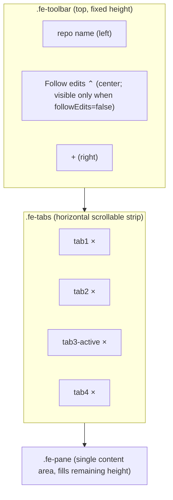

# File Edits V3.2 — Tabs + always-on edits

Replaces the stacked-cards layout with a tab strip. Builds on V3.1
(`docs/file-edits-v3.1.md`) — the picker and the persistence machinery
both carry over with minor adjustments.

**This is a client-only refactor.** No server changes. Same
`/snapshot`, same `/open`, same `caco.edit` event shape, same
`/cards` persistence endpoint.

## Goal

Replace stacked cards with a tab strip. Each opened file is one tab;
clicking a tab shows that file's content in a single content pane below
the tab strip. Files come in two ways:

1. **Agent/external edit** → tab auto-opens (no need to click + first).
2. **User pick** → + button opens the V3.1 fuzzy picker; selecting a
   file opens its tab.

A `followEdits` boolean governs whether the applet auto-switches tabs
when an edit arrives. Operator gestures (switching tab manually,
scrolling the content pane, picking a file) turn it off. Clicking the
top-center **"Follow edits"** button turns it back on AND jumps to the
most recent edit.

## Why

After V3.1:
- Cards stack vertically; scanning a 20-card stream is slow.
- The Follow-edits floating bottom-right button is visually
  disconnected from where the action is.
- Each card carries header chrome (chevron, status pill, path, open
  link, X) that's repeated for every file — wasteful for a viewer.
- The "dismissed" set is conceptually weird: an X means "stop showing
  me edits to this file" but the right gesture for a viewer is "close
  this tab" with no permanence.

Tabs collapse all of that to: pick a tab, see its content.

## Scope (locked)

- Tab strip replaces card list. One opened file per tab.
- Single content pane below the strip. Switching tabs swaps the pane
  content.
- Class-per-tab (`FileTab`) instance holds the rendered content and
  the saved scroll position.
- `+` button (V3.1 picker) moves into the toolbar to the right of
  "Follow edits".
- "Follow edits" button is **top-center** of the toolbar (between
  folder name on the left and "+" on the right).
- Always-show: any agent/external edit opens a tab. No "dismissed"
  set.
- X closes a tab. No re-open until the file is touched again or
  picked again.

## Non-goals (V3.2)

- **No dismissed set.** V1's sticky-X is gone. X closes the tab; if
  the file gets edited again, a new tab opens. Persisted card list
  no longer carries a `dismissed[]` field.
- Drag-to-reorder tabs.
- Tab grouping / pinning.
- Multi-pane (split view).
- Per-tab toolbar actions beyond X.
- Server changes.
- New events.

## Preserved invariants

- Cards-don't-reorder becomes "tabs don't reorder." Insertion order =
  creation order.
- Tabs persist across applet open/close and session switch via the
  V2.1 mechanism (the persisted JSON now stores tab order + active
  tab id; see §Persistence below).
- 50-tab cap. Oldest non-active tab evicted first when over cap.
  Active tab never evicted.
- Click-outside semantics on the picker unchanged.
- Server contracts unchanged: `/snapshot`, `/open`, `/cards`,
  `caco.edit`.

---

## Layout



Three-row flexbox in `.fe-root`:

| Region | Height | Content |
|---|---|---|
| `.fe-toolbar` | auto | repo name · Follow-edits button (centered) · + button |
| `.fe-tabs` | auto, horizontally scrollable | tab pills, newest at right |
| `.fe-pane` | flex: 1 | the active tab's content (or empty state) |

### Toolbar

- **repo name** (left, mono): unchanged from V3.1.
- **Follow-edits button** (center):
  - Reads `↓ Follow edits` plus an N-badge for distinct files edited
    while followEdits was off in the current session.
  - Visible **only when followEdits is false**.
  - Click: enable followEdits, jump to most recent edit
    (`jumpToMostRecent()`).
  - Styled with `--color-accent` (matches Caco's primary).
- **+ button** (right): unchanged from V3.1.

### Tab strip

Horizontal flex row, scrollable when overflow. Each tab is a
`<button class="fe-tab">` with two children: filename + close-X.

- Filename is shown as basename only (e.g. `script.js`). Full relative
  path on hover via `title`.
- Active tab styled like Caco's `.session-item.active` —
  `background: var(--color-success)` with a left/bottom accent edge
  (we'll adapt — see CSS).
- Hover: `--color-selector-hover`.
- Tooltip on hover shows the full relativePath.
- X is a `<span class="fe-tab-x">` inside the button; click stops
  propagation and closes the tab.
- Tabs never reorder. New tabs append to the right.
- When a tab is opened by an edit and `followEdits=true`, the active
  tab switches AND the strip horizontally scrolls so the new active
  tab is visible (rightward end of strip stays in view).

### Content pane

- Single `<div class="fe-pane">`. The active tab's `FileTab` instance
  appends its rendered DOM here on activation.
- Empty state: shown when no tabs exist. Message: "No files open.
  Click + to open one, or wait for edits."
- The pane is the scroll container per tab.

### File picker (+ button)

Unchanged from V3.1, except:
- "(open)" suffix now refers to "has an open tab," not "has a card."
- "(dismissed)" suffix removed. No dismissed set.
- Picking a file opens its tab AND switches to it AND turns
  followEdits off (user action).

---

## `FileTab` class

One instance per opened file. Lives in the applet's IIFE.

```js
class FileTab {
  constructor(edit) {
    this.relativePath = edit.relativePath;
    this.absolutePath = edit.path;
    this.edit = edit;           // current EditEntry; mutated on update
    this.tabEl = null;          // <button class="fe-tab">
    this.paneEl = null;         // detached DOM holding rendered content
    this.scrollTop = 0;         // saved scroll position
    this.userCollapsed = false; // unused in V3.2 (no collapse UI)
    this.render();              // populate paneEl
  }

  /** Build the strip pill element. */
  buildTabEl() { /* basename + X */ }

  /** Re-render the content pane for the current edit. */
  render() { /* renderFullFile(this.paneEl, this.edit) or hunk fallback */ }

  /** Called when a poll updates the same path. Re-render if content changed. */
  update(newEdit) {
    if (this.contentEqual(newEdit)) return false;
    this.edit = newEdit;
    this.render();
    return true;
  }

  contentEqual(other) {
    // same fullFileEqual as today; folded into the class
  }

  /** Attach paneEl to the global pane container. */
  activate(paneContainer) {
    paneContainer.innerHTML = '';
    paneContainer.appendChild(this.paneEl);
    // Restore scroll on next rAF (after layout)
    requestAnimationFrame(() => {
      paneContainer.scrollTop = this.scrollTop;
    });
  }

  /** Capture current scroll before deactivation. */
  deactivate(paneContainer) {
    this.scrollTop = paneContainer.scrollTop;
  }

  /** Destroy: drop tab + pane DOM, release references. */
  destroy() {
    if (this.tabEl?.parentNode) this.tabEl.parentNode.removeChild(this.tabEl);
    this.paneEl = null;
  }
}
```

Implementation notes:

- `paneEl` is detached when the tab is inactive. Only the active tab's
  pane lives in the document tree. This keeps the DOM small even with
  50 tabs.
- `scrollTop` is saved on `deactivate` and restored on `activate`. The
  restore happens in `requestAnimationFrame` so layout settles before
  the scroll write.
- `render()` rebuilds the pane DOM from scratch on update. With the
  V2 full-file renderer + hljs + word marks already producing the
  whole-file DOM, the cost is acceptable for a single tab at a time.

---

## State machine

Replaces V2/V3's scrollMode (`autoscroll` / `sticky`) with a single
boolean. Same intent, simpler shape.

```js
let followEdits = true;           // default ON
let activeTabId = null;           // relativePath of active tab
let tabs = new Map();             // Map<relativePath, FileTab>
let lastEditedTabId = null;       // for jumpToMostRecent
```

### `followEdits` transitions

| Event | followEdits after | Notes |
|---|---|---|
| Tab opened by agent edit AND followEdits was true | `true` | Activate the new tab, jump to it |
| Tab opened by agent edit AND followEdits was false | `false` | Add tab to strip but don't switch; bump badge |
| Tab opened by user pick (+ button) | `false` | User asked for this specific tab; don't auto-follow |
| User clicks a tab in the strip | `false` | Explicit choice |
| User scrolls the pane | `false` | Reading something specific |
| User clicks "Follow edits" button | `true` | Re-engage; jump to most recent |
| Session change | `true` | Reset to default |
| User dismisses (X) the active tab | `false` | They're not following; they're managing |

### `jumpToMostRecent()`

The "one function." Both the auto-follow path on incoming edits AND
the "Follow edits" button call this. Algorithm:

1. If `tabs.size === 0`, no-op.
2. Pick the tab with the highest `edit.mtimeMs` across all open
   tabs. Fall back to most-recently-touched-by-apply if mtimes are
   absent.
3. `setActiveTab(targetId)` — if already active, no-op.
4. Scroll the new active tab's pane to the top (the edit just
   arrived; user wants to see the diff at the top).

This is intentionally simpler than V3.1's `lastChangedCard`:
`jumpToMostRecent` always picks across ALL tabs, not just
this-apply's. That way the Follow button never has "nothing to jump
to."

### `setActiveTab(tabId)`

```js
function setActiveTab(tabId) {
  if (tabId === activeTabId) return;
  const prev = tabs.get(activeTabId);
  if (prev) prev.deactivate(paneEl);
  activeTabId = tabId;
  const next = tabs.get(tabId);
  if (next) {
    next.tabEl.classList.add('active');
    // Strip other active classes
    tabs.forEach((t, id) => {
      if (id !== tabId) t.tabEl.classList.remove('active');
    });
    next.activate(paneEl);
    next.tabEl.scrollIntoView({ inline: 'nearest', block: 'nearest' });
  }
  schedulePersist();
  updateFollowButton();
}
```

### Tab open flow

Called from BOTH the `caco.edit` event handler AND the picker:

```js
function openOrUpdateTab(edit, options = {}) {
  const id = edit.relativePath;
  let tab = tabs.get(id);
  let isNew = false;
  if (!tab) {
    if (tabs.size >= TAB_CAP) {
      evictOldestNonActive();
    }
    tab = new FileTab(edit);
    tabs.set(id, tab);
    tabsStripEl.appendChild(tab.tabEl);  // tabs never reorder
    isNew = true;
  } else {
    const changed = tab.update(edit);
    if (!changed && !options.forceFocus) return;
  }
  lastEditedTabId = id;
  if (followEdits || options.forceFocus) {
    setActiveTab(id);
    if (isNew || options.forceFocus) {
      // New tab or explicit focus: scroll pane to top
      paneEl.scrollTop = 0;
      tab.scrollTop = 0;
    }
  } else {
    // followEdits is off: just bump the badge
    badgeCounter.add(id);
    updateFollowButton();
  }
  schedulePersist();
}
```

Picker call: `openOrUpdateTab(edit, { forceFocus: true })` —
forceFocus implies "user asked for this; show it now and turn off
follow."

`caco.edit` call: `openOrUpdateTab(edit)` — follow respected.

### Pane scroll listener

```js
paneEl.addEventListener('scroll', () => {
  if (programmaticScroll) { programmaticScroll = false; return; }
  if (followEdits) {
    followEdits = false;
    updateFollowButton();
  }
  // Save scroll position for the active tab
  const active = tabs.get(activeTabId);
  if (active) active.scrollTop = paneEl.scrollTop;
});
```

`programmaticScroll` flag handles the case where `setActiveTab` does
a `scrollTop = 0` (or restores `tab.scrollTop`). Same single-shot
flag we used in V2 Phase 3, but simpler because we don't have the
±1px tolerance issue (only auto-scrolls are exactly `scrollTop = 0`
or `scrollTop = saved`).

---

## Persistence (client-only)

**No server changes.** The existing `/api/sessions/:id/file-edits/cards`
GET/PUT/POST endpoints and the `file-edits-cards.json` file shape are
reused as-is. The server doesn't interpret the field semantics; the
client repurposes:

- **`cards[]`** continues to be `Array<{ relativePath, collapsed }>`
  on disk. V3.2 writes `collapsed: false` for every tab (the field is
  meaningless in tab UI but kept to satisfy the existing
  `schemaVersion: 1` validator).
- **`dismissed[]`** is no longer written. V3.2 always sends an empty
  array. Any pre-existing dismissed entries from V2.1 sessions are
  ignored on read (V3.2 has no "filter these out" concept). Operator
  accepted "no dismiss" — surviving v2.1 dismissed lists are silently
  dropped on the next write.
- **Active tab is NOT persisted** in V3.2 because the existing
  `schemaVersion: 1` shape has no field for it. Acceptable — on
  applet open, no tab is auto-active until either the user clicks
  one OR followEdits=true and an edit arrives. (See open question
  on whether to store active tab via a future schema bump.)
- **Insertion order** is the persisted `cards[]` array order.

Server endpoint and store code untouched. The only "schema" change is
the client's interpretation of the bytes on disk.

### Initial load

```js
async function initFromPersistence(sid) {
  const persisted = await loadPersistedTabs(sid);
  // Pre-create placeholder FileTab instances in persisted order so the
  // strip shows them immediately. Pane stays empty / shows the first
  // tab as active per the "no auto-activate" rule.
  for (const { relativePath } of persisted.cards || []) {
    const placeholder = { relativePath, path: '', status: 'clean',
                          timestamp: new Date().toISOString() };
    const tab = new FileTab(placeholder);
    tabs.set(relativePath, tab);
    tabsStripEl.appendChild(tab.tabEl);
  }
  // Then fetchSnapshot to fill in real edit content via tab.update().
  await fetchSnapshot();
}
```

The snapshot fills each placeholder by calling `tab.update(edit)`. The
existing server-side snapshot logic (V2.1) that joins the persisted
list and fetches HEAD blobs continues to work — it sees the same
`cards[]` and treats them as paths to fetch.

---

## CSS

Themed off existing Caco tokens. Adapted from `.session-item`:

```css
.fe-root {
  display: flex;
  flex-direction: column;
  height: 100%;
  position: relative;
  font-family: var(--font-sans);
  color: var(--color-text);
}

.fe-toolbar {
  display: grid;
  grid-template-columns: 1fr auto 1fr;
  align-items: center;
  gap: var(--space-md);
  padding: var(--space-sm) var(--space-md);
  border-bottom: 1px solid var(--color-border);
  flex-shrink: 0;
}

.fe-toolbar > .fe-repo { justify-self: start; }
.fe-toolbar > .fe-follow { justify-self: center; }
.fe-toolbar > .fe-actions { justify-self: end; }  /* holds + */

.fe-follow {
  background: var(--color-accent);
  color: white;
  border: 0;
  border-radius: var(--radius-md);
  padding: 4px 12px;
  font-family: var(--font-sans);
  font-size: var(--text-sm);
  font-weight: 600;
  cursor: pointer;
}
.fe-follow:hover { filter: brightness(1.1); }
.fe-follow[hidden] { display: none; }

.fe-tabs {
  display: flex;
  gap: 2px;
  padding: 4px var(--space-md);
  overflow-x: auto;
  border-bottom: 1px solid var(--color-border);
  flex-shrink: 0;
}

.fe-tab {
  display: flex;
  align-items: center;
  gap: var(--space-sm);
  background: var(--color-selector-bg);
  color: var(--color-text);
  border: 0;
  padding: 4px 10px;
  border-radius: var(--radius-md);
  cursor: pointer;
  font-family: var(--font-mono);
  font-size: var(--text-xs);
  white-space: nowrap;
  flex-shrink: 0;
}
.fe-tab:hover { background: var(--color-selector-hover); }
.fe-tab.active {
  background: var(--color-success);
  color: var(--color-text-bright);
}
.fe-tab-x {
  color: var(--color-text-muted);
  font-size: var(--text-base);
  line-height: 1;
  padding: 0 2px;
  border-radius: 3px;
}
.fe-tab-x:hover { color: var(--color-error); background: rgba(0,0,0,0.2); }

.fe-pane {
  flex: 1;
  min-height: 0;
  overflow-y: auto;
  padding: 0;
  overflow-anchor: auto;
}
.fe-pane-empty {
  padding: var(--space-xl);
  color: var(--color-text-muted);
  text-align: center;
}
```

The old `.fe-card`, `.fe-stream`, `.fe-head`, `.fe-status`, etc., are
removed entirely. The diff-row CSS (`.fe-row`, `.fe-gutter`,
`.fe-line`, marks) stays because `FileTab.render()` uses
`renderFullFile` which produces those.

---

## HTML

```html
<div class="fe-root">
  <header class="fe-toolbar">
    <span class="fe-repo" id="feRepo">repo</span>
    <button class="fe-follow" id="feFollow">↓ Follow edits</button>
    <span class="fe-actions">
      <button class="fe-btn" id="feOpen" title="Open file">+</button>
    </span>
  </header>
  <div class="fe-tabs" id="feTabs"></div>
  <div class="fe-pane" id="fePane">
    <div class="fe-pane-empty" id="fePaneEmpty">
      No files open. Click + to open one, or wait for edits.
    </div>
  </div>
</div>
```

The "not a git repo" message moves into the empty pane area; the
stream container is gone.

---

## Edge cases

- **Edit arrives for a path with an open tab while followEdits=false.**
  Tab content updates in place (FileTab.update). If the tab is the
  active tab, the pane re-renders. If not, just the cached pane DOM
  updates. Badge increments.
- **Edit arrives for a path with NO open tab while followEdits=true.**
  New tab opens; active switches to it; pane scrolls to top.
- **Edit arrives for a path with NO open tab while followEdits=false.**
  New tab opens (appended to strip), but stays inactive. Badge
  increments. User can click the tab or Follow.
- **User picks a file that's already open.** No new tab; switch to
  existing; turn off followEdits; pane restores scrollTop.
- **User Xs the active tab.** Active tab becomes... the next tab in
  strip order? Or null? Choose: the previous tab in strip order
  (left neighbor), or null if the closed tab was the leftmost.
- **User Xs an inactive tab.** Tab closes; active unchanged.
- **Session change.** Persist outgoing session's state; clear
  in-memory; load incoming.
- **Cap eviction.** When the 51st distinct file gets edited, the
  oldest tab in the strip (left-to-right insertion order) gets closed
  IFF it's not the active tab. If the oldest IS active, evict the
  second-oldest. If all 50 are active — impossible, there's one active
  tab.
- **followEdits=true, file edited, but the editing arrived to an
  already-active tab.** No tab switch; just re-render the pane. Scroll
  stays at saved position; followEdits stays on.
- **A picked file that's already in the strip but inactive.** Same as
  pick-existing: switch to it; turn off followEdits.

---

## Acceptance

1. Open the applet with no persisted tabs → empty pane message shows.
2. Agent edits `src/foo.ts` → tab `foo.ts` appears in strip, becomes
   active, pane shows the diff. followEdits stays on.
3. Agent edits `src/bar.ts` next → `bar.ts` tab appears, becomes
   active. `foo.ts` tab remains in the strip but inactive.
4. Click the `foo.ts` tab → pane swaps to `foo.ts` content, scroll
   restores. **Follow-edits button becomes visible** (followEdits is
   now off).
5. Agent edits `bar.ts` again → `bar.ts` tab gets a badge or count
   indicator? **Per spec: Follow-edits button badge increments.**
   `bar.ts` content updates in its cached pane (not visible). `foo.ts`
   remains active.
6. Click "Follow edits" → jumps to most recent edit (`bar.ts`), turns
   followEdits on, hides the button.
7. Scroll the pane → Follow-edits button reappears (followEdits off).
   Save scroll position for the active tab.
8. Switch tabs → restored scroll position for the destination tab.
9. Click + → picker; type, pick `README.md` → tab opens, becomes
   active. Follow-edits stays off.
10. X the active tab → previous tab becomes active. (Or empty pane
    if it was the only tab.)
11. Close applet, reopen → all tabs restored in order. No tab is
    auto-active until a user click or an incoming edit (per
    "active-tab not persisted" rule).
12. Restart server, reopen → tabs persist (per V2.1 mechanism +
    snapshot fill).
13. 51st distinct file edited → oldest non-active tab evicted.
14. Switch session → previous session's tabs persist; new session's
    tabs load.

---

## Risks

- **Pre-existing `dismissed[]` lists are dropped on first write.** V2.1
  sessions persisted dismissed paths. V3.2 always writes
  `dismissed: []`, so on the first save those entries are lost.
  Operator accepted "no dismiss" so this is intentional.
- **No active-tab restore.** A user who left the applet on a specific
  file last session won't return to that file. They'll see the strip
  but the pane stays empty until they click a tab or an edit arrives
  (with followEdits=true, which is the default). Future schema bump
  could fix.
- **DOM cost of building 50 detached panes.** Each pane holds a full
  hljs-highlighted file. Mitigated by lazy rendering: each tab's
  `paneEl` is built on first `activate()`, not on construction.
- **Word marks + scroll restore.** Scroll position is saved as raw
  pixels. If the file is re-rendered with significantly different
  content (large hunk added near top), the saved pixel position may
  land in a different logical place. Acceptable for V3.2; future work
  could anchor on line number.

## Open questions

1. **Lazy `FileTab.render()` or eager?** Eager (render in constructor)
   means 50-tab restore costs 50× full-file render up front. Lazy
   (render on first `activate()`) defers cost but causes a one-frame
   blank when switching to an unvisited tab. **Recommend lazy.**
2. **What does X on the active tab do?** Left neighbor or right
   neighbor or null? **Recommend left neighbor; null if no
   neighbor.** Same as VS Code.
3. **Should the Follow-edits badge count BE a count, or just a dot?**
   V2 had per-edit counter. **Recommend keep the count.**
4. **Tab close animation?** None for V3.2; cleanup. **Skip.**
5. **Active-tab persistence.** Would require bumping `schemaVersion`
   to 2 server-side (otherwise the existing validator rejects unknown
   fields). Deferred: tracked as a small follow-up; not in V3.2.

## Document layout

- `docs/file-edits.md` — V1 + V3 backlog (unchanged structurally).
- `docs/file-edits-v2.md` — V2 spec (frozen).
- `docs/file-edits-v2.1.md` — V2.1 spec (frozen).
- `docs/file-edits-v3.1.md` — V3.1 spec (frozen).
- `docs/file-edits-v3.2.md` — this doc. Supersedes the V2 stacked-card
  UX entirely (V2.1 persistence machinery still relevant).
- `docs/file-edits-v3.2-review.md` — review log (post-review).
