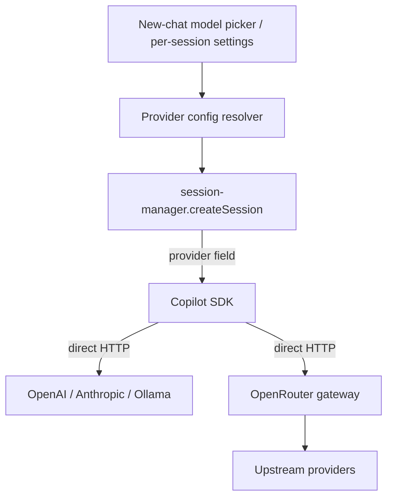

# Multi-Provider Support (BYOK / OpenRouter)

**Goal:** let Caco use models from non-GitHub providers (OpenAI, Anthropic direct, Azure, Ollama, OpenRouter) while keeping the rest of Caco unchanged.

**Headline finding:** we do **not** need to build a custom abstraction layer. The Copilot SDK Caco already depends on (`@github/copilot-sdk@1.0.0-beta.7`) **natively supports Bring-Your-Own-Key (BYOK)** via a per-session `provider` field. OpenRouter slots in as an OpenAI-compatible endpoint.

---

## TL;DR

| Question | Answer |
|---|---|
| Does Copilot SDK support custom providers? | **Yes** — `provider?: ProviderConfig` on session config. Verified in `node_modules/@github/copilot-sdk/dist/types.d.ts:1408`. |
| CLI-only or SDK too? | **SDK too.** `provider` is on `SessionConfigBase`, the base for both `createSession` and `resumeSession`. |
| Do we keep SDK events (streaming, tool calls)? | **Yes.** The runtime still emits all events; only the LLM HTTP call is redirected. |
| Is a GitHub Copilot subscription required? | **No** in BYOK mode. Auth is against your provider's key. |
| Where does the request go? | **Direct to provider.** GitHub's proxy is bypassed (no premium-quota usage, no GitHub content filters, GitHub session telemetry forced off). |
| Is OpenRouter needed? | **Optional.** It's one valid `provider` target (`type: "openai"`, `baseUrl: https://openrouter.ai/api/v1`). Use it for multi-provider routing/failover behind one key. |
| What's the integration cost in Caco? | Small. Thread a `provider` config through `createSession` + add `onListModels`. See [Integration](#integration-into-caco). |

---

## What is BYOK in the Copilot SDK

GitHub calls it **BYOK ("Bring Your Own Key")**, not "BYOM". It is exposed programmatically — not just an interactive-CLI feature.

`ProviderConfig` (verified, `types.d.ts:1408`):

```typescript
interface ProviderConfig {
  type?: "openai" | "azure" | "anthropic";   // default "openai"
  wireApi?: "completions" | "responses";      // default "completions"
  baseUrl: string;                            // REQUIRED
  apiKey?: string;                            // optional for local (Ollama)
  bearerToken?: string;                       // takes precedence over apiKey
  azure?: { apiVersion?: string };
  headers?: Record<string, string>;
  modelId?: string;    // Copilot-known model used for agent config (tools/prompts/limits)
  wireModel?: string;  // name actually sent to the provider (e.g. Azure deployment)
  maxPromptTokens?: number;
  maxOutputTokens?: number;
}
```

Attached on `SessionConfigBase` (`types.d.ts:1219`):

```typescript
provider?: ProviderConfig;
// "When a custom provider (BYOK) is configured, session telemetry is always disabled."
enableSessionTelemetry?: boolean;
```

Because `provider` is **per-session**, different Caco sessions can run on different providers simultaneously.

### Provider config snippets

```typescript
// OpenAI direct
provider: { type: "openai", baseUrl: "https://api.openai.com/v1", apiKey: env.OPENAI_API_KEY }

// Anthropic direct
provider: { type: "anthropic", baseUrl: "https://api.anthropic.com", apiKey: env.ANTHROPIC_API_KEY }

// Ollama (local, no key)
provider: { type: "openai", baseUrl: "http://localhost:11434/v1" }

// Azure OpenAI (host only; deployment name via wireModel)
provider: { type: "azure", baseUrl: "https://my-res.openai.azure.com",
            apiKey: env.AZURE_OPENAI_KEY, azure: { apiVersion: "2024-10-21" },
            modelId: "gpt-4o", wireModel: "my-deployment" }

// OpenRouter (OpenAI-compatible gateway)
provider: { type: "openai", baseUrl: "https://openrouter.ai/api/v1",
            apiKey: env.OPENROUTER_API_KEY }
```

### Listing custom models

`client.listModels()` queries the CLI server, which doesn't know your custom models. Supply them via the client constructor:

```typescript
new CopilotClient({
  onListModels: () => [
    { id: "anthropic/claude-opus-4", name: "Claude Opus 4 (OpenRouter)",
      capabilities: { supports: { vision: true }, limits: { max_context_window_tokens: 200000 } } },
  ],
});
```

### BYOK limitations

- Static credentials only (API key / static bearer). No OAuth, Entra ID, managed identity, or token refresh.
- `model` must be set explicitly; the runtime won't guess.
- GitHub content filters bypassed (provider's filters apply instead).
- GitHub session telemetry forced off; your own OTLP tracing still works.
- `assistant.usage` shape may differ per provider (OpenAI-compat returns usage in body; Anthropic differs). Caco's throughput accounting may need a per-provider normalizer.

---

## What is OpenRouter

A **hosted API gateway** ([openrouter.ai](https://openrouter.ai)) presenting one OpenAI-Chat-Completions-compatible endpoint (`https://openrouter.ai/api/v1`) that routes to hundreds of upstream providers (OpenAI, Anthropic, Google, Meta, Mistral, DeepSeek, …) behind one key. It handles provider selection, load balancing, automatic failover, and unified billing.

- **Compatibility:** drop-in for the `openai` npm SDK — change `baseURL` + `apiKey` only. For the Copilot SDK, use `type: "openai"`.
- **Model ids:** `{provider}/{model}` e.g. `anthropic/claude-opus-4`, `openai/gpt-4o`. Aliases: `~anthropic/claude-sonnet-latest`, `openrouter/auto`. Suffix variants: `:nitro` (throughput), `:floor` (cheapest), `:free`, `:thinking`, `:exacto` (reliable tool-calling).
- **Routing control:** optional `provider` object per request — `order`, `only`/`ignore`, `data_collection: "deny"`, `sort: price|throughput|latency`, `max_price`, `zdr`. Multi-model fallback via `models: [...]`.
- **Agentic features:** streaming (normalized), tool calling (normalized for native-support models; YAML-injection fallback otherwise — use `:exacto`/`require_parameters`), structured outputs (model-specific), vision + PDF, prompt caching (surfaced in `usage.prompt_tokens_details.cached_tokens`), and `usage.cost` in credits on every response.
- **Pricing:** token rates **passed through at cost**, no per-token markup; **5.5% fee on credit purchases** ($0.80 min); no per-request fee. BYOK-through-OpenRouter: first 1M req/mo free, then 5%.
- **Privacy:** OpenRouter doesn't log prompts by default; `data_collection: "deny"` and `zdr: true` restrict to compliant upstreams; EU residency via `https://eu.openrouter.ai`.

### Caveats

- ~20–80 ms proxy latency per hop (community-reported; not official). Mitigate with `:nitro` / `sort: latency`.
- Tool-calling reliability varies per upstream — pin with `:exacto` or `require_parameters: true`.
- Lowest-common-denominator gaps: reasoning tokens, audio, `logprobs`, provider-native extensions, fine-tunes (not supported), embeddings/image-gen (separate endpoints).
- Third-party trust surface for prompts.

### Alternatives

| Tool | Type | Distinction |
|---|---|---|
| **LiteLLM** | OSS library + self-host proxy | Runs in your infra; full data sovereignty; no credit fee. |
| **Vercel AI SDK** (`ai`) | Client TS SDK | Framework hooks (`useChat`); no hosted routing/failover. |
| **Portkey** | Hosted gateway + observability | Like OpenRouter plus built-in LLMOps (traces, evals, guardrails). |

---

## Decision

**Use the SDK's native BYOK. Do not build a bespoke abstraction layer.**

Rationale:
- The SDK already abstracts the provider behind `ProviderConfig`. Re-implementing the agentic tool-loop, streaming normalization, and event model (currently owned by the Copilot runtime) would be a large, high-risk rewrite for no added capability.
- BYOK keeps **all** existing Caco features: tools (`defineTool`), streaming events, sessions, fork/resume, MCP, surfaces.
- OpenRouter is complementary, not a replacement — point a BYOK `provider` at OpenRouter when you want one key + multi-provider routing/failover; point it directly at OpenAI/Anthropic/Ollama otherwise.

**Recommended layering:**



---

## Integration into Caco

Current single coupling point — `src/session-manager.ts:420`:

```typescript
session = await client.createSession({
  model: config.model,
  streaming: true,
  // ... existing fields ...
  // ADD:  provider: config.provider,
} as CreateSessionConfig);
```

Steps:

1. **Types** — add `provider?: ProviderConfig` to Caco's internal `CreateSessionConfig` (`session-manager.ts:82`) and thread it through `create()` → `createSession()`.
2. **Client `onListModels`** — pass a handler to `new CopilotClient({...})` (`session-manager.ts:217`) that merges custom-provider models with GitHub's, so the picker lists them.
3. **Config source** — store provider profiles (name, type, baseUrl, env-var name for key, model list) in a Caco-owned config file `~/.caco/providers.json` (Caco invents and parses it; the SDK/CLI never reads it). **Never persist raw API keys in repo or meta-store** — read from env at session-create time.
4. **Model picker UI** — group models by provider; selecting a custom model resolves its `provider` profile and passes it to `create()`.
5. **Throughput normalizer** — verify `assistant.usage` fields per provider; add a small adapter in `dispatch-events.ts` if Anthropic/others differ from the OpenAI shape Caco assumes.
6. **Default model** — `DEFAULT_MODEL` (`src/preferences.ts`) must be overridable per provider profile.

Out of scope for a first cut: OpenRouter per-request routing rules (`order`, `:exacto`, fallback chains) — these can be added later via `provider.headers` / extra body once basic BYOK works.

---

## Sources

- Copilot SDK BYOK docs: `github/copilot-sdk` → `docs/auth/byok.md`, `README.md`
- Verified locally: `node_modules/@github/copilot-sdk/dist/types.d.ts:177,1219,1408`; `dist/generated/rpc.d.ts:1284`
- OpenRouter: `openrouter.ai/docs` — quickstart, provider-selection, model-fallbacks, model-routing, prompt-caching, privacy, api-reference/limits, faq
