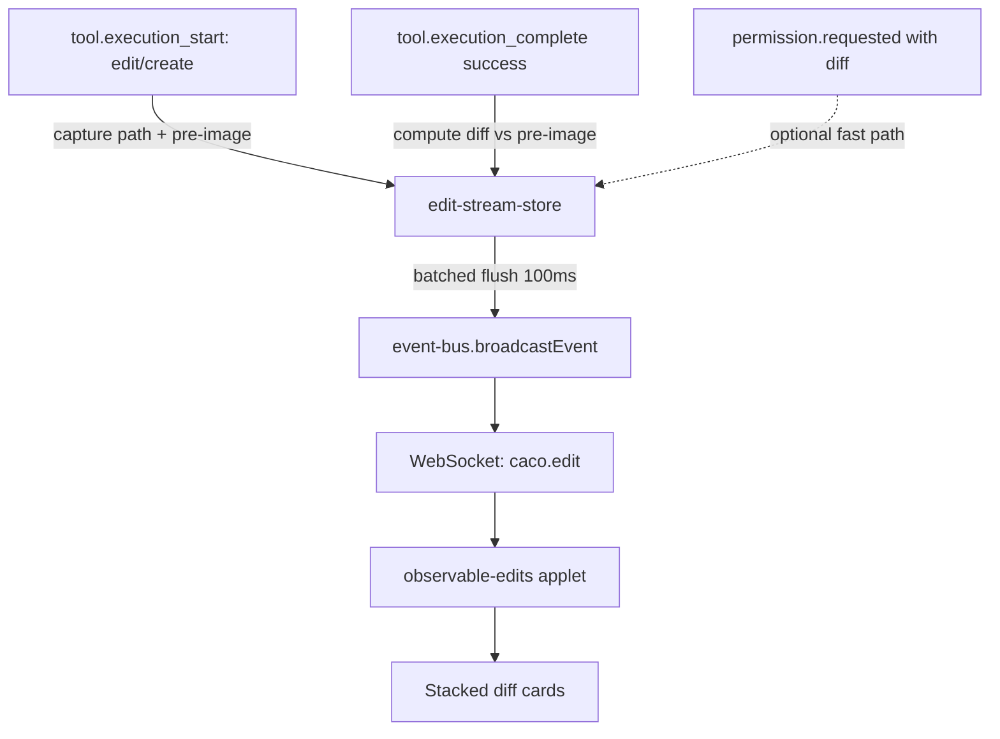

# Observable Edits

> v2 spec, after [code review](./observable-edits-review.md). v1 had two factually wrong claims about the SDK and watch-store; both blockers are addressed below. Some architectural choices remain open for the operator — see §Open Questions.

## Goal

Let a Caco user watch files change in real-time as the agent modifies them. The motivating use case: VS Code's "agent edits show up as diffs" experience that keeps junior developers in Caco instead of bouncing them out to an editor for visibility.

What the user sees: a stacked column of file cards, each with the filename and an X. Below each filename, a syntax-highlighted unified diff (red/green). One scrollbar for the whole column. Cards appear and update as the agent edits.

## Non-Goals

- **Not a text editor.** This is an observer. Editing happens in the agent or in the user's preferred editor on disk.
- **Not git replacement.** Stage/commit/push is `git-status` applet's job. This panel is read-only in v1.
- **Not a tab manager.** v1 ships the stacked view only.
- **Not full content sync.** We track diffs, not entire file content per keystroke.
- **Not multi-repo.** v1 scopes to the active session's `cwd`.
- **Not binary files.** Defer images to `image-viewer`.
- **Not external-edit detection in v1.** v1 is **agent-edits-only.** Filesystem watching for external edits (vim, sed, another editor) requires recursive directory watching, which is an explicit non-goal of `file-watch-leases.md`. Adding it requires a separate spec round; see §Follow-ups.

## Use Cases (v1, agent-only)

1. **The pivotal one.** Agent is editing a refactor. User opens the panel, sits back, watches each file's diff appear. When a diff looks wrong, user dismisses (X) and asks the agent to revisit. When all looks good, user moves to `git-status` to stage + commit.
2. **Long sessions, lots of edits.** Multi-hour refactor; panel must not OOM the browser or jank the main thread.
3. **User catches a bad edit fast.** Agent edits file A wrong, panel shows the diff within ~1s of `tool.execution_complete`, user pivots before the agent runs another 5 minutes.

External-editor and shell-tool edits are documented as v2 in §Follow-ups.

## Design

### Architecture



The new piece is the **edit-stream-store**: a per-session module that captures pre-images at edit-start, computes diffs at edit-complete, and emits batched events.

### Diff source (BLOCKER 1 resolved)

The previous spec claimed `tool.execution_complete.result.diff` exists. It does not. Verified shape of `ToolExecutionCompleteResult` in `node_modules/@github/copilot-sdk/dist/generated/session-events.d.ts:3061-3075`:

```ts
interface ToolExecutionCompleteResult {
  content: string;
  contents?: ToolExecutionCompleteContent[];
  detailedContent?: string;  // "preserves complete content such as diffs" — tool-specific format
  uiResource?: ToolExecutionCompleteUIResource;
}
```

The real diff source is **`PermissionRequestWrite` / `PermissionPromptRequestWrite`** events (lines 4164 and 4434), which fire **before** the write with a pre-formatted unified diff. But they only fire when permission prompting is enabled; auto-approved sessions skip them.

**Chosen primary strategy: read-before-write with pre-image cache.**

1. On `tool.execution_start` for `edit` / `create` (and any other write tool), capture:
   - `path` from `arguments.path`
   - `toolCallId` from event
   - `preImage`: `readFileSync(path)` if file exists, otherwise `null` (create case)
   - Stash in `Map<toolCallId, {path, preImage, startedAt}>`.
2. On `tool.execution_complete` with `success: true` for that `toolCallId`:
   - Look up pre-image entry, drop it from the stash.
   - Read current content; compute unified diff (Node `diff` package or shell out to `diff -u`).
   - Emit `caco.edit` event with diff + path + source.
3. On `tool.execution_complete` with `success: false`: drop the stash entry, no emit.

**Optional fast path** for the permission-prompt case: if we see a `permission.requested` event whose `params` include a matching `path` and `diff`, cache the diff keyed by `toolCallId`. When `tool.execution_complete` arrives, use the cached SDK diff instead of computing one (it's already formatted exactly as the SDK shows the operator). Falls back to compute-on-disk if absent.

This single strategy works for every write-shaped tool the agent uses — including future tools we don't know about yet, as long as they go through the SDK's permission/execution lifecycle.

**Pre-image cache caps:** see §Resource limits.

### Tool name classification

v1 captures pre-images for tools where `args.path` is a string and the tool name matches a write predicate. The set is:

| Tool name | Action | Notes |
|---|---|---|
| `edit` | capture + compute | most common path |
| `create` | capture (null pre-image) + compute | "diff" is the whole new content as additions |
| `write` | capture + compute | if SDK / extension exposes it |
| anything else | skip | shell, view, bash — no diff to show |

The predicate lives in one place (a `WRITE_TOOLS` set) so adding/removing tools is one line. Custom MCP write tools won't be detected automatically — out of scope for v1.

### Coalescing — batched flush (BLOCKER 3 resolved)

Per-path 250ms coalescing did nothing for the realistic case: agent does `edit` 30 times in a row, one per file. New design:

- The store maintains a `Map<path, EditEntry>` of unflushed entries.
- A `setTimeout(flush, FLUSH_MS)` is scheduled when the first entry lands.
- On flush, **all pending entries** are emitted as a single broadcast: `{ type: 'caco.edit', data: { edits: [...] } }` (array, even when length 1).
- `FLUSH_MS` default: 100ms. Tunable.
- The applet handles `caco.edit` by iterating `edits` and updating cards in one DOM batch.

This collapses N-file refactors into a small number of broadcasts, lets the applet do one render pass instead of N, and removes the "↑ N new edits" pill counter race condition.

### Resource limits (IMPORTANT 4 resolved)

The old spec said 50 cards × 5000 lines = "10 MB acceptable." That's a string-byte estimate. The real cost is DOM nodes for syntax-highlighted line spans:

- **Visible card cap:** 30. Oldest cards drop off the bottom on overflow.
- **Per-diff line cap:** 1000 lines. Diffs larger than that show "(truncated — N lines hidden)" with a link to `text-editor` for full content.
- **Pre-image cache cap:** 100 entries total, LRU eviction. A 16MB-per-file ceiling is enforced (`readFileSync` on files larger than that skips capture; tool still completes but diff is shown as "(file too large for diff — N bytes)").

Worst-case DOM: 30 cards × 1000 lines × ~3 spans/line ≈ 90 000 nodes. Borderline on low-end hardware but workable. Virtualization is v2 if the cap proves too tight in practice.

### Filter

**v1 has no filesystem watcher**, so the question of what to filter only applies to the agent's edits. Agents tend to edit project source files, not `node_modules/`. We add a minimal extension blacklist as a defensive net (catches the rare `node_modules/*` edit during a generated-code commit):

- Hardcoded skip list: `node_modules/`, `.git/`, `dist/`, `build/`, `target/`, `__pycache__/`, `*.pyc`, `*.o`, `*.obj`, `*.class`, `*.lock`.
- No `git check-ignore` subprocess in v1. (When v2 adds filesystem watching, `check-ignore` becomes worth the subprocess cost; until then it's overkill.)

### Wire format

```ts
// Broadcast to the session that owns the edit:
{
  type: 'caco.edit',
  data: {
    edits: Array<{
      path: string;            // absolute
      relativePath: string;    // relative to session cwd
      diff: string;            // unified diff (`diff -u` format)
      diffSource: 'sdk' | 'computed';
      timestamp: string;       // ISO 8601
      truncated?: { hiddenLines: number };
      preImageSkipped?: { reason: 'too-large' | 'unreadable'; bytes?: number };
    }>;
  }
}
```

Single event type. No `caco.observable.*` sub-namespace (IMPORTANT 5 resolved). The in-process emitter and the broadcast event share the name `caco.edit`.

Dismissal happens client-side only — see below.

### Dismiss semantics (IMPORTANT 2 resolved)

**Sticky until applet restart.** When the user clicks X, the path is added to a client-side `dismissedPaths: Set<string>`. Future incoming `caco.edit` entries for that path are silently dropped at the applet level until the applet is closed and reopened (or "Clear all dismissals" is clicked). This matches the motivating use case where dismissing means "I told you to stop showing me this file; if I want to see future edits I'll click Refresh."

Two affordances in the toolbar:
- **Clear all visible** — removes all visible cards but keeps the dismiss set.
- **Reset dismissals** — clears `dismissedPaths` so subsequent edits re-appear.

Server doesn't need to know about dismissals. Simpler.

### Client: `applets/observable-edits/`

A standard Caco applet (not a session-surface — that's for two-party collaborative documents).

DOM shape:

```html
<div class="oe-root">
  <div class="oe-toolbar">
    <span class="oe-repo-path">caco</span>
    <span class="oe-counts">12 files</span>
    <button class="oe-clear">Clear visible</button>
    <button class="oe-reset">Reset dismissals</button>
  </div>
  <div class="oe-stream">
    <article class="oe-card" data-path="/abs/path">
      <header>
        <code class="oe-path">src/foo.ts</code>
        <time class="oe-time">2s</time>
        <button class="oe-x" aria-label="Dismiss">×</button>
      </header>
      <pre class="oe-diff">
        <span class="oe-d-add">+ new line</span>
        <span class="oe-d-del">- old line</span>
        <span class="oe-d-ctx">  unchanged</span>
      </pre>
    </article>
  </div>
</div>
```

Behavior:
- Subscribes to `caco.edit` via `appletAPI.onEvent`.
- Maintains `Map<path, cardElement>`. New path: prepend (newest at top, IMPORTANT 6 question now in surface). Same path: replace the diff content in place, bump time.
- X button: add to `dismissedPaths`, remove the card from the DOM.
- "↑ N new" floating pill at top when cards arrive above the viewport.

### Diff styling

Per-line CSS classes driven by leading `+` / `-` / ` ` characters, applied during diff parsing. No reliance on `highlight.js` for the diff structure itself.

For **content** syntax inside diff hunks (TypeScript, Python, etc.), we add `'diff'` to `scripts/build-highlight.js` LANGUAGES so `highlight.js` can do per-language tokenization on top. Cheap build-script edit (IMPORTANT 1 resolved). If this turns out to be expensive at runtime, we drop it and ship plain-text diffs in v1.

### Server module: `src/edit-stream-store.ts`

Per-session state. Wired in `server.ts` alongside `watchStore`:

```ts
interface EditStreamStore {
  attachToSession(sessionId: string, cwd: string): void;
  detachFromSession(sessionId: string): void;
  // Hooked into the SDK event stream by session-messages route.
  observeStart(sessionId: string, event: ToolExecutionStartEvent): void;
  observeComplete(sessionId: string, event: ToolExecutionCompleteEvent): void;
  observePermission(sessionId: string, event: PermissionRequestedEvent): void;
}
```

No HTTP routes in v1 — all activity is event-driven. Dismissal is client-side only.

### Session lifecycle

- Applet opens → no server-side state change. The store has been observing this session's tool events since session start (it attaches at session create/resume).
- Applet shows whatever has been emitted since it opened. It does **not** replay past edits — those are visible in chat already as `tool.execution_complete` blocks. v1 is forward-only.
- Session ends → store drops the session's pre-image cache.
- Session forks (new architectural question, IMPORTANT 6) → see §Open Questions.

## Code Analysis

### Files added

| File | Lines (est) |
|------|---|
| `src/edit-stream-store.ts` | ~200 |
| `applets/observable-edits/meta.json` | ~30 |
| `applets/observable-edits/content.html` | ~25 |
| `applets/observable-edits/script.js` | ~180 |
| `applets/observable-edits/style.css` | ~120 |
| `tests/unit/edit-stream-store.test.ts` | ~150 |

### Files modified

| File | What |
|------|---|
| `src/dispatch-events.ts` | Forward write-tool start/complete/permission events to `editStreamStore`. |
| `src/event-bus.ts` | Expose `editStreamStore` for tool handler wiring (or keep the wiring in server.ts). |
| `server.ts` | Instantiate `editStreamStore`, attach to sessionState lifecycle. |
| `scripts/build-highlight.js` | Add `'diff'` to LANGUAGES (~2 lines, rebuild adds ~5KB). |

### No new dependencies

`diff` package: if Node's built-in is insufficient, use `child_process.spawnSync('diff', ['-u', ...])` — `diff(1)` is universally available. If we end up wanting word-level diff later, that's a follow-up.

## Considerations

### Why not session-surface?

Session-surface is for two-party collaborative documents where both the agent and the user mutate a shared `items[]`. Observable-edits is a one-way data stream from server to client with client-only dismissal state. Wrong primitive.

### Why no virtualization in v1?

Virtualized scroll for arbitrary-height cards (diffs vary wildly) is a multi-day implementation. The 30-card / 1000-line caps keep DOM bounded enough that v1 is shippable without it. Virtualization is v2 if the caps prove too tight.

### Why drop filesystem watching from v1?

`docs/file-watch-leases.md` declares recursive watching a non-goal. The current `watch-store` would need either (a) a new `tree` scope that internally uses chokidar or a recursive walker, or (b) a per-directory lease (blows the 16-lease process cap on any non-trivial repo). Both are real engineering work that warrants its own spec round. Shipping agent-only first proves the UI metaphor; adding the fs path is mechanical once the watch infra exists.

### Why static blacklist not git check-ignore in v1?

`check-ignore` is worth its subprocess cost when we have a high-rate event source to filter (a recursive fs watcher). Without that, the only thing it'd filter is agent edits — and agents rarely edit ignored paths. The static blacklist catches the rare cases. When v2 adds fs watching, `check-ignore` joins.

### Permission events vs compute-on-disk: trade-off

| Path | Cost | Fidelity |
|------|------|---|
| SDK permission diff | zero compute | matches the prompt the user saw |
| Compute on disk | one `diff -u` per edit | always available |

Strategy: prefer SDK diff when available, fall back to compute. The applet doesn't care — `diffSource` field is informational only.

### Pre-image race

Between `tool.execution_start` (when we read the pre-image) and the actual write (which may happen ms later), the file might be modified by an external process. In v1, agent-only means the only thing writing to that path right now is the agent itself, which hasn't yet written. The pre-image is correct.

In v2 with filesystem watching, this becomes a real concern (e.g. formatter ran between start and complete). Handle then.

### What "newest position" actually is

Spec proposes newest at top (matches notifications, reverse-chron chat). Build logs are bottom-up. Need the operator's preference. **Open question.**

### Replay across applet restarts

If the user closes and reopens the applet mid-session, they lose any cards that arrived in between. v1 accepts this — the chat history shows what happened. If real users complain, we can buffer the last N edits server-side. v1 keeps it simple.

## Risks

| Risk | Likelihood | Mitigation |
|------|---|---|
| Pre-image read on huge file (lockfile, generated SQL dump) stalls | Medium | 16MB skip-capture cap; tool still completes, diff shows "too large" |
| `diff -u` subprocess overhead on hot edit loops | Low | spawnSync per event is sub-millisecond for normal-sized files; if it becomes a bottleneck, switch to a Node diff lib |
| Agent uses a write tool we didn't classify | Medium | `WRITE_TOOLS` set is one-line additions; document the predicate |
| `permission.requested` happens but we lose it before `tool.execution_complete` (process restart) | Low | Fall back to compute-on-disk; no edit is lost, just one diff |
| 1000-line cap surprises user on prettier-style mass-format | Medium | "(truncated — N lines hidden)" tells them, link to text-editor for full file |
| 30-card cap drops a real edit the user cared about | Low | Tunable; chat history has the tool_execution_complete block as a fallback view |
| Pre-image cache grows unbounded if `tool.execution_complete` is dropped (SDK or network failure) | Low | LRU + 100-entry cap + 5-minute TTL on entries |
| `highlight.js` diff lang adds enough bytes to matter | Low | ~5KB after minify; measure and drop if bigger than expected |
| Dismissed-paths set grows over a long session | Low | Capped at 1000 entries; oldest evicted |
| Session fork: child inherits or starts fresh? | Medium | Open question (architectural) |

## Acceptance (v1)

1. New session, agent calls `edit` on a file. Within 200ms of `tool.execution_complete`, a card appears in the panel with path, time, and a red/green diff. `diffSource` is `'computed'` (or `'sdk'` if permission prompting was on).
2. Agent calls `edit` on 10 files in 200ms. One `caco.edit` broadcast carries all 10 entries; the applet renders them in one DOM batch.
3. Click X on a card. Card disappears. Subsequent edits to that path **do not** re-add a card.
4. Click "Reset dismissals". Dismiss set clears. Next edit to a previously-dismissed path re-appears.
5. Click "Clear visible". All cards gone. Dismiss set unchanged. Next edit appears normally.
6. Agent `create`s a new file. Card shows the full new content as additions.
7. Agent edits a 10000-line file. Card shows truncated diff with "(truncated — 8000 lines hidden)" footer.
8. Agent edits 50 files in one minute. Card count stays at 30 (oldest 20 dropped silently).
9. Session ends → no leaked pre-image cache entries (verifiable via a debug log or test).
10. Diff hunks have visible red/green styling without `highlight.js` per-language tokenization (the CSS class path).
11. Diff hunks with `highlight.js` `diff` language added show further per-token coloration on top of red/green.

## Follow-ups (not v1)

- **External-edit detection (vim, shell, sed).** Requires extending `watch-store` with a `tree` scope. Separate spec.
- **`git check-ignore` filter** once fs watching lands.
- **Per-hunk approve/reject.** Wraps each hunk in an action; on reject, replay the diff in reverse onto the file.
- **Stage file action.** Calls into git-status applet.
- **Tabbed view.** A/B against stacked.
- **Replay-on-open.** Server buffers last N edits so a late-opened applet shows backfill.
- **Virtualization** if 30-card cap proves too tight.
- **Word-level diff** (intra-line diffs in `git diff --word-diff` style).
- **Multi-repo / multi-cwd watching.**
- **Configurable caps** (truncation, card count, filter list) via a config file.

## Open Questions (architectural — for the operator)

These shape the design, not just polish. Surfaced via session-surface questionnaire.

1. **Diff source priority.** Prefer SDK permission-event diff when available, else compute on disk — or always compute (simpler, slower)?
2. **Pre-image cap.** 100 entries, LRU. Generous enough? Too much memory?
3. **Coalesce flush window.** 100ms batched. Tunable.
4. **Visible card cap & truncation cap.** 30 cards × 1000 lines (DOM-safe). Higher would risk jank.
5. **Newest position.** Top (notification-style) or bottom (build-log style)?
6. **Session fork behavior.** Forked session: fresh pre-image cache and applet state, or inherit?
7. **No-diff-yet placeholder.** When pre-image is too large, show "(too large)" card or skip silently?
8. **`highlight.js` diff lang inclusion.** Add to LANGUAGES (~5KB) or stay CSS-only?
9. **Replay on applet open.** Skip for v1 (forward-only), or worth the buffer for the "I opened the panel mid-flow" case?
10. **Failed edits.** `tool.execution_complete` with `success: false`: skip entirely (current spec) or show a "failed edit" card?
