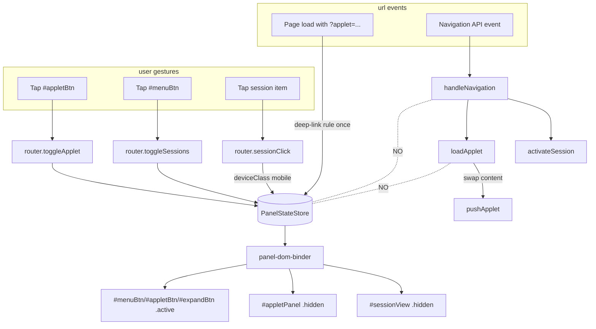

# Panel State Architecture — Review and Refactor Plan

Scope: front-end visibility of `#sessionView` and `#appletPanel`. Chat is always
mounted and is not part of this state machine.

The user-visible bug: after switching between several sessions, the applet panel
re-appears on each selection even though the user closed it. Four point fixes
have shipped (`54c686c`, `1aebd5f`, `cfd0b9d`, `5933dc8`) and none of them
finished the job, because the state has no owner — every module that knows the
class name `hidden` writes it.

---

## 1. Current state map

### 1.1 Visibility writers (call sites that mutate `.hidden` on a panel)

Applet panel (`#appletPanel`):

| # | File:line | Caller | Trigger |
|---|-----------|--------|---------|
| A1 | `public/ts/view-controller.ts:138-148` | `showAppletPanel()` | primitive |
| A2 | `public/ts/view-controller.ts:150-156` | `hideAppletPanel()` | primitive |
| A3 | `public/ts/router.ts:118` | `handleNavigation` — *URL has applet, slug already active* | URL change |
| A4 | `public/ts/router.ts:124` | `handleNavigation` — *URL has no applet param* | URL change |
| A5 | `public/ts/router.ts:228` | `toggleApplet()` show branch | user tap `#appletBtn` |
| A6 | `public/ts/router.ts:230` | `toggleApplet()` hide branch | user tap `#appletBtn` |
| A7 | `public/ts/router.ts:279` | `loadApplet()` non-restore branch | any caller of loadApplet |

Session panel (`#sessionView`):

| # | File:line | Caller | Trigger |
|---|-----------|--------|---------|
| S1 | `public/ts/view-controller.ts:113-117` | `showSessionPanel()` | primitive |
| S2 | `public/ts/view-controller.ts:119-123` | `hideSessionPanel()` | primitive |
| S3 | `public/ts/view-controller.ts:127` | `toggleSessionPanel()` | unused export |
| S4 | `public/ts/router.ts:161` | `toggleSessions()` close branch | user tap `#menuBtn` |
| S5 | `public/ts/router.ts:186` | `sessionClick()` (mobile only) | user picks a session |
| S6 | `public/ts/main.ts:87` | bootstrap | page load |
| S7 | `public/ts/session-panel.ts:201` | `showSessionManager()` | `toggleSessions` open branch |
| S8 | `public/ts/chat-view-controller.ts:73` | `chatView.showSessions()` | unused (legacy) |

That is **7 applet writers and 8 session writers across 5 files**, plus the two
primitive pairs. The CSS layer is a ninth implicit writer: `.hidden` triggers
`:has()` rules in `style.css:1981`, `:1985`, `:1991`, `:1994` and `:1394` —
adding or removing `.hidden` on one panel re-flows the others.

Persistence: `src/session-meta-store.ts:34` declares
`appletPanelVisible?: boolean`. It is read in
`src/routes/sessions.ts:272` (resume payload), written in
`src/routes/sessions.ts:302` (PATCH `/applet`), and posted from
`public/ts/router.ts:242` (`persistPanelVisibility`). Front-end no longer
consumes it (`chat-view-controller.ts:260-261`).

### 1.2 Flow from "user clicks a session" to "applet visibility flips"

```mermaid
flowchart TD
  click[User clicks session item] --> sc[sessionClick router.ts:171]
  sc --> act[chatView.activateSession]
  sc --> push[history.pushState clean URL]
  sc -->|matchMedia mobile| hideS[hideSessionPanel S5]
  act --> resume[POST /resume]
  resume --> data[(meta.appletPanelVisible — ignored now)]
  act --> showChat
  act --> rest[restoreApplet]
  rest -->|dynamic import| router2[router.loadApplet]
  router2 --> push2[pushApplet swaps DOM]
  router2 -->|restore=true|noop1[no show — fix from cfd0b9d]
  rest --> rURL[history.replaceState ?applet=...]
  click -. parallel back/forward .-> nav[Navigation API navigate event]
  nav --> hN[handleNavigation router.ts:101]
  hN -->|appletSlug == active| A3show[showAppletPanel A3]
  hN -->|no applet param| A4hide[hideAppletPanel A4]
  rURL -. user later hits Back .-> nav
```

The remaining bug surface is the dotted-line region: every `replaceState` /
`pushState` from `restoreApplet` writes a URL that **a later Navigation API
event will read prescriptively** at lines 118 or 124. URL state is being used
as both a description of the current view and a command to the view.

---

## 2. Root cause analysis — why each fix was insufficient

The bug is **multi-source, multi-trigger**. Each fix closed one source while
leaving the others able to assert visibility on their own.

1. **`54c686c` — pushApplet stops calling showAppletPanel.**
   Removed writer in `applet-runtime.ts`. But `loadApplet` (A7) still force-shows
   on the non-restore path, and `restoreApplet` was still consulting
   `meta.panelVisible`. Bug persisted via meta restore.

2. **`1aebd5f` — sessionClick uses pushState instead of nav.navigate.**
   Avoids firing the Navigation intercept on a stale URL. Good, but only for the
   *first* navigation after a click. The next genuine `nav.navigate` (long-press,
   programmatic `?applet=`, browser back/forward) still routes through
   `handleNavigation` and hits A3 unconditionally.

3. **`cfd0b9d` — restoreApplet ignores panelVisible, snapshots sessionId.**
   Closes the meta-driven leak. But `loadApplet({restore:true})` itself is still
   called by `restoreApplet`, and the router contract at A7 says "non-restore
   shows, restore doesn't." That works only as long as every caller correctly
   labels itself. Any non-restore call path (URL load on startup, long-press,
   any future caller forgetting the flag) re-shows the panel.

4. **`5933dc8` — hideSessionPanel gated to mobile.**
   Orthogonal to the applet bug; fixed desktop scrub. Confirms the codebase has
   no shared concept of "device class" — `matchMedia` is consulted inline at the
   one call site that cared.

**The structural cause:** the URL is treated as *prescriptive* in
`handleNavigation` (lines 118 and 124) but is being written *descriptively* by
`restoreApplet` (line 249). Every other module reads the DOM
(`isAppletPanelVisible()`) to make decisions and writes the DOM directly to
record them. There is no canonical store, so any writer can win the race.

Converging paths that flip applet visibility during session selection:

- **P1** `loadApplet` non-restore path (A7) — fired by *any* caller that omits
  `{restore:true}`.
- **P2** `handleNavigation` URL-prescriptive branch (A3) — fired by back/forward,
  any `nav.navigate`, even a same-slug navigation.
- **P3** `handleNavigation` URL-erase branch (A4) — fires whenever a URL
  *without* applet param is committed; flips the panel to hidden even if the
  applet content is loaded and the user wants it open.
- **P4** future regressions: nothing structurally prevents another module from
  importing `showAppletPanel` and calling it.

---

## 3. Proposed architecture

### 3.1 Principles

1. **Single source of truth.** A `PanelStateStore` holds
   `{ session: boolean, applet: boolean }`. Nothing else may set `.hidden` on
   `#sessionView` or `#appletPanel`.
2. **Synchronous setters.** No `await`, no dynamic `import()`, no `fetch()` on
   the path that flips visibility. Persistence happens in a subscriber.
3. **URL is descriptive.** `handleNavigation` updates *content* (`activateSession`,
   `loadApplet`), never visibility. Visibility is owned by the user's last tap
   and by an explicit deep-link rule applied **once** at page load.
4. **One device-class decision.** A `getDeviceClass()` helper wraps
   `matchMedia('(max-width: 768px)')`. All width-dependent behavior consults it.
5. **No per-session applet visibility.** Field stays in storage for one release
   for backward compat; reads return `undefined` from a new accessor, and the
   field is deleted in a follow-up.

### 3.2 Module layout

New file: **`public/ts/panel-state.ts`** (~120 LOC).

```ts
export type DeviceClass = 'mobile' | 'desktop';

export interface PanelState {
  session: boolean;   // #sessionView visible
  applet:  boolean;   // #appletPanel visible
}

export type Reason =
  | 'user-toggle-session'
  | 'user-toggle-applet'
  | 'user-session-pick'
  | 'deep-link'
  | 'init';

export interface PanelStateStore {
  get(): Readonly<PanelState>;
  set(patch: Partial<PanelState>, reason: Reason): void;
  subscribe(fn: (s: PanelState, prev: PanelState, reason: Reason) => void): () => void;
}

export function createPanelStateStore(initial: PanelState): PanelStateStore;
export function deviceClass(): DeviceClass;     // matchMedia wrapped
export const panelState: PanelStateStore;       // module-level singleton
```

Invariants enforced inside `set`:

- On mobile, `session=true` forces `applet=false` in the *rendered* output
  (CSS already does this via `:has()`; the store does **not** mutate `applet`
  to match — preserving the user's preference for when the picker closes).
- Reasons are recorded for debugging; `subscribe` callbacks see them.

New file: **`public/ts/panel-dom-binder.ts`** (~40 LOC). The *only* module that
touches `.hidden` on `#sessionView` and `#appletPanel`. It subscribes to
`panelState` and applies the diff:

```ts
export function bindPanelStateToDom(store: PanelStateStore): void;
```

It also owns the button-active classes (`#menuBtn.active`, `#appletBtn.active`,
`#expandBtn` visibility) and `document.title`. All currently in
`view-controller.ts:113-156`.

### 3.3 Changes to existing files

`public/ts/view-controller.ts` — **delete** `showSessionPanel`,
`hideSessionPanel`, `toggleSessionPanel`, `isSessionPanelVisible`,
`showAppletPanel`, `hideAppletPanel`, `isAppletPanelVisible`. Replace with
re-exports `panelState.get().applet` / `panelState.set(...)` if any in-tree
caller still wants the old name during migration. `setViewState` keeps owning
`'newChat' | 'chatting'` for the chat region only.

`public/ts/router.ts`:

- `handleNavigation` no longer touches visibility (delete lines 117-125).
  Same-slug navigation does nothing; missing slug does nothing. Visibility is
  user-driven.
- `toggleApplet` calls `panelState.set({applet: !s.applet}, 'user-toggle-applet')`.
- `toggleSessions` calls `panelState.set({session: !s.session}, 'user-toggle-session')`.
- `sessionClick` calls `panelState.set({session: false}, 'user-session-pick')`
  only when `deviceClass() === 'mobile'`.
- `loadApplet` no longer calls `showAppletPanel` (delete line 279). Loading
  content and showing the panel become independent.

`public/ts/chat-view-controller.ts`:

- `restoreApplet` already does not touch visibility; the dynamic `import()` for
  `loadApplet` is also unnecessary once `loadApplet` is moved out of
  `router.ts` (see §3.4) — replace with a static import.
- `data.appletPanelVisible` is removed from the resume payload type.

`public/ts/main.ts`:

- `showSessionPanel()` at line 87 becomes
  `panelState.set({session: true}, 'init')`.
- New deep-link rule (one place): if `?applet=...` is present at *page load*,
  call `panelState.set({applet: true}, 'deep-link')`. After that, URL never
  drives visibility.

`public/ts/session-panel.ts`:

- `showSessionManager` calls `panelState.set({session: true}, ...)`.

`src/session-meta-store.ts`, `src/routes/sessions.ts`, `src/routes/api.ts`:

- Mark `appletPanelVisible` deprecated. Stop writing it
  (`router.ts:persistPanelVisibility` deleted; route stops accepting it). Leave
  the field readable for one release so older clients don't crash.

### 3.4 Optional: extract `loadApplet` from `router.ts`

`router.ts` mixes URL routing, applet loading, and session-panel toggling.
Move `loadApplet` to a new `public/ts/applet-loader.ts`. This eliminates the
`chat-view-controller -> router` dynamic import that exists today only to
break the import cycle, and finishes the separation: router handles URLs,
loader handles content, store handles visibility.

### 3.5 New flow (mermaid)



The single arrow into `store` from each gesture, and the explicit *absent* edge
from URL/loader to store, is the invariant we want.

---

## 4. Migration plan

Land in small, separately-revertible steps. Tests are added with the step that
introduces the surface they cover.

1. **Add `panel-state.ts` and `panel-dom-binder.ts`.** No callers yet. Wire
   `bindPanelStateToDom` in `main.ts` *after* `initViewState`. The binder
   initializes itself by reading the current DOM (`#sessionView.hidden`,
   `#appletPanel.hidden`) so the store inherits the legacy initial state.
   Ship unit tests for the store (see §5). No behavior change.

2. **Reroute the four user-gesture call sites** through the store:
   `toggleApplet`, `toggleSessions`, `sessionClick`, `main.ts` bootstrap.
   `view-controller`'s show/hide functions become thin wrappers around
   `panelState.set` for the remaining callers. End-to-end behavior unchanged
   on desktop; verify mobile dismissal still fires.

3. **Delete the URL-prescriptive visibility writes** in `handleNavigation`
   (lines 117-125 collapse to "no-op on visibility"). At this point the bug
   should be gone; verify with the test suite in §5 and with manual rapid
   session switching.

4. **Delete `loadApplet`'s `showAppletPanel()` call** (line 279) and the
   `{restore}` option. All loads become silent on visibility. Page-load
   deep-link rule in `main.ts` is the only place that sets `applet: true`
   from a URL — applied once, never again.

5. **Excise `appletPanelVisible` from the front-end resume payload.** Remove
   the field from `chat-view-controller.ts`'s response type, the
   `persistPanelVisibility` POST, and the route handler in
   `src/routes/sessions.ts:289-302`. Field remains on disk and in the type
   for one release.

6. **Extract `loadApplet` into `applet-loader.ts`.** Drop the dynamic import
   in `chat-view-controller.restoreApplet`.

7. **Remove the old `view-controller` wrappers** once no caller remains.
   Final `view-controller.ts` owns only `setViewState('newChat'|'chatting')`
   and form-enabled state.

8. **Cleanup PR:** delete `appletPanelVisible` from
   `src/session-meta-store.ts` and from existing meta files at migration time
   (or write a one-shot meta scrubber).

Each step builds; each step passes the existing tests; each step adds new
tests for the new surface.

---

## 5. Tests to add

All against `panel-state.ts` (pure data, no DOM).

```ts
describe('PanelStateStore', () => {
  it('user toggling the applet button is the only thing that flips applet visibility');
  it('selecting a session does not change applet visibility on desktop');
  it('selecting a session does not change applet visibility on mobile');
  it('selecting a session hides the session panel on mobile');
  it('selecting a session leaves the session panel visible on desktop');
  it('rapid session selections never re-show a closed applet panel');
  it('loading an applet does not show the applet panel');
  it('a URL without an applet param does not hide the applet panel');
  it('a URL with an applet param does not show the applet panel after first page load');
  it('the deep-link rule shows the applet panel exactly once at startup');
  it('subscribers see the reason for every transition');
  it('subscribers are not called when set is a no-op');
});
```

For the DOM binder, two integration tests against jsdom:

```ts
describe('panel-dom-binder', () => {
  it('mirrors store state to .hidden classes on both panels');
  it('does not call setAttribute when state did not change');
});
```

Each test name reads as a requirement that traces back to a property in §3.1.

---

## 6. Risks and mitigations

- **CSS `:has()` coupling.** The mobile rules at `style.css:1981`, `:1985`,
  `:1991`, `:1994` key off `.hidden` on `.session-panel` and `.applet-panel`.
  The binder must add/remove `.hidden` exactly the same way — same class name,
  same target elements — or mobile layout regresses. *Mitigation:* the binder
  is the only writer, and a screenshot/visual check on mobile breakpoint is
  required for step 2.

- **Initial state drift.** Step 1 has the store inherit state from the DOM.
  If `initViewState` ever transitions before the binder is wired, the store is
  out of sync. *Mitigation:* call order in `main.ts` is `initRegions →
  initViewState → bindPanelStateToDom(panelState) → initRouter`; assert it.

- **`appletPanelVisible` on disk for old sessions.** Operator confirmed the
  field is no longer wanted. *Mitigation:* leave the schema field optional
  for one release; remove in a cleanup PR with a migration that strips it
  from every meta file.

- **Navigation API back/forward expectations.** Today's `handleNavigation`
  re-shows the panel when you press Back into a URL with `?applet=...`. After
  the refactor, Back loads the *content* but does not re-show the panel.
  *Mitigation:* this matches the stated invariant ("applet visibility is a
  global UI preference owned by `#appletBtn`"). If user testing finds Back
  should re-show, add it as an explicit `panelState.set(..., 'history')`
  branch — but only at one call site, and only with a `reason` so it can be
  traced.

- **Dynamic-import removal breaks a circular dep.** The current
  `chat-view-controller → router` dynamic import exists because both modules
  import each other. Step 6 moves `loadApplet` to its own file to break the
  cycle. *Mitigation:* step is independently revertible; until it lands,
  keep the static import inside `restoreApplet` (the cycle is *content*, not
  visibility, after step 3).

- **Keep around during transition:** the old `view-controller` show/hide
  exports through step 6. They become one-line wrappers that delegate to the
  store, so reverting any step in 2-5 is a two-line change.

---

## Summary

- **Distinct visibility writers found:** 15 (7 applet + 8 session), excluding
  the two primitive pairs in `view-controller.ts`.
- **Refactor invasiveness:** roughly **+260 LOC** (new `panel-state.ts` ~120,
  `panel-dom-binder.ts` ~40, tests ~100) and **−180 LOC** removed/inlined
  (view-controller show/hide, router URL-prescriptive branches, restoreApplet
  meta plumbing, persistPanelVisibility, dynamic import). Net ~+80 LOC across
  ~7 files. No new dependencies.
- **Confidence:** high. The bug class is "two writers race on the same DOM
  bit." Collapsing to one writer, with all setters synchronous and all URL
  paths excluded from the set, eliminates the race by construction. The
  remaining failure modes (CSS coupling, initial drift, Back-button policy)
  are listed in §6 and are detectable by the tests in §5 or by visual check.
