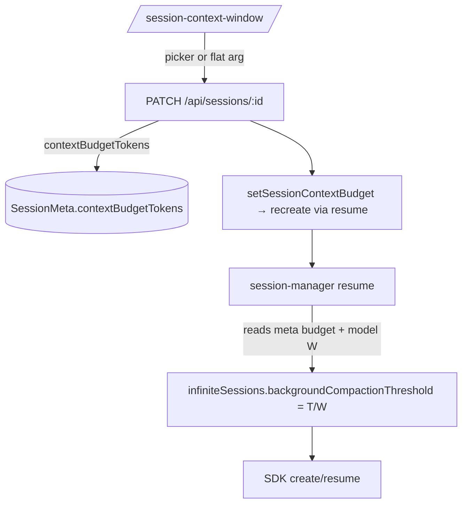

# Spec: `/session-context-window`

**Status:** draft · **SDK:** `@github/copilot-sdk@1.0.0-beta.7`

## Goals

Let a user cap an **active** session's live context window so the SDK compacts earlier, cutting per-call cache cost (the dominant cost on large-window models). One picker-driven slash command, working identically for GitHub and BYOK models.

**Non-goals:** new-session configuration (not worth the complexity); changing `bufferExhaustionThreshold`; a custom compaction loop (the SDK already auto-compacts).

## Background (verified)

- The SDK auto-compacts via `infiniteSessions` (`SessionConfigBase`, `types.d.ts:1322`): `backgroundCompactionThreshold` (default **0.80**, `types.d.ts:1099`) starts async compaction at that fraction of the prompt-token limit; `bufferExhaustionThreshold` (0.95, `types.d.ts:1105`) hard-blocks. Caco never sets `infiniteSessions`, so it inherits defaults today.
- **The denominator the runtime uses is `max_prompt_tokens || max_context_window_tokens || 128_000`** (`@github/copilot/app.js:3644`), **not** plain `max_context_window_tokens`. Our `T/W` must use the same prompt-token denominator when present (see [Token math](#token-math)).
- `backgroundCompactionThreshold` is a **fraction (0–1)**, settable **only at create/resume** — there is **no live setter** on the `session` object (methods: `send`/`sendAndWait`/`on`/`getEvents`/`disconnect`/`abort`/`setModel`/`log` + `rpc`/`ui`; raw `rpc.history.{compact,truncate,cancelBackgroundCompaction,abortManualCompaction,summarizeForHandoff}` at `dist/generated/rpc.d.ts:10470`).
- The runtime applies `infiniteSessions` with **no provider gating** (`@github/copilot/app.js:4947` — normalizer reads only `e.infiniteSessions`; force-disabled only for child/sub-agent sessions). So the **same field works for BYOK** sessions — one mechanism, both paths.

**Consequence:** the budget is stored as an absolute token count and converted to a fraction at apply time; applying to a live session means **recreate-via-resume** (the existing `setSessionModel` cross-provider pattern), which replays history once but then saves on every subsequent call.

## UX

Command: **`/session-context-window`** (alias surfaced in the command list as "Cap session context window").

### No argument → picker

Opens the standard command popup with options computed from the **active session's model context window** `W`:

| Option | Token value | Notes |
|---|---|---|
| 20% / 40% / 60% / 80% | `Math.round(pct·W / 100k)·100k` | snapped to nearest 100k for legibility |
| SDK default (~80%) | — | **clears** the override (NOT a full-window mode — the SDK still compacts at its 0.80 default) |

There is no literal "100%" option: a cap at the full window would invert the background/buffer thresholds and effectively disable background compaction. "Full window" intent maps to clearing the override.

Rules (exact algorithm):
- For each `pct` in `[0.2, 0.4, 0.6, 0.8]`: `raw = pct·W`; `snapped = Math.round(raw / 100_000) · 100_000`; `effective = snapped > 0 ? snapped : raw` (never offer 0).
- **Dedup** by `effective` token value (small models collapse several `pct` to the same value).
- **Sort ascending** by `effective`.
- **Red rendering** (`danger`) for any option whose `effective < 100_000` — signals the window is already small and the cap buys little. (Most/all options go red on ≤100k models.)
- Worked example, 200k model: 20%→`raw 40k` (red), 40%→`100k`, 60%→`100k` (dedup-dropped), 80%→`200k`. Result: `40k (red)`, `100k`, `200k`, plus "SDK default".
- Each row's `description` shows the resulting `%` and the credit-per-call implication, e.g. `200k · ~$0.10/call`.
- The currently-active budget (if any) is marked selected.

### Flat argument → direct set

`/session-context-window 200000` (or `200k`) sets the budget to that absolute token count, bypassing the picker. Parse `k`/`m` suffixes; reject non-numeric or `> W` with a red toast. `default`/`reset`/`full` clears the override.

### Active-model lookup (client)

The active model id is **not** exported from app state (it's private footer state). The command **fetches `/api/sessions/:id/state`** to get `data.model`, then looks up that model's `contextWindow` (and, when present, prompt-token limit) from `getAvailableModels()`. If the model isn't found or has no window, red toast and abort.

### Feedback

- Success → **green** toast noting the one-time replay: `Context capped at 200k (~20%) — reconnecting, history replays once`.
- Failure → **red** toast with the server message (e.g. `Model context window unknown`, `Session not active`, `Session busy — try again when idle`).
- Clear → green toast: `Context cap cleared (SDK default ~80%)`.

The command **only operates on the active session.** No active session → red toast `No active session`. **Busy session** (mid-dispatch) → red toast `Session busy — try again when idle` (see [Busy-session guard](#busy-session-guard)).

## Token math

Given budget `T` (absolute tokens) and the model's **prompt-token denominator** `W`:

```
W = max_prompt_tokens ?? max_context_window_tokens ?? 128_000   // match the runtime, app.js:3644
backgroundCompactionThreshold = clamp(T / W, 0.05, 0.94)
```

- **Upper cap `0.94`** keeps background **strictly below** `bufferExhaustionThreshold` (0.95). If `T/W ≥ 0.95` → **clear the override** (no meaningful cap). The single rule for "too large" is: `T/W ≥ 0.95 ⇒ clear`; otherwise clamp into `[0.05, 0.94]`. This same rule governs `T > W_new` after a model change (below).
- **Floor `0.05`** so a tiny `T` can't round to 0 and disable compaction.
- `W` source: GitHub via `getModels()` → `capabilities.limits.max_prompt_tokens ?? max_context_window_tokens`; BYOK via the provider registry's `contextWindow` (the registry sets it into `max_context_window_tokens`; no separate prompt-token limit, so it is `W`). If `W` is unknown/0 (Auto, or a BYOK model with no `contextWindow`), **reject** — the fraction is undefined.

**Note:** the client picker presents options against the **context window** for legibility (the user thinks in "window size"), but the server stores the absolute `T` and converts with the **prompt-token** denominator above. The two differ slightly; the budget is honest because the conversion is server-side and authoritative. The picker's `%` labels are approximate.

Clearing the override removes `infiniteSessions` from the (re)create args so the SDK default (0.80) applies.

## Data flow



## Code changes (ownership)

| File | Change |
|---|---|
| `src/session-meta-store.ts` | Add `contextBudgetTokens?: number` to `SessionMeta` (`:18-40`). Absolute tokens; absent = SDK default. |
| `src/session-manager.ts` | New helper `infiniteSessionsFor(modelCacoId): InfiniteSessionConfig \| undefined` — reads the session's `contextBudgetTokens`, resolves `W` (GitHub `max_prompt_tokens ?? max_context_window_tokens`, or registry `contextWindow`), returns `{ backgroundCompactionThreshold: clamp(T/W) }`, or `undefined` when no budget / `T/W ≥ 0.95`. Thread it into **both** `createSession` args (`:486-497`) and `resumeArgs` (`:610-621`). New public `setSessionContextBudget(sessionId, tokens \| null)`: **(1)** reject if the session is busy ([guard](#busy-session-guard)); **(2)** read+stash the *previous* `contextBudgetTokens`; **(3)** persist the new value to meta; **(4)** recreate via disconnect+resume (mirror `setSessionModel` `:1024-1081`); **(5)** on resume failure, **restore the stashed previous meta value** before rethrowing (unlike `setSessionModel`, which carries the override as a resume arg, this setter writes meta first, so rollback must un-write it). |
| `src/routes/sessions.ts` | Extend `PATCH /api/sessions/:id` (`:434-443`) with `contextBudgetTokens?: number \| null`. Validate `> 0` and `≤ W`; null clears. Reject busy sessions with `409 SESSION_BUSY`. Call `setSessionContextBudget`; 400 with message on failure (mirrors the `model` branch at `:481-489`). |
| `public/ts/input-popup.ts` | Add optional `danger?: boolean` to `PopupItem` (`:3-9`); render with a red class in the item builder (`:179-199`). |
| `public/ts/command-registry.ts` | Register `session-context-window` in `BUILTIN_COMMANDS` (`:17`) + handler (template: `session-model` `:122-147`). Handler: parse flat arg (k/m suffix, `default`/`reset`/`full`) or, when empty, `picker()` fetches `/api/sessions/:id/state` for the active model, looks up `W` via `getAvailableModels()`, builds options. PATCH on select; green/red toast. |
| `public/style.css` | `.input-popup-item.danger` (red text) — reuse `--color-error`. |
| Docs | README "Slash Commands" + a line in the footer-cost notes. |

No server compaction code: the runtime owns it. We only set the threshold at (re)create.

## Busy-session guard

Recreating a session mid-dispatch would `disconnect()` an in-flight response and force-clear dispatch state (`session-manager.ts:1037-1068`, dispatch tracked at `session-messages.ts:243-249`). Neither `PATCH` nor `setSessionModel` currently guards against this — a pre-existing hazard the model-switch path shares.

For this feature, **reject when busy**: the route checks the session's busy state (same source dispatch uses) and returns `409 { error: "Session busy — try again when idle" }`; the client shows a red toast. This is the conservative choice — no queueing, no interrupting a live response. (A future enhancement could apply-after-idle, out of scope here.)

## Apply-timing decision

**Immediate apply via recreate** (not lazy-on-next-restart): the value of the feature is mid-job cost reduction on a long session. Recreate replays history once (a bounded one-time cache cost) and then every subsequent call is cheaper. This reuses `setSessionModel`'s proven disconnect→resume→rollback machinery; on resume failure, restore the previous meta budget and surface a red toast. The success toast states that history replays once so the user understands the trade. A purely lazy option (persist now, apply next resume) is strictly weaker for the stated goal and is not specified. Short sessions may not recoup the replay — acceptable, since the user is opting in explicitly on a session they judge long.

## Risks & mitigations

| Risk | Mitigation |
|---|---|
| Recreate replays full context (one-time cost) just to lower future cost; short sessions may not pay it back. | User opts in explicitly; success toast states "history replays once". Pays off within a few subsequent calls on a long session. Future: lazy/apply-after-idle mode. |
| Recreate while the session is mid-response disconnects an in-flight dispatch. | **Busy-session guard**: route returns `409 SESSION_BUSY`; client red toast. No recreate while busy. |
| Threshold ≥ buffer (0.95) inverts the two and disables background compaction. | Single rule: `T/W ≥ 0.95 ⇒ clear override`; otherwise clamp to `[0.05, 0.94]`, strictly below 0.95. |
| Wrong denominator (window vs prompt-token limit). | Use `max_prompt_tokens ?? max_context_window_tokens ?? 128k`, matching the runtime (`app.js:3644`). Picker labels are approximate; server conversion is authoritative. |
| `W` unknown (Auto model, BYOK without `contextWindow`). | Reject with a clear red toast; never apply an undefined fraction. |
| BYOK compaction summarization routes through the user's provider — unverified live. | Note in spec; verify with a real key before relying on it. Failure surfaces as a normal resume error + rollback. |
| Budget persisted, model later changed to one with smaller `W` (so `T > W_new`). | `T` is absolute; `infiniteSessionsFor` recomputes `T/W` against the *current* model each (re)create. Same rule applies: `T/W ≥ 0.95 ⇒ no `infiniteSessions` (default); else clamp. |
| Rollback leaves stale meta after a failed recreate. | Setter stashes the previous `contextBudgetTokens` and restores it on resume failure before rethrowing. |
| Small-model picker offers degenerate sub-100k values. | Snap + raw fallback + red rendering + dedup + ascending sort, per UX. |

## Edge cases

- No active session → red toast, no-op.
- **Busy session (mid-dispatch) → `409 SESSION_BUSY`, red toast, no recreate.**
- Flat arg `> W` → reject (red). `0` or negative → reject. `default`/`reset`/`full` → clear.
- Re-selecting the current budget → short-circuit (no recreate, success toast).
- Auto model or any model with no resolvable `W` → reject (no denominator).
- Model later switched to a smaller window so stored `T/W ≥ 0.95` → treated as cleared (default 0.80) at that (re)create; meta value retained but inert.
- Server restart: budget persists in meta; `infiniteSessionsFor` re-applies on the next resume automatically.
- Sub-agent/swarm child sessions: out of scope (runtime force-disables `infiniteSessions` there anyway).

## Divisibility

1. **R1** — meta field + `infiniteSessionsFor` wired into create/resume (no command yet). Sessions with a pre-set budget compact earlier. Testable server-side.
2. **R2** — `setSessionContextBudget` + PATCH + recreate.
3. **R3** — command + flat-arg path + toasts.
4. **R4** — picker UI (`danger` flag, snapping, dedup, red rendering).

Each ships independently; R1 alone is inert without a writer, so R1+R2 are the minimum useful slice.
